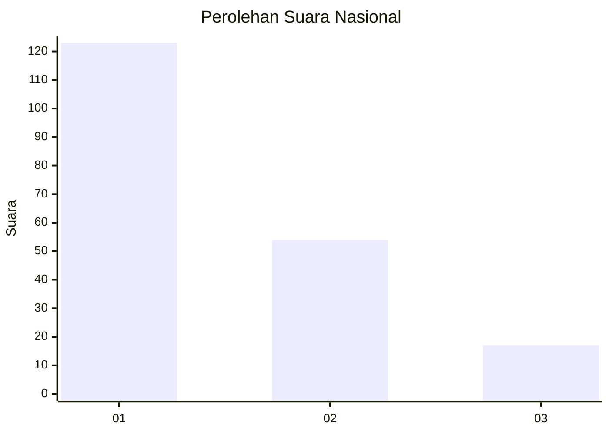
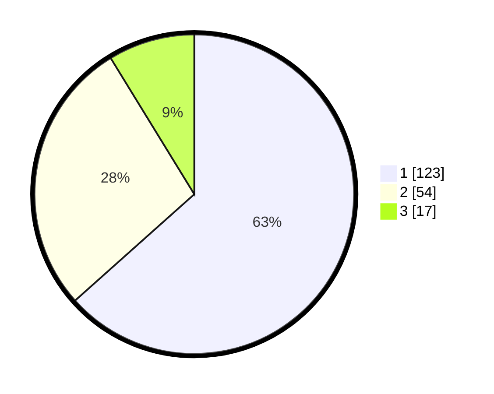

# Hasil

## Grafik

## Tabel

| No.    | Nama Paslon    | Suara | Suara (raw) | Persentase |
|:------ |:-------------- | -----:| -----------:| ----------:|
| 100025 | ANIES MUHAIMIN | 123   | [123][p-1]  | 63,40      |
| 100026 | PRABOWO GIBRAN | 54    | [54][p-2]   | 27,84      |
| 100027 | GANJAR MAHFUD  | 17    | [17][p-3]   | 8,76       |

[p-1]: https://github.com/gigit-pemilu/pemilu-2024/blob/main/pilpres/hitung-suara/sub/31-dki-jakarta/sub/75-jakarta-timur/sub/04-kramatjati/sub/1005-balekambang/sub/010-tps/sub/paslon-1.txt
[p-2]: https://github.com/gigit-pemilu/pemilu-2024/blob/main/pilpres/hitung-suara/sub/31-dki-jakarta/sub/75-jakarta-timur/sub/04-kramatjati/sub/1005-balekambang/sub/010-tps/sub/paslon-2.txt
[p-3]: https://github.com/gigit-pemilu/pemilu-2024/blob/main/pilpres/hitung-suara/sub/31-dki-jakarta/sub/75-jakarta-timur/sub/04-kramatjati/sub/1005-balekambang/sub/010-tps/sub/paslon-3.txt

## Foto C Plano

https://sirekap-obj-formc.kpu.go.id/c902/pemilu/ppwp/31/75/04/10/05/3175041005010-20240214-234619--d2731385-eb7f-48b6-948f-30b91171874b.jpg

https://sirekap-obj-formc.kpu.go.id/c902/pemilu/ppwp/31/75/04/10/05/3175041005010-20240214-234719--ef92e731-a726-4230-a4c5-e6a3062b9054.jpg

https://sirekap-obj-formc.kpu.go.id/c902/pemilu/ppwp/31/75/04/10/05/3175041005010-20240214-234815--a382fd02-bf68-4f11-bb3e-f40a71bd8146.jpg

## Metadata

| Key        | Value               |
| ---------- | ------------------- |
| Time Stamp | 2024-02-15 15:00:29 |

