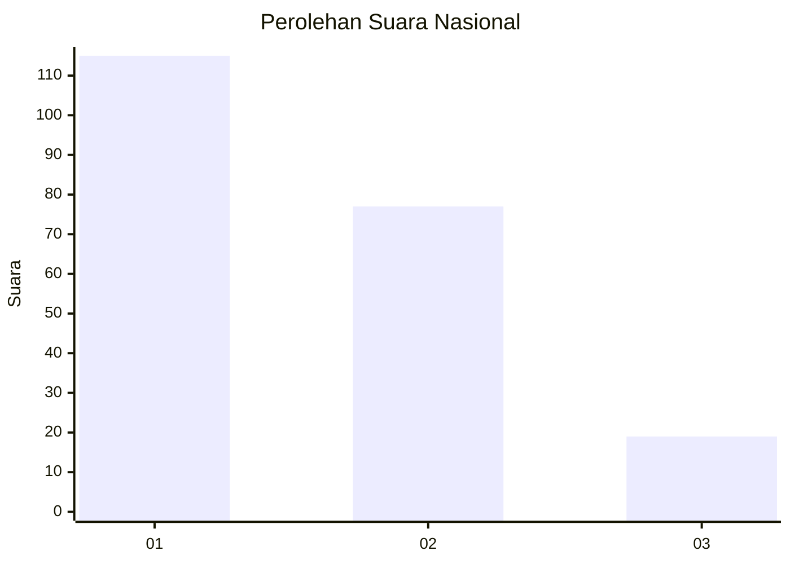
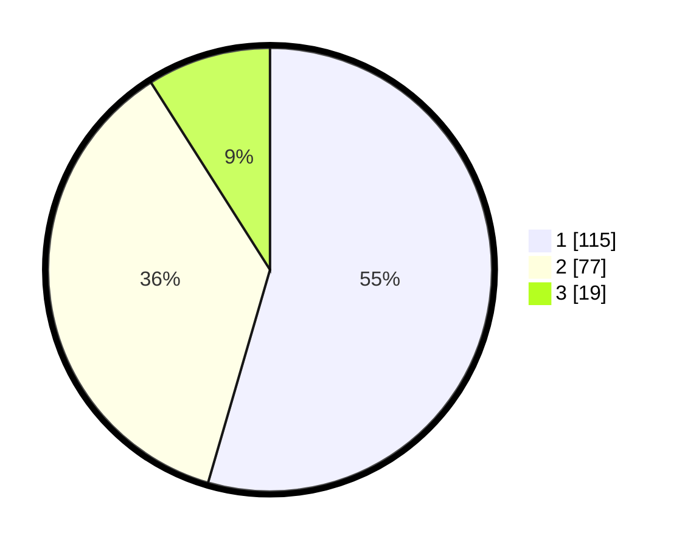

# Hasil

## Grafik

## Tabel

| No.    | Nama Paslon    | Suara | Suara (raw) | Persentase |
|:------ |:-------------- | -----:| -----------:| ----------:|
| 100025 | ANIES MUHAIMIN | 115   | [115][p-1]  | 54,50      |
| 100026 | PRABOWO GIBRAN | 77    | [77][p-2]   | 36,49      |
| 100027 | GANJAR MAHFUD  | 19    | [19][p-3]   | 9,00       |

[p-1]: https://github.com/gigit-pemilu/pemilu-2024/blob/main/pilpres/hitung-suara/sub/31-dki-jakarta/sub/75-jakarta-timur/sub/04-kramatjati/sub/1005-balekambang/sub/019-tps/sub/paslon-1.txt
[p-2]: https://github.com/gigit-pemilu/pemilu-2024/blob/main/pilpres/hitung-suara/sub/31-dki-jakarta/sub/75-jakarta-timur/sub/04-kramatjati/sub/1005-balekambang/sub/019-tps/sub/paslon-2.txt
[p-3]: https://github.com/gigit-pemilu/pemilu-2024/blob/main/pilpres/hitung-suara/sub/31-dki-jakarta/sub/75-jakarta-timur/sub/04-kramatjati/sub/1005-balekambang/sub/019-tps/sub/paslon-3.txt

## Foto C Plano

https://sirekap-obj-formc.kpu.go.id/301d/pemilu/ppwp/31/75/04/10/05/3175041005019-20240218-110534--689f3347-536e-4de2-9ec0-90a77c0193e3.jpg

https://sirekap-obj-formc.kpu.go.id/301d/pemilu/ppwp/31/75/04/10/05/3175041005019-20240218-110629--8bad3c6a-45fc-45ab-bffe-1df50b3bfe7d.jpg

https://sirekap-obj-formc.kpu.go.id/301d/pemilu/ppwp/31/75/04/10/05/3175041005019-20240219-074749--c9dabd2e-b681-4352-9766-b438fcc581bc.jpg

## Metadata

| Key        | Value               |
| ---------- | ------------------- |
| Time Stamp | 2024-02-19 11:00:00 |

