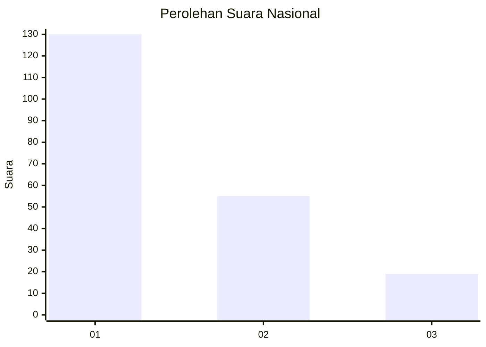
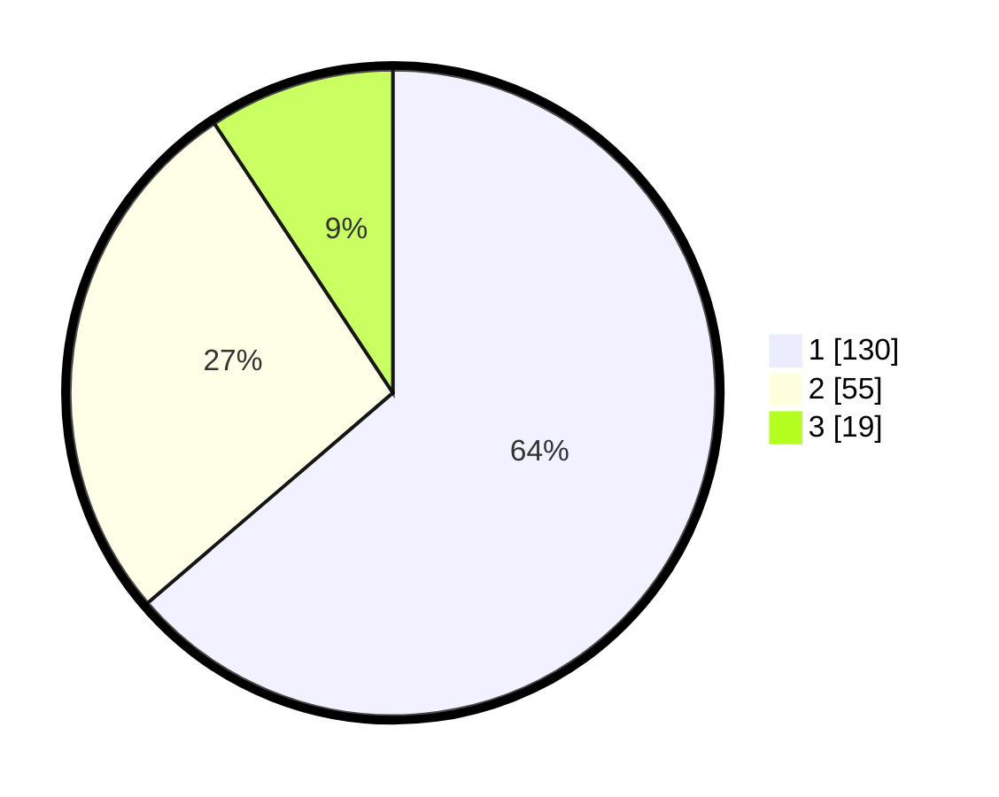

# Hasil

## Grafik

## Tabel

| No.    | Nama Paslon    | Suara | Suara (raw) | Persentase |
|:------ |:-------------- | -----:| -----------:| ----------:|
| 100025 | ANIES MUHAIMIN | 130   | [130][p-1]  | 63,73      |
| 100026 | PRABOWO GIBRAN | 55    | [55][p-2]   | 26,96      |
| 100027 | GANJAR MAHFUD  | 19    | [19][p-3]   | 9,31       |

[p-1]: https://github.com/gigit-pemilu/pemilu-2024/blob/main/pilpres/hitung-suara/sub/31-dki-jakarta/sub/75-jakarta-timur/sub/04-kramatjati/sub/1005-balekambang/sub/026-tps/sub/paslon-1.txt
[p-2]: https://github.com/gigit-pemilu/pemilu-2024/blob/main/pilpres/hitung-suara/sub/31-dki-jakarta/sub/75-jakarta-timur/sub/04-kramatjati/sub/1005-balekambang/sub/026-tps/sub/paslon-2.txt
[p-3]: https://github.com/gigit-pemilu/pemilu-2024/blob/main/pilpres/hitung-suara/sub/31-dki-jakarta/sub/75-jakarta-timur/sub/04-kramatjati/sub/1005-balekambang/sub/026-tps/sub/paslon-3.txt

## Foto C Plano

https://sirekap-obj-formc.kpu.go.id/6fac/pemilu/ppwp/31/75/04/10/05/3175041005026-20240215-031105--44a79893-4ef4-4898-bb9b-9ecd98445642.jpg

https://sirekap-obj-formc.kpu.go.id/6fac/pemilu/ppwp/31/75/04/10/05/3175041005026-20240215-031211--3b8d1ffd-58c0-4b8f-855d-47816ae9c852.jpg

https://sirekap-obj-formc.kpu.go.id/6fac/pemilu/ppwp/31/75/04/10/05/3175041005026-20240215-031308--111a57dc-badf-458e-9516-f2afe5bb445e.jpg

## Metadata

| Key        | Value               |
| ---------- | ------------------- |
| Time Stamp | 2024-02-15 16:30:25 |

