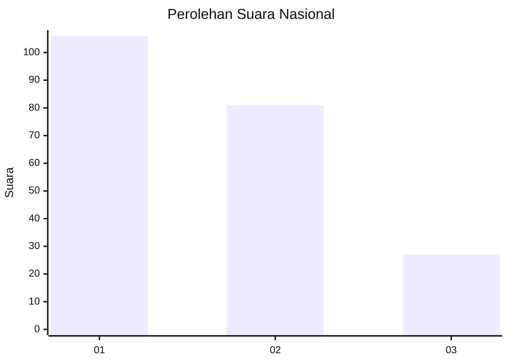
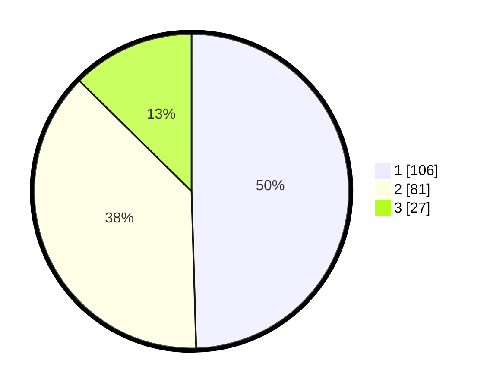

# Hasil

## Grafik

## Tabel

| No.    | Nama Paslon    | Suara | Suara (raw) | Persentase |
|:------ |:-------------- | -----:| -----------:| ----------:|
| 100025 | ANIES MUHAIMIN | 106   | [106][p-1]  | 49,53      |
| 100026 | PRABOWO GIBRAN | 81    | [81][p-2]   | 37,85      |
| 100027 | GANJAR MAHFUD  | 27    | [27][p-3]   | 12,62      |

[p-1]: https://github.com/gigit-pemilu/pemilu-2024/blob/main/pilpres/hitung-suara/sub/31-dki-jakarta/sub/75-jakarta-timur/sub/04-kramatjati/sub/1005-balekambang/sub/031-tps/sub/paslon-1.txt
[p-2]: https://github.com/gigit-pemilu/pemilu-2024/blob/main/pilpres/hitung-suara/sub/31-dki-jakarta/sub/75-jakarta-timur/sub/04-kramatjati/sub/1005-balekambang/sub/031-tps/sub/paslon-2.txt
[p-3]: https://github.com/gigit-pemilu/pemilu-2024/blob/main/pilpres/hitung-suara/sub/31-dki-jakarta/sub/75-jakarta-timur/sub/04-kramatjati/sub/1005-balekambang/sub/031-tps/sub/paslon-3.txt

## Foto C Plano

https://sirekap-obj-formc.kpu.go.id/1f24/pemilu/ppwp/31/75/04/10/05/3175041005031-20240214-222422--62a478f8-26e2-480d-a8d0-6e80cb340914.jpg

https://sirekap-obj-formc.kpu.go.id/1f24/pemilu/ppwp/31/75/04/10/05/3175041005031-20240214-222804--ea17c591-4251-46ef-9214-01478ce80446.jpg

https://sirekap-obj-formc.kpu.go.id/1f24/pemilu/ppwp/31/75/04/10/05/3175041005031-20240214-223102--09c72a90-950d-44fb-8fd2-4d192d49addd.jpg

## Metadata

| Key        | Value               |
| ---------- | ------------------- |
| Time Stamp | 2024-02-15 16:30:25 |

