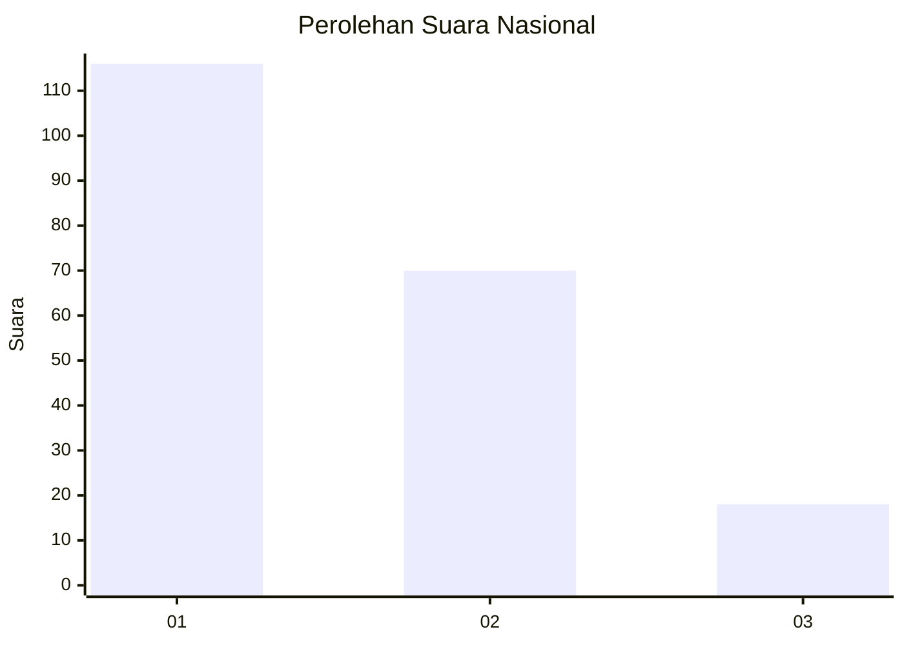
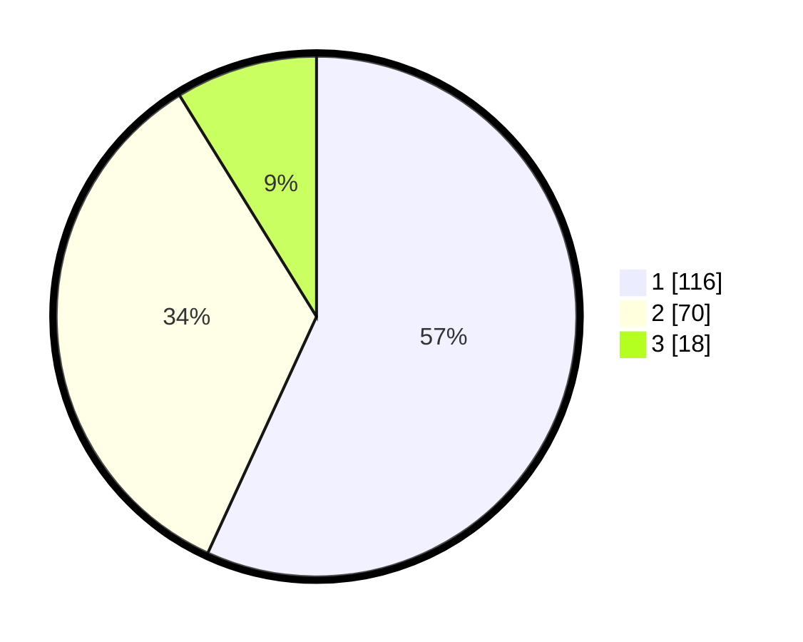

# Hasil

## Grafik

## Tabel

| No.    | Nama Paslon    | Suara | Suara (raw) | Persentase |
|:------ |:-------------- | -----:| -----------:| ----------:|
| 100025 | ANIES MUHAIMIN | 116   | [116][p-1]  | 56,86      |
| 100026 | PRABOWO GIBRAN | 70    | [70][p-2]   | 34,31      |
| 100027 | GANJAR MAHFUD  | 18    | [18][p-3]   | 8,82       |

[p-1]: https://github.com/gigit-pemilu/pemilu-2024/blob/main/pilpres/hitung-suara/sub/31-dki-jakarta/sub/75-jakarta-timur/sub/04-kramatjati/sub/1005-balekambang/sub/037-tps/sub/paslon-1.txt
[p-2]: https://github.com/gigit-pemilu/pemilu-2024/blob/main/pilpres/hitung-suara/sub/31-dki-jakarta/sub/75-jakarta-timur/sub/04-kramatjati/sub/1005-balekambang/sub/037-tps/sub/paslon-2.txt
[p-3]: https://github.com/gigit-pemilu/pemilu-2024/blob/main/pilpres/hitung-suara/sub/31-dki-jakarta/sub/75-jakarta-timur/sub/04-kramatjati/sub/1005-balekambang/sub/037-tps/sub/paslon-3.txt

## Foto C Plano

https://sirekap-obj-formc.kpu.go.id/d9d9/pemilu/ppwp/31/75/04/10/05/3175041005037-20240215-003714--b9fd228f-4927-4b9f-9d08-13540c518fe2.jpg

https://sirekap-obj-formc.kpu.go.id/d9d9/pemilu/ppwp/31/75/04/10/05/3175041005037-20240215-003755--4d7c96aa-14bb-4cca-8ad5-a4266d0c76e3.jpg

https://sirekap-obj-formc.kpu.go.id/d9d9/pemilu/ppwp/31/75/04/10/05/3175041005037-20240215-003843--cc0f4df1-98b1-408c-bc84-628d114a987d.jpg

## Metadata

| Key        | Value               |
| ---------- | ------------------- |
| Time Stamp | 2024-02-15 17:00:25 |

