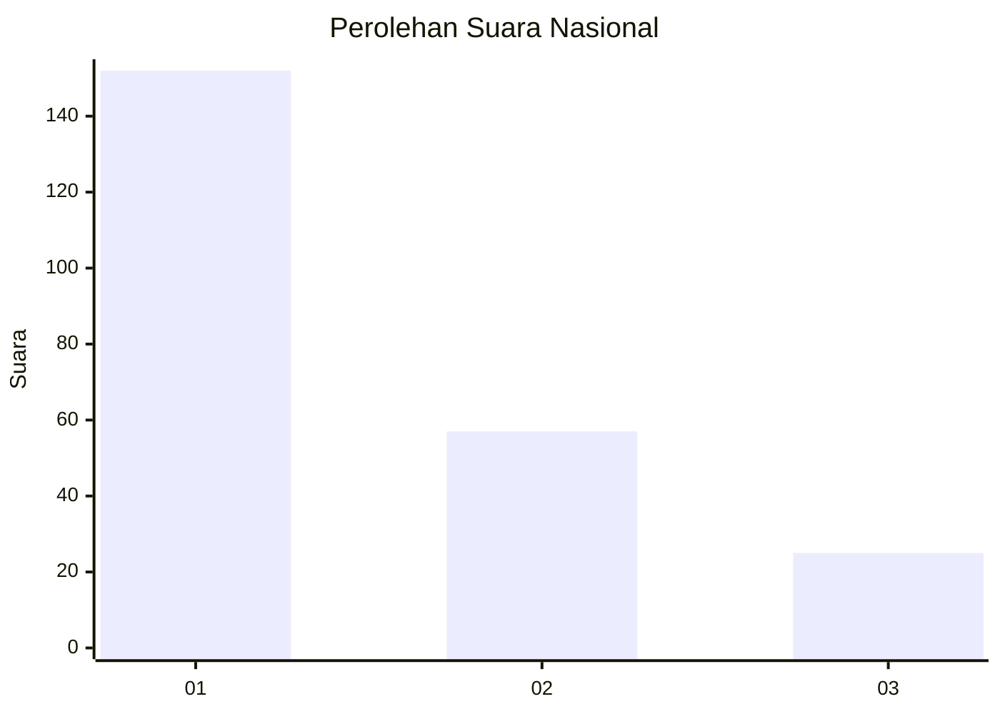
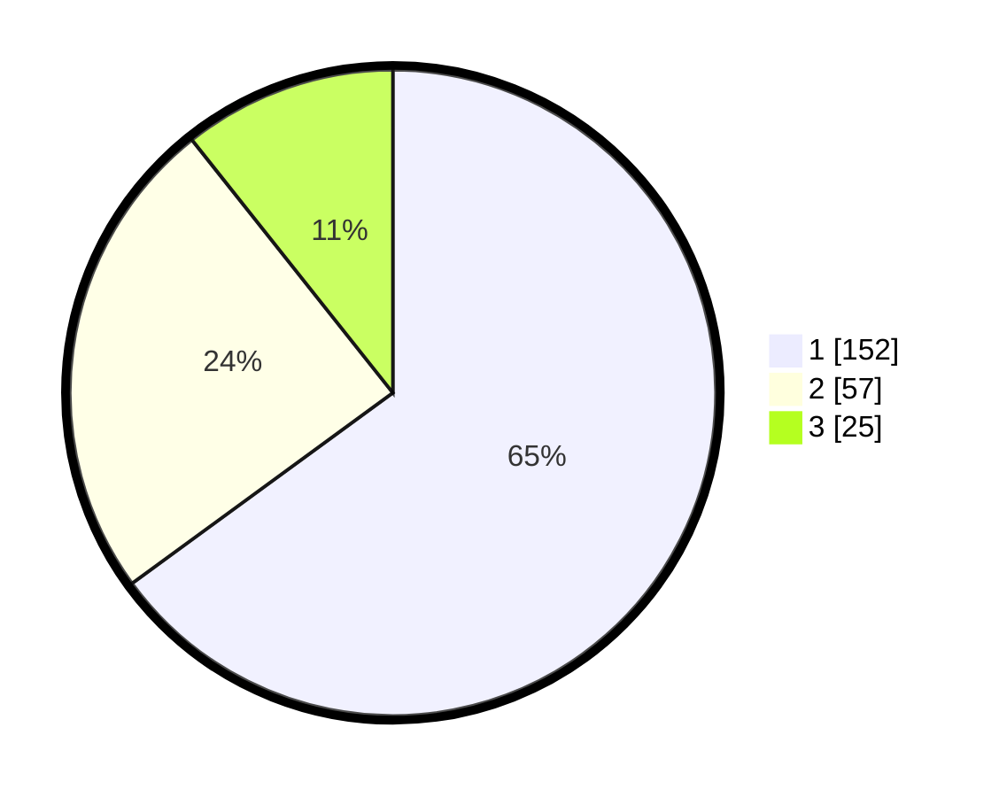

# Hasil

## Grafik

## Tabel

| No. | Nama Paslon    | Suara | Suara (raw) | Persentase |
|:--- |:-------------- | -----:| -----------:| ----------:|
| 1   | ANIES MUHAIMIN | 152   | [152][p-1]  | 64,96      |
| 2   | PRABOWO GIBRAN | 57    | [57][p-2]   | 24,36      |
| 3   | GANJAR MAHFUD  | 25    | [25][p-3]   | 10,68      |

[p-1]: https://github.com/gigit-pemilu/pemilu-2024/blob/main/pilpres/hitung-suara/sub/31-dki-jakarta/sub/75-jakarta-timur/sub/04-kramatjati/sub/1005-balekambang/sub/040-tps/sub/paslon-1.txt
[p-2]: https://github.com/gigit-pemilu/pemilu-2024/blob/main/pilpres/hitung-suara/sub/31-dki-jakarta/sub/75-jakarta-timur/sub/04-kramatjati/sub/1005-balekambang/sub/040-tps/sub/paslon-2.txt
[p-3]: https://github.com/gigit-pemilu/pemilu-2024/blob/main/pilpres/hitung-suara/sub/31-dki-jakarta/sub/75-jakarta-timur/sub/04-kramatjati/sub/1005-balekambang/sub/040-tps/sub/paslon-3.txt

## Foto C Plano

https://sirekap-obj-formc.kpu.go.id/23e7/pemilu/ppwp/31/75/04/10/05/3175041005040-20240215-015205--cc09b466-2157-496f-981f-b20eb10e7cd9.jpg

https://sirekap-obj-formc.kpu.go.id/23e7/pemilu/ppwp/31/75/04/10/05/3175041005040-20240214-220009--dd501b97-9e86-412f-966f-38ee86c039e6.jpg

https://sirekap-obj-formc.kpu.go.id/23e7/pemilu/ppwp/31/75/04/10/05/3175041005040-20240214-220107--db825dc1-af62-4525-bf7e-7eeceed78547.jpg

## Metadata

| Key        | Value               |
| ---------- | ------------------- |
| Time Stamp | 2024-02-15 17:00:25 |

