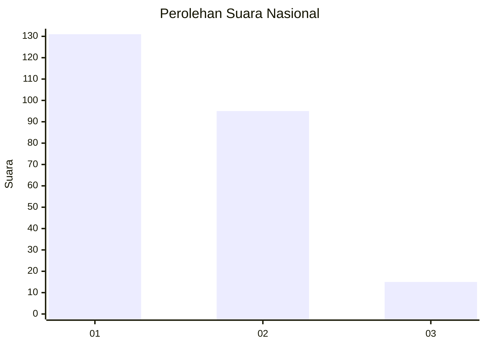
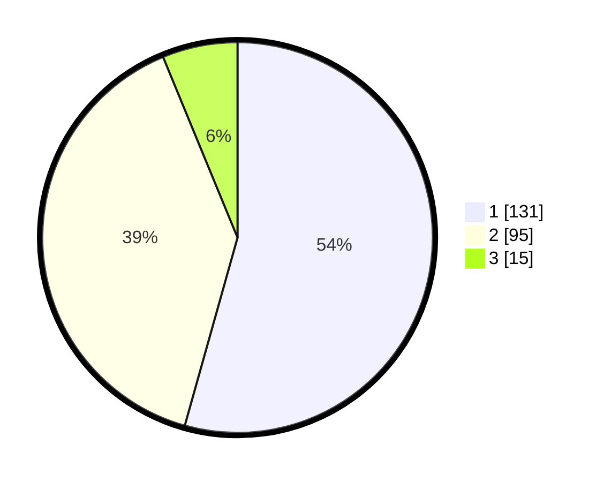

# Hasil

## Grafik

## Tabel

| No.    | Nama Paslon    | Suara | Suara (raw) | Persentase |
|:------ |:-------------- | -----:| -----------:| ----------:|
| 100025 | ANIES MUHAIMIN | 131   | [131][p-1]  | 54,36      |
| 100026 | PRABOWO GIBRAN | 95    | [95][p-2]   | 39,42      |
| 100027 | GANJAR MAHFUD  | 15    | [15][p-3]   | 6,22       |

[p-1]: https://github.com/gigit-pemilu/pemilu-2024/blob/main/pilpres/hitung-suara/sub/31-dki-jakarta/sub/75-jakarta-timur/sub/04-kramatjati/sub/1005-balekambang/sub/049-tps/sub/paslon-1.txt
[p-2]: https://github.com/gigit-pemilu/pemilu-2024/blob/main/pilpres/hitung-suara/sub/31-dki-jakarta/sub/75-jakarta-timur/sub/04-kramatjati/sub/1005-balekambang/sub/049-tps/sub/paslon-2.txt
[p-3]: https://github.com/gigit-pemilu/pemilu-2024/blob/main/pilpres/hitung-suara/sub/31-dki-jakarta/sub/75-jakarta-timur/sub/04-kramatjati/sub/1005-balekambang/sub/049-tps/sub/paslon-3.txt

## Foto C Plano

https://sirekap-obj-formc.kpu.go.id/5a3a/pemilu/ppwp/31/75/04/10/05/3175041005049-20240215-023705--ea82cc3a-a5bd-4608-bb4c-eb4cc9fca10b.jpg

https://sirekap-obj-formc.kpu.go.id/5a3a/pemilu/ppwp/31/75/04/10/05/3175041005049-20240215-023829--c5d4eb3a-1cda-4395-877d-7cd75da0c2b0.jpg

https://sirekap-obj-formc.kpu.go.id/5a3a/pemilu/ppwp/31/75/04/10/05/3175041005049-20240215-024044--12a833b4-8315-4dc8-99e1-5996b148787d.jpg

## Metadata

| Key        | Value               |
| ---------- | ------------------- |
| Time Stamp | 2024-02-15 15:00:29 |

