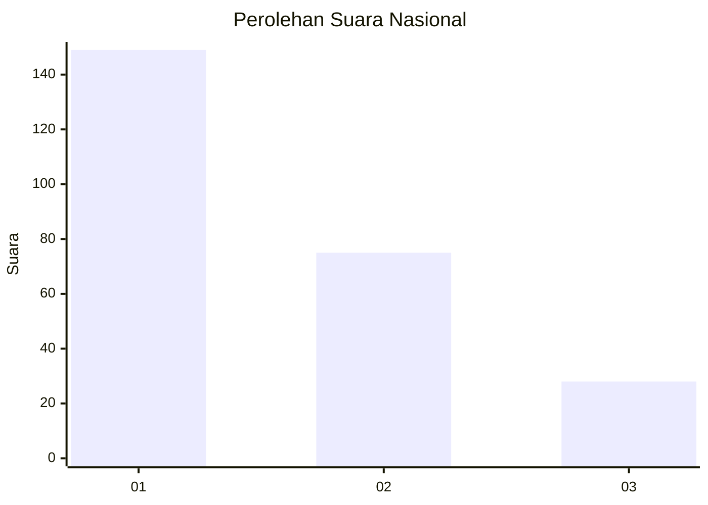
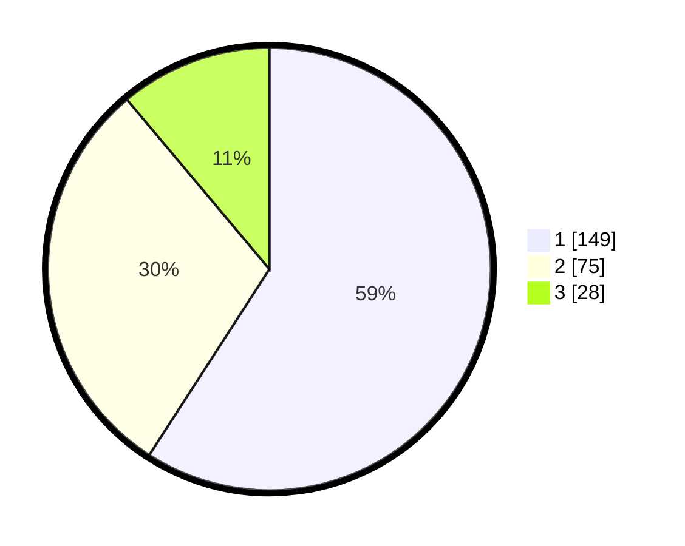

# Hasil

## Grafik

## Tabel

| No.    | Nama Paslon    | Suara | Suara (raw) | Persentase |
|:------ |:-------------- | -----:| -----------:| ----------:|
| 100025 | ANIES MUHAIMIN | 149   | [149][p-1]  | 59,13      |
| 100026 | PRABOWO GIBRAN | 75    | [75][p-2]   | 29,76      |
| 100027 | GANJAR MAHFUD  | 28    | [28][p-3]   | 11,11      |

[p-1]: https://github.com/gigit-pemilu/pemilu-2024/blob/main/pilpres/hitung-suara/sub/31-dki-jakarta/sub/75-jakarta-timur/sub/04-kramatjati/sub/1005-balekambang/sub/052-tps/sub/paslon-1.txt
[p-2]: https://github.com/gigit-pemilu/pemilu-2024/blob/main/pilpres/hitung-suara/sub/31-dki-jakarta/sub/75-jakarta-timur/sub/04-kramatjati/sub/1005-balekambang/sub/052-tps/sub/paslon-2.txt
[p-3]: https://github.com/gigit-pemilu/pemilu-2024/blob/main/pilpres/hitung-suara/sub/31-dki-jakarta/sub/75-jakarta-timur/sub/04-kramatjati/sub/1005-balekambang/sub/052-tps/sub/paslon-3.txt

## Foto C Plano

https://sirekap-obj-formc.kpu.go.id/0134/pemilu/ppwp/31/75/04/10/05/3175041005052-20240215-033037--cef5eb19-899a-41a0-9da5-5d9aba6fd08b.jpg

https://sirekap-obj-formc.kpu.go.id/0134/pemilu/ppwp/31/75/04/10/05/3175041005052-20240214-212624--220b9ea2-d458-4d60-9e2d-6673c0f8e831.jpg

https://sirekap-obj-formc.kpu.go.id/0134/pemilu/ppwp/31/75/04/10/05/3175041005052-20240214-212734--40994771-0f5c-4a2e-9c1a-f5e8e3682db1.jpg

## Metadata

| Key        | Value               |
| ---------- | ------------------- |
| Time Stamp | 2024-02-15 09:00:24 |

