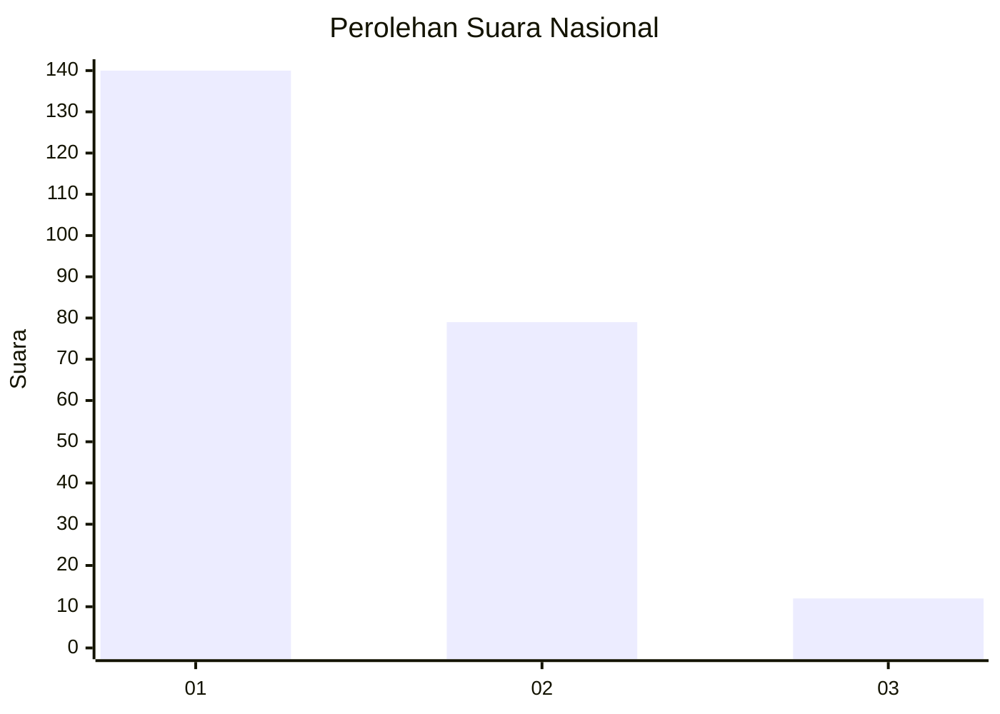
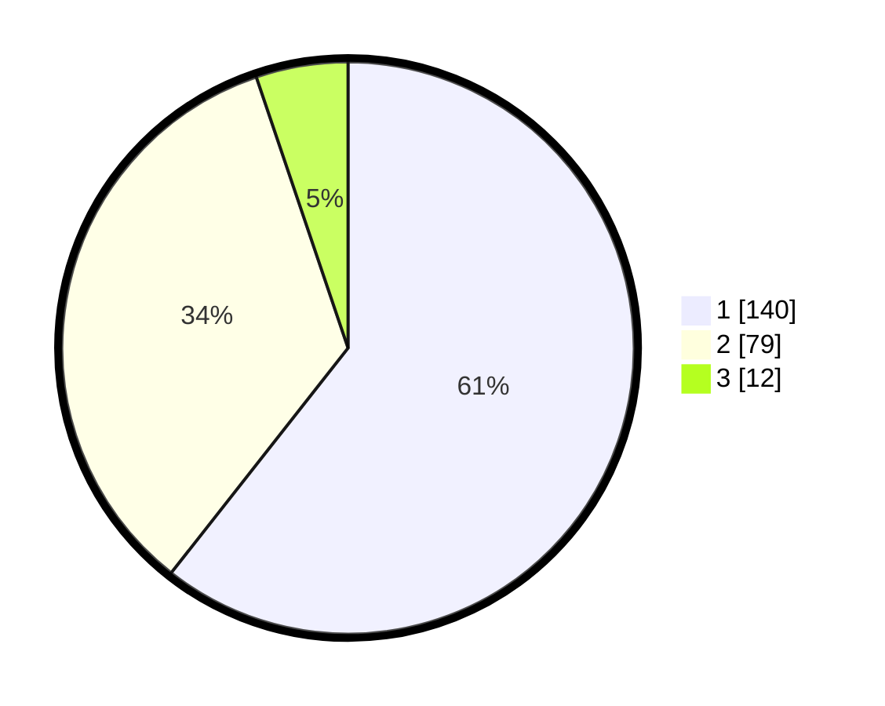

# Hasil

## Grafik

## Tabel

| No.    | Nama Paslon    | Suara | Suara (raw) | Persentase |
|:------ |:-------------- | -----:| -----------:| ----------:|
| 100025 | ANIES MUHAIMIN | 140   | [140][p-1]  | 60,61      |
| 100026 | PRABOWO GIBRAN | 79    | [79][p-2]   | 34,20      |
| 100027 | GANJAR MAHFUD  | 12    | [12][p-3]   | 5,19       |

[p-1]: https://github.com/gigit-pemilu/pemilu-2024/blob/main/pilpres/hitung-suara/sub/31-dki-jakarta/sub/75-jakarta-timur/sub/04-kramatjati/sub/1005-balekambang/sub/053-tps/sub/paslon-1.txt
[p-2]: https://github.com/gigit-pemilu/pemilu-2024/blob/main/pilpres/hitung-suara/sub/31-dki-jakarta/sub/75-jakarta-timur/sub/04-kramatjati/sub/1005-balekambang/sub/053-tps/sub/paslon-2.txt
[p-3]: https://github.com/gigit-pemilu/pemilu-2024/blob/main/pilpres/hitung-suara/sub/31-dki-jakarta/sub/75-jakarta-timur/sub/04-kramatjati/sub/1005-balekambang/sub/053-tps/sub/paslon-3.txt

## Foto C Plano

https://sirekap-obj-formc.kpu.go.id/344a/pemilu/ppwp/31/75/04/10/05/3175041005053-20240214-200825--df26b684-ea16-41a8-9139-7ab5b3586c0e.jpg

https://sirekap-obj-formc.kpu.go.id/344a/pemilu/ppwp/31/75/04/10/05/3175041005053-20240214-201113--9a018bd8-61ee-446b-a86d-023d60b9db06.jpg

https://sirekap-obj-formc.kpu.go.id/344a/pemilu/ppwp/31/75/04/10/05/3175041005053-20240214-215157--8fb3ca1a-aa24-4f68-9f15-a99cd187da57.jpg

## Metadata

| Key        | Value               |
| ---------- | ------------------- |
| Time Stamp | 2024-02-15 12:00:28 |

