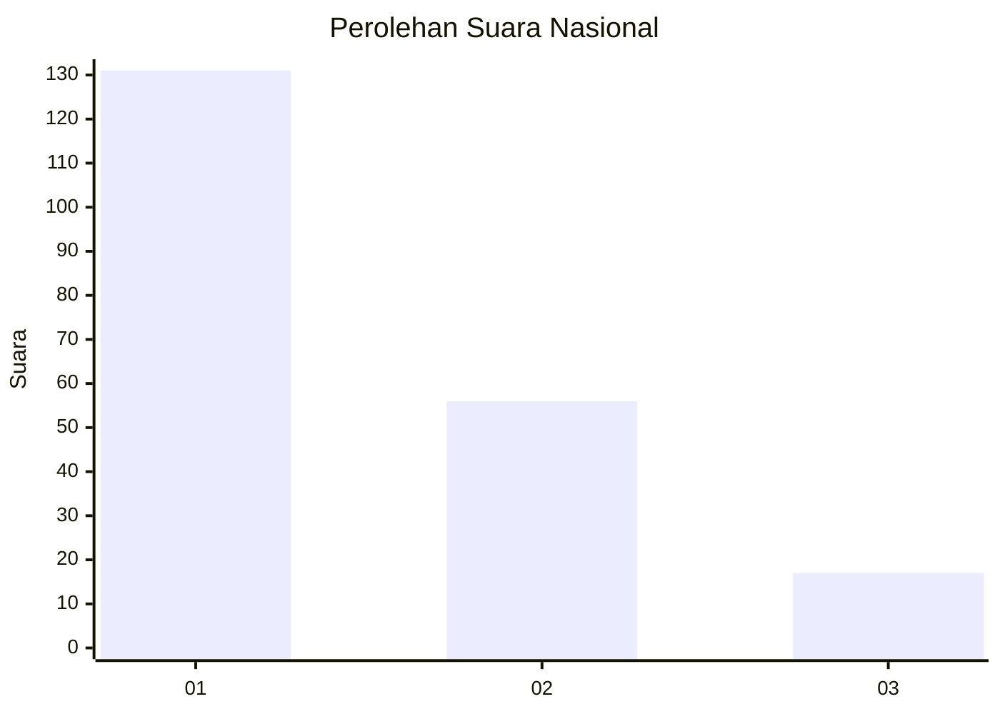
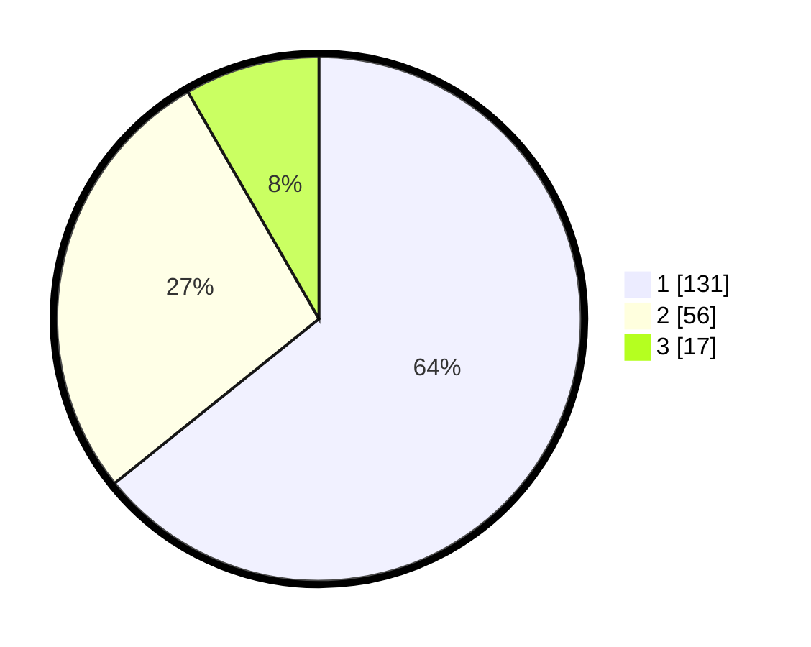

# Hasil

## Grafik

## Tabel

| No.    | Nama Paslon    | Suara | Suara (raw) | Persentase |
|:------ |:-------------- | -----:| -----------:| ----------:|
| 100025 | ANIES MUHAIMIN | 131   | [131][p-1]  | 64,22      |
| 100026 | PRABOWO GIBRAN | 56    | [56][p-2]   | 27,45      |
| 100027 | GANJAR MAHFUD  | 17    | [17][p-3]   | 8,33       |

[p-1]: https://github.com/gigit-pemilu/pemilu-2024/blob/main/pilpres/hitung-suara/sub/31-dki-jakarta/sub/75-jakarta-timur/sub/04-kramatjati/sub/1005-balekambang/sub/061-tps/sub/paslon-1.txt
[p-2]: https://github.com/gigit-pemilu/pemilu-2024/blob/main/pilpres/hitung-suara/sub/31-dki-jakarta/sub/75-jakarta-timur/sub/04-kramatjati/sub/1005-balekambang/sub/061-tps/sub/paslon-2.txt
[p-3]: https://github.com/gigit-pemilu/pemilu-2024/blob/main/pilpres/hitung-suara/sub/31-dki-jakarta/sub/75-jakarta-timur/sub/04-kramatjati/sub/1005-balekambang/sub/061-tps/sub/paslon-3.txt

## Foto C Plano

https://sirekap-obj-formc.kpu.go.id/e1c0/pemilu/ppwp/31/75/04/10/05/3175041005061-20240220-105154--3b2d727a-8f1a-4e0d-8321-31167ff6873f.jpg

https://sirekap-obj-formc.kpu.go.id/e1c0/pemilu/ppwp/31/75/04/10/05/3175041005061-20240220-104859--93cb2573-1a4c-45ec-97c6-4fbc62820f32.jpg

https://sirekap-obj-formc.kpu.go.id/e1c0/pemilu/ppwp/31/75/04/10/05/3175041005061-20240220-103656--21a1b09f-1d70-4724-b911-480cf4408337.jpg

## Metadata

| Key        | Value               |
| ---------- | ------------------- |
| Time Stamp | 2024-02-24 22:31:28 |

