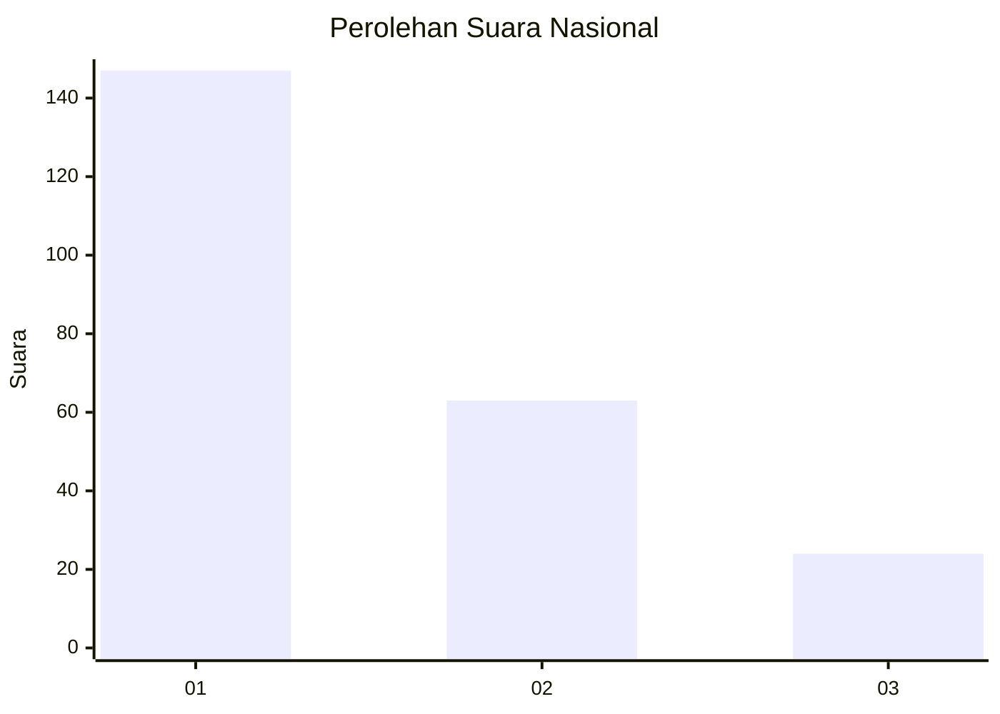
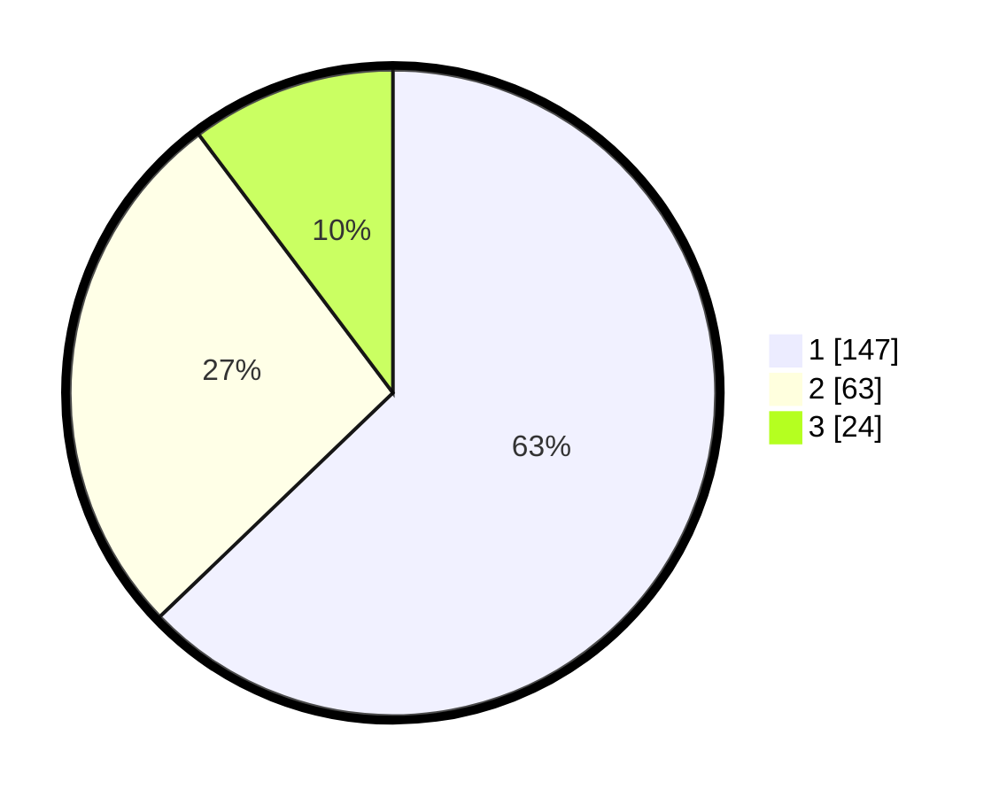

# Hasil

## Grafik

## Tabel

| No.    | Nama Paslon    | Suara | Suara (raw) | Persentase |
|:------ |:-------------- | -----:| -----------:| ----------:|
| 100025 | ANIES MUHAIMIN | 147   | [147][p-1]  | 62,82      |
| 100026 | PRABOWO GIBRAN | 63    | [63][p-2]   | 26,92      |
| 100027 | GANJAR MAHFUD  | 24    | [24][p-3]   | 10,26      |

[p-1]: https://github.com/gigit-pemilu/pemilu-2024/blob/main/pilpres/hitung-suara/sub/31-dki-jakarta/sub/75-jakarta-timur/sub/04-kramatjati/sub/1005-balekambang/sub/073-tps/sub/paslon-1.txt
[p-2]: https://github.com/gigit-pemilu/pemilu-2024/blob/main/pilpres/hitung-suara/sub/31-dki-jakarta/sub/75-jakarta-timur/sub/04-kramatjati/sub/1005-balekambang/sub/073-tps/sub/paslon-2.txt
[p-3]: https://github.com/gigit-pemilu/pemilu-2024/blob/main/pilpres/hitung-suara/sub/31-dki-jakarta/sub/75-jakarta-timur/sub/04-kramatjati/sub/1005-balekambang/sub/073-tps/sub/paslon-3.txt

## Foto C Plano

https://sirekap-obj-formc.kpu.go.id/cb4f/pemilu/ppwp/31/75/04/10/05/3175041005073-20240218-194813--f578a4fb-fb97-449c-b61e-07fbf8f686a2.jpg

https://sirekap-obj-formc.kpu.go.id/cb4f/pemilu/ppwp/31/75/04/10/05/3175041005073-20240215-010602--f1d598ad-cc77-4ffd-abb7-f48fb1ee9737.jpg

https://sirekap-obj-formc.kpu.go.id/cb4f/pemilu/ppwp/31/75/04/10/05/3175041005073-20240215-010625--8c57e1b4-62c3-4b3f-9d91-87ae903ab811.jpg

## Metadata

| Key        | Value               |
| ---------- | ------------------- |
| Time Stamp | 2024-02-19 06:16:00 |

