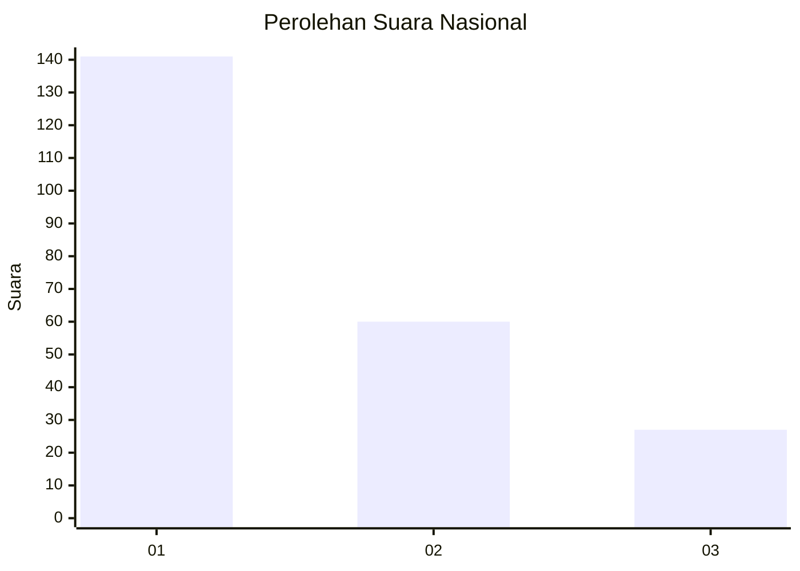
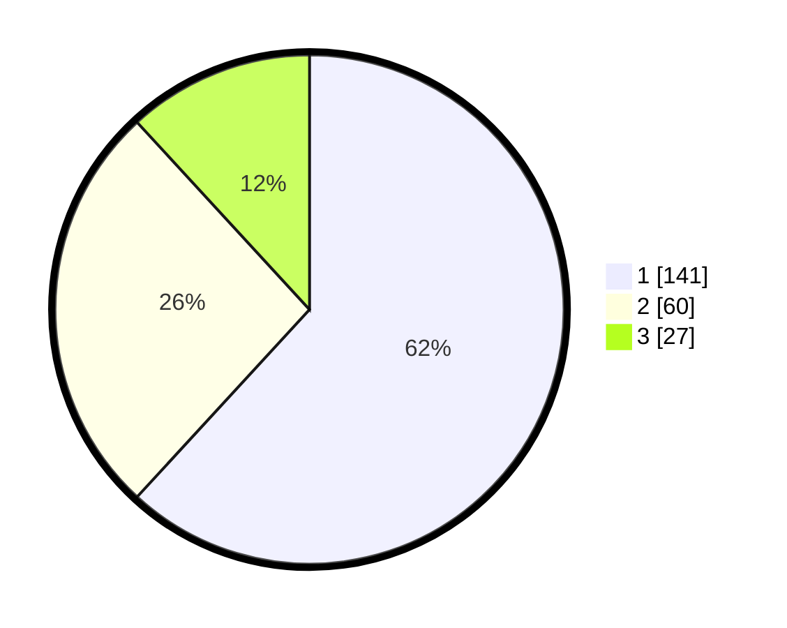

# Hasil

## Grafik

## Tabel

| No.    | Nama Paslon    | Suara | Suara (raw) | Persentase |
|:------ |:-------------- | -----:| -----------:| ----------:|
| 100025 | ANIES MUHAIMIN | 141   | [141][p-1]  | 61,84      |
| 100026 | PRABOWO GIBRAN | 60    | [60][p-2]   | 26,32      |
| 100027 | GANJAR MAHFUD  | 27    | [27][p-3]   | 11,84      |

[p-1]: https://github.com/gigit-pemilu/pemilu-2024/blob/main/pilpres/hitung-suara/sub/31-dki-jakarta/sub/75-jakarta-timur/sub/04-kramatjati/sub/1005-balekambang/sub/074-tps/sub/paslon-1.txt
[p-2]: https://github.com/gigit-pemilu/pemilu-2024/blob/main/pilpres/hitung-suara/sub/31-dki-jakarta/sub/75-jakarta-timur/sub/04-kramatjati/sub/1005-balekambang/sub/074-tps/sub/paslon-2.txt
[p-3]: https://github.com/gigit-pemilu/pemilu-2024/blob/main/pilpres/hitung-suara/sub/31-dki-jakarta/sub/75-jakarta-timur/sub/04-kramatjati/sub/1005-balekambang/sub/074-tps/sub/paslon-3.txt

## Foto C Plano

https://sirekap-obj-formc.kpu.go.id/cff6/pemilu/ppwp/31/75/04/10/05/3175041005074-20240214-194527--cae49924-5ed5-442a-8285-c2170240974b.jpg

https://sirekap-obj-formc.kpu.go.id/cff6/pemilu/ppwp/31/75/04/10/05/3175041005074-20240214-194624--e7237bbf-c8cf-4136-8233-b36453614539.jpg

https://sirekap-obj-formc.kpu.go.id/cff6/pemilu/ppwp/31/75/04/10/05/3175041005074-20240214-194712--98ae6751-43f4-48dd-bfb6-404ca091fce6.jpg

## Metadata

| Key        | Value               |
| ---------- | ------------------- |
| Time Stamp | 2024-02-15 17:00:25 |

