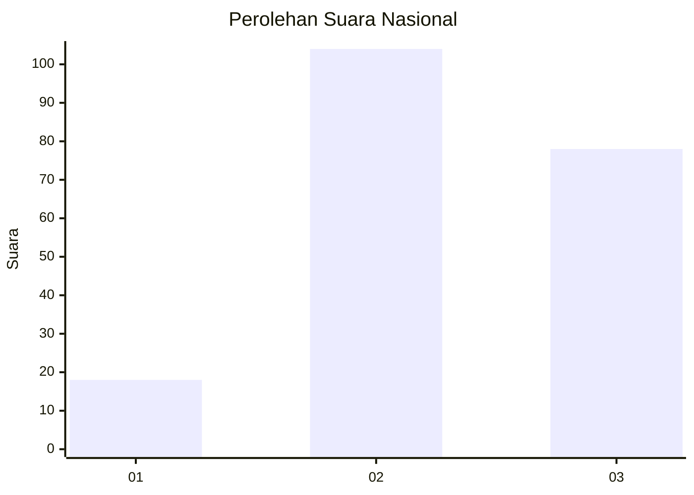
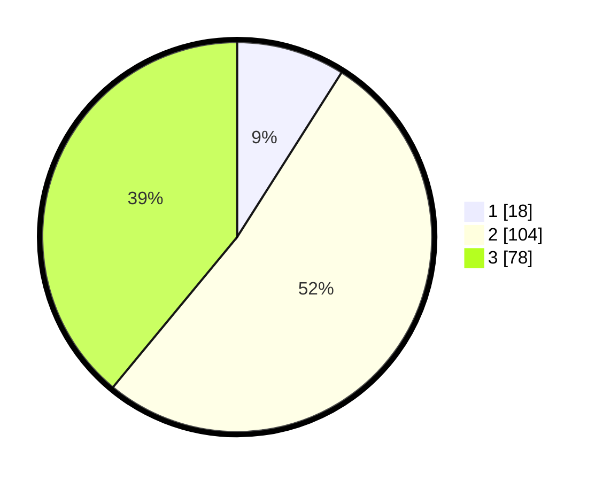

# Hasil

## Grafik

## Tabel

| No.    | Nama Paslon    | Suara | Suara (raw) | Persentase |
|:------ |:-------------- | -----:| -----------:| ----------:|
| 100025 | ANIES MUHAIMIN | 18    | [18][p-1]   | 9,00       |
| 100026 | PRABOWO GIBRAN | 104   | [104][p-2]  | 52,00      |
| 100027 | GANJAR MAHFUD  | 78    | [78][p-3]   | 39,00      |

[p-1]: https://github.com/gigit-pemilu/pemilu-2024/blob/main/pilpres/hitung-suara/sub/31-dki-jakarta/sub/75-jakarta-timur/sub/04-kramatjati/sub/1006-cililitan/sub/006-tps/sub/paslon-1.txt
[p-2]: https://github.com/gigit-pemilu/pemilu-2024/blob/main/pilpres/hitung-suara/sub/31-dki-jakarta/sub/75-jakarta-timur/sub/04-kramatjati/sub/1006-cililitan/sub/006-tps/sub/paslon-2.txt
[p-3]: https://github.com/gigit-pemilu/pemilu-2024/blob/main/pilpres/hitung-suara/sub/31-dki-jakarta/sub/75-jakarta-timur/sub/04-kramatjati/sub/1006-cililitan/sub/006-tps/sub/paslon-3.txt

## Foto C Plano

https://sirekap-obj-formc.kpu.go.id/62d8/pemilu/ppwp/31/75/04/10/06/3175041006006-20240214-205941--11e27a1c-b551-4210-bb0f-a8ac822cb773.jpg

https://sirekap-obj-formc.kpu.go.id/62d8/pemilu/ppwp/31/75/04/10/06/3175041006006-20240216-162146--db8f7c4b-0398-4007-a219-b0b85932fcfe.jpg

https://sirekap-obj-formc.kpu.go.id/62d8/pemilu/ppwp/31/75/04/10/06/3175041006006-20240216-162326--d005104e-8a94-40da-ba94-2bb23499747f.jpg

## Metadata

| Key        | Value               |
| ---------- | ------------------- |
| Time Stamp | 2024-02-19 11:00:00 |

