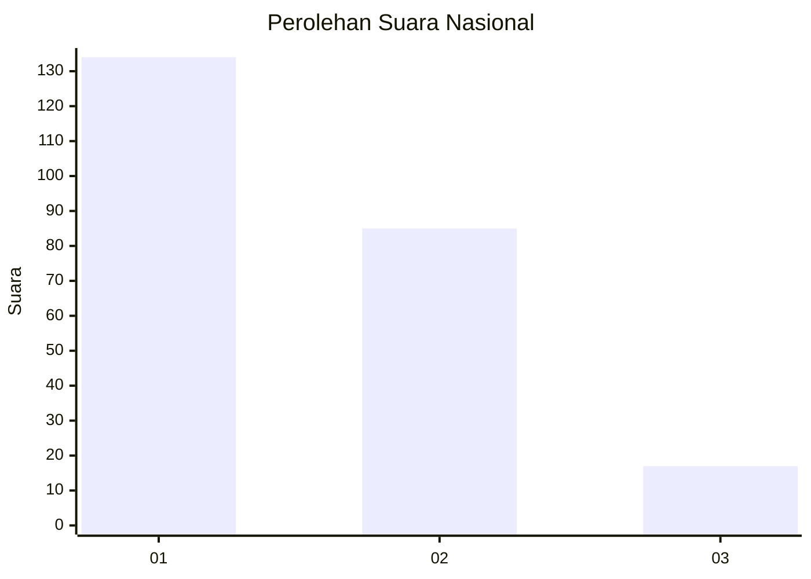
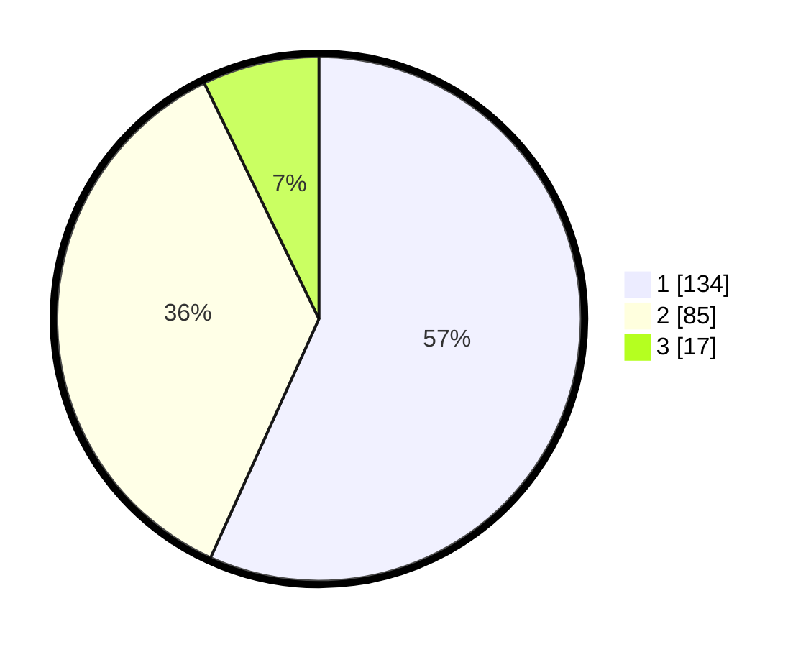

# Hasil

## Grafik

## Tabel

| No.    | Nama Paslon    | Suara | Suara (raw) | Persentase |
|:------ |:-------------- | -----:| -----------:| ----------:|
| 100025 | ANIES MUHAIMIN | 134   | [134][p-1]  | 56,78      |
| 100026 | PRABOWO GIBRAN | 85    | [85][p-2]   | 36,02      |
| 100027 | GANJAR MAHFUD  | 17    | [17][p-3]   | 7,20       |

[p-1]: https://github.com/gigit-pemilu/pemilu-2024/blob/main/pilpres/hitung-suara/sub/31-dki-jakarta/sub/75-jakarta-timur/sub/04-kramatjati/sub/1006-cililitan/sub/008-tps/sub/paslon-1.txt
[p-2]: https://github.com/gigit-pemilu/pemilu-2024/blob/main/pilpres/hitung-suara/sub/31-dki-jakarta/sub/75-jakarta-timur/sub/04-kramatjati/sub/1006-cililitan/sub/008-tps/sub/paslon-2.txt
[p-3]: https://github.com/gigit-pemilu/pemilu-2024/blob/main/pilpres/hitung-suara/sub/31-dki-jakarta/sub/75-jakarta-timur/sub/04-kramatjati/sub/1006-cililitan/sub/008-tps/sub/paslon-3.txt

## Foto C Plano

https://sirekap-obj-formc.kpu.go.id/8a3c/pemilu/ppwp/31/75/04/10/06/3175041006008-20240215-010927--da525f8b-2682-468a-8c01-3d386c603157.jpg

https://sirekap-obj-formc.kpu.go.id/8a3c/pemilu/ppwp/31/75/04/10/06/3175041006008-20240215-022525--d347be92-971e-4b6e-864f-bbbe65fdcbcb.jpg

https://sirekap-obj-formc.kpu.go.id/8a3c/pemilu/ppwp/31/75/04/10/06/3175041006008-20240215-022528--5d2d555d-a801-44fa-b2db-67d1490c8189.jpg

## Metadata

| Key        | Value               |
| ---------- | ------------------- |
| Time Stamp | 2024-02-15 15:00:29 |

