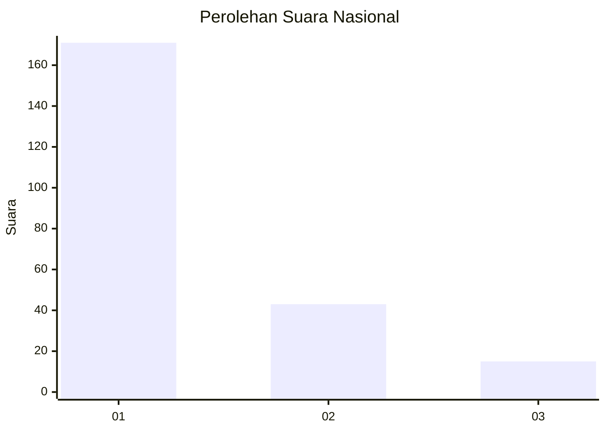
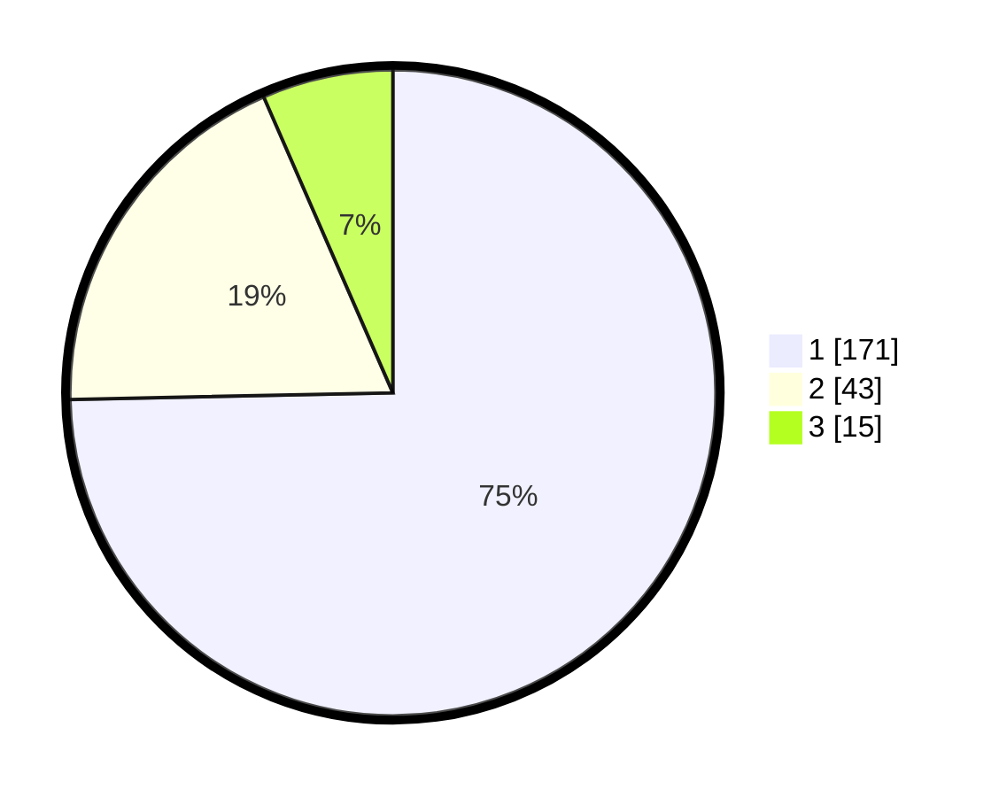

# Hasil

## Grafik

## Tabel

| No.    | Nama Paslon    | Suara | Suara (raw) | Persentase |
|:------ |:-------------- | -----:| -----------:| ----------:|
| 100025 | ANIES MUHAIMIN | 171   | [171][p-1]  | 74,67      |
| 100026 | PRABOWO GIBRAN | 43    | [43][p-2]   | 18,78      |
| 100027 | GANJAR MAHFUD  | 15    | [15][p-3]   | 6,55       |

[p-1]: https://github.com/gigit-pemilu/pemilu-2024/blob/main/pilpres/hitung-suara/sub/31-dki-jakarta/sub/75-jakarta-timur/sub/04-kramatjati/sub/1006-cililitan/sub/035-tps/sub/paslon-1.txt
[p-2]: https://github.com/gigit-pemilu/pemilu-2024/blob/main/pilpres/hitung-suara/sub/31-dki-jakarta/sub/75-jakarta-timur/sub/04-kramatjati/sub/1006-cililitan/sub/035-tps/sub/paslon-2.txt
[p-3]: https://github.com/gigit-pemilu/pemilu-2024/blob/main/pilpres/hitung-suara/sub/31-dki-jakarta/sub/75-jakarta-timur/sub/04-kramatjati/sub/1006-cililitan/sub/035-tps/sub/paslon-3.txt

## Foto C Plano

https://sirekap-obj-formc.kpu.go.id/cb1f/pemilu/ppwp/31/75/04/10/06/3175041006035-20240214-220750--0de36781-adb7-47a5-a19e-d13a13733a36.jpg

https://sirekap-obj-formc.kpu.go.id/cb1f/pemilu/ppwp/31/75/04/10/06/3175041006035-20240214-220926--c903f241-fb18-4e5a-862a-e295cc138939.jpg

https://sirekap-obj-formc.kpu.go.id/cb1f/pemilu/ppwp/31/75/04/10/06/3175041006035-20240214-221043--082accf6-fd22-45b2-a92c-2aee3ea8568d.jpg

## Metadata

| Key        | Value               |
| ---------- | ------------------- |
| Time Stamp | 2024-02-15 18:00:26 |

