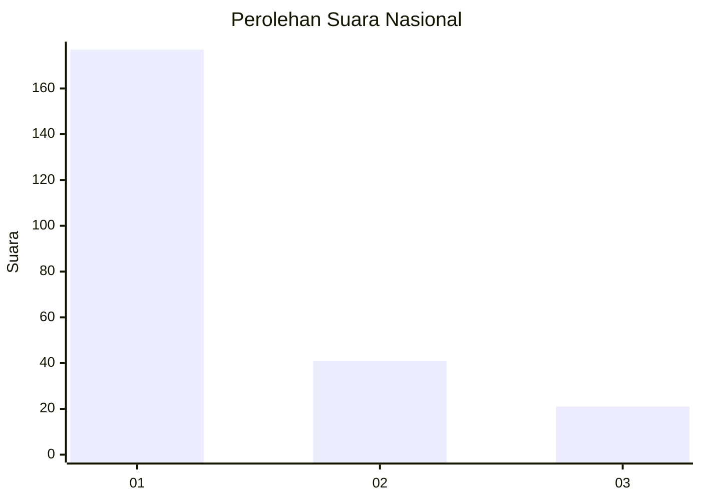
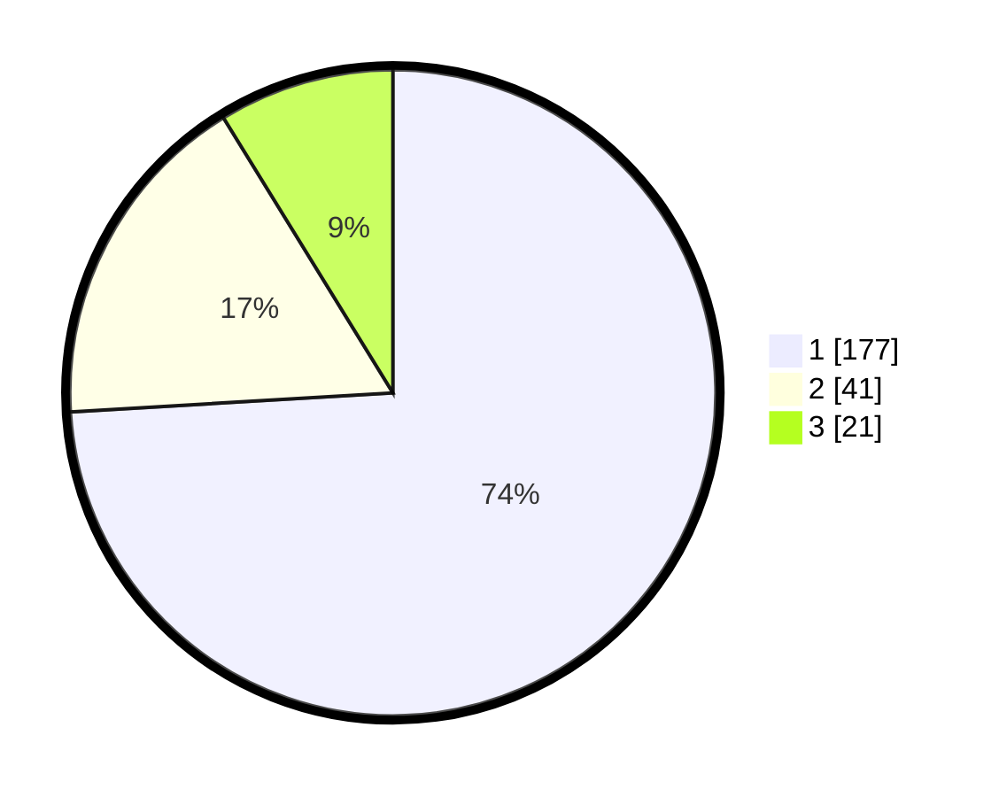

# Hasil

## Grafik

## Tabel

| No. | Nama Paslon    | Suara | Suara (raw) | Persentase |
|:--- |:-------------- | -----:| -----------:| ----------:|
| 1   | ANIES MUHAIMIN | 177   | [177][p-1]  | 74,06      |
| 2   | PRABOWO GIBRAN | 41    | [41][p-2]   | 17,15      |
| 3   | GANJAR MAHFUD  | 21    | [21][p-3]   | 8,79       |

[p-1]: https://github.com/gigit-pemilu/pemilu-2024/blob/main/pilpres/hitung-suara/sub/31-dki-jakarta/sub/75-jakarta-timur/sub/04-kramatjati/sub/1006-cililitan/sub/043-tps/sub/paslon-1.txt
[p-2]: https://github.com/gigit-pemilu/pemilu-2024/blob/main/pilpres/hitung-suara/sub/31-dki-jakarta/sub/75-jakarta-timur/sub/04-kramatjati/sub/1006-cililitan/sub/043-tps/sub/paslon-2.txt
[p-3]: https://github.com/gigit-pemilu/pemilu-2024/blob/main/pilpres/hitung-suara/sub/31-dki-jakarta/sub/75-jakarta-timur/sub/04-kramatjati/sub/1006-cililitan/sub/043-tps/sub/paslon-3.txt

## Foto C Plano

https://sirekap-obj-formc.kpu.go.id/6adb/pemilu/ppwp/31/75/04/10/06/3175041006043-20240214-225751--e1d93dac-876a-41ea-88cf-a9a5d79a07d9.jpg

https://sirekap-obj-formc.kpu.go.id/6adb/pemilu/ppwp/31/75/04/10/06/3175041006043-20240215-002245--8881ba57-60be-4122-a7e9-6f630793972d.jpg

https://sirekap-obj-formc.kpu.go.id/6adb/pemilu/ppwp/31/75/04/10/06/3175041006043-20240215-002318--5477a323-c5ee-486c-9d18-852d815540ff.jpg

## Metadata

| Key        | Value               |
| ---------- | ------------------- |
| Time Stamp | 2024-02-15 18:00:26 |

