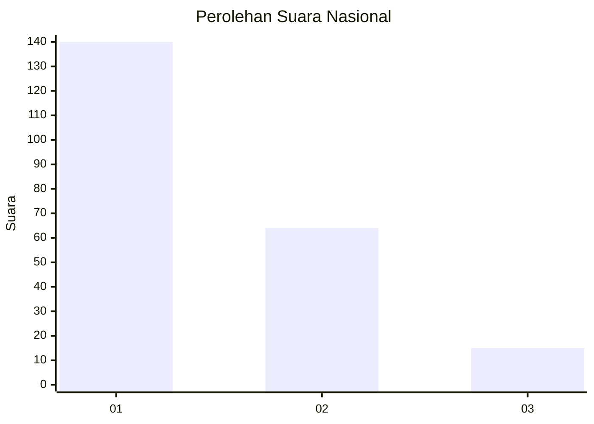
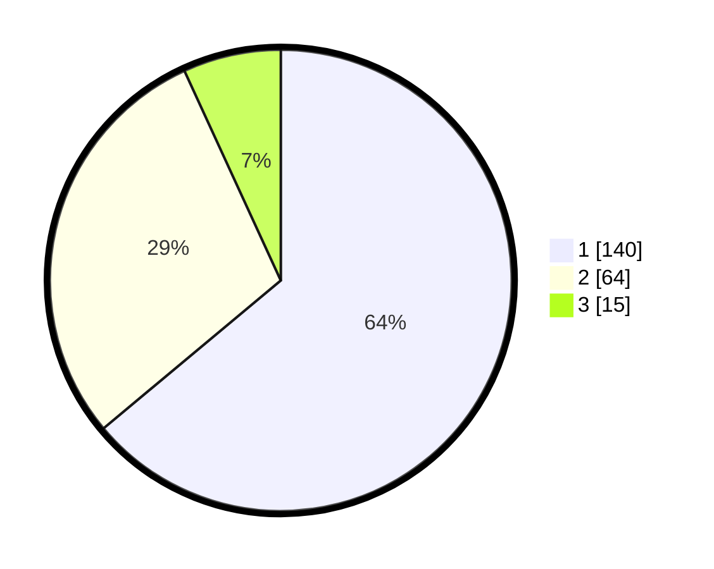

# Hasil

## Grafik

## Tabel

| No.    | Nama Paslon    | Suara | Suara (raw) | Persentase |
|:------ |:-------------- | -----:| -----------:| ----------:|
| 100025 | ANIES MUHAIMIN | 140   | [140][p-1]  | 63,93      |
| 100026 | PRABOWO GIBRAN | 64    | [64][p-2]   | 29,22      |
| 100027 | GANJAR MAHFUD  | 15    | [15][p-3]   | 6,85       |

[p-1]: https://github.com/gigit-pemilu/pemilu-2024/blob/main/pilpres/hitung-suara/sub/31-dki-jakarta/sub/75-jakarta-timur/sub/04-kramatjati/sub/1006-cililitan/sub/062-tps/sub/paslon-1.txt
[p-2]: https://github.com/gigit-pemilu/pemilu-2024/blob/main/pilpres/hitung-suara/sub/31-dki-jakarta/sub/75-jakarta-timur/sub/04-kramatjati/sub/1006-cililitan/sub/062-tps/sub/paslon-2.txt
[p-3]: https://github.com/gigit-pemilu/pemilu-2024/blob/main/pilpres/hitung-suara/sub/31-dki-jakarta/sub/75-jakarta-timur/sub/04-kramatjati/sub/1006-cililitan/sub/062-tps/sub/paslon-3.txt

## Foto C Plano

https://sirekap-obj-formc.kpu.go.id/3d5b/pemilu/ppwp/31/75/04/10/06/3175041006062-20240214-212742--2c0a6d6b-da67-48c5-b265-5a92c6871702.jpg

https://sirekap-obj-formc.kpu.go.id/3d5b/pemilu/ppwp/31/75/04/10/06/3175041006062-20240215-000649--e3ed41ef-e330-435e-8344-ebbe758b95e9.jpg

https://sirekap-obj-formc.kpu.go.id/3d5b/pemilu/ppwp/31/75/04/10/06/3175041006062-20240214-213037--6e4e3540-1a47-401e-989c-bb1ecf3bafc2.jpg

## Metadata

| Key        | Value               |
| ---------- | ------------------- |
| Time Stamp | 2024-02-15 15:00:29 |

