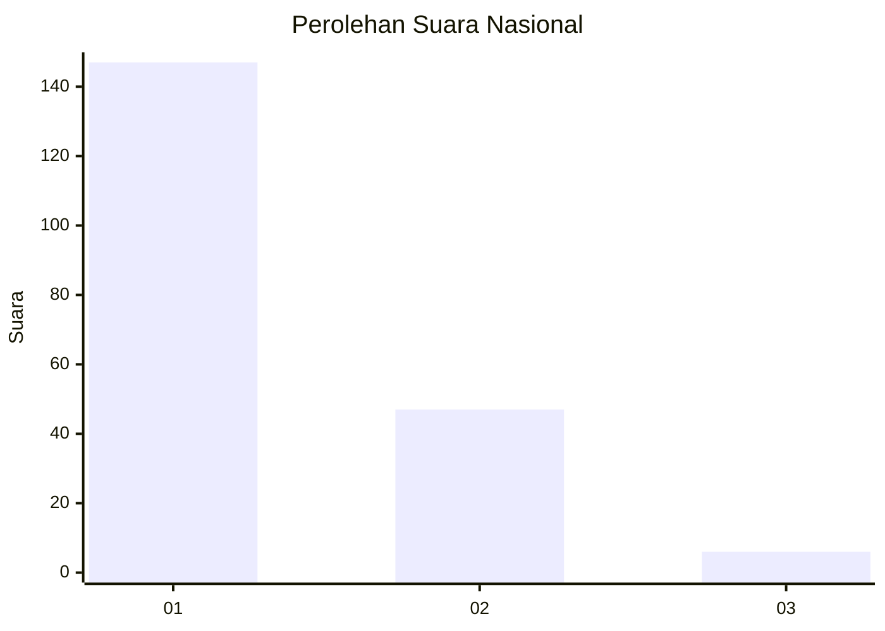
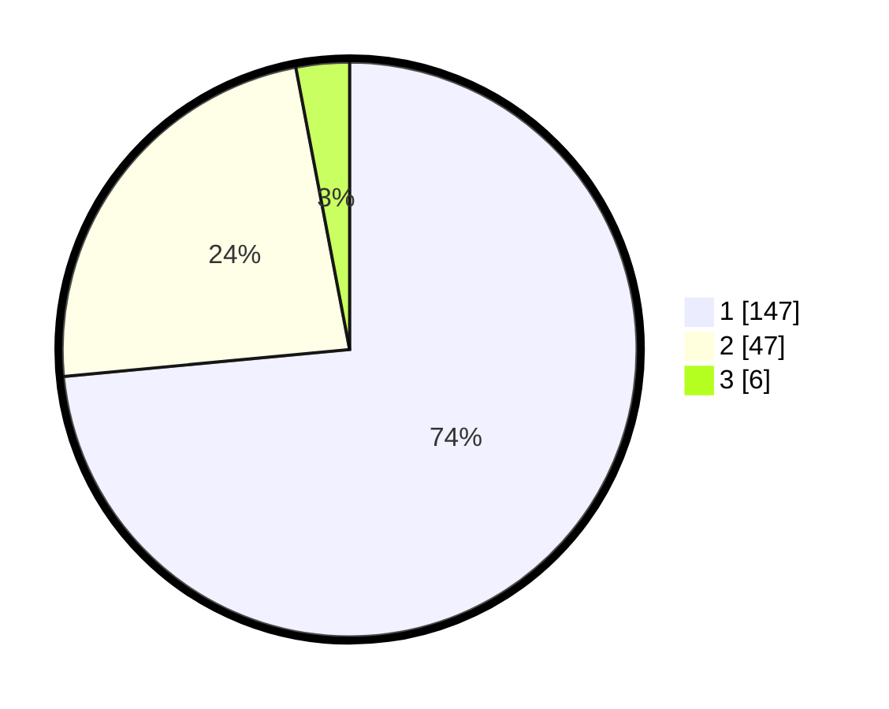

# Hasil

## Grafik

## Tabel

| No.    | Nama Paslon    | Suara | Suara (raw) | Persentase |
|:------ |:-------------- | -----:| -----------:| ----------:|
| 100025 | ANIES MUHAIMIN | 147   | [147][p-1]  | 73,50      |
| 100026 | PRABOWO GIBRAN | 47    | [47][p-2]   | 23,50      |
| 100027 | GANJAR MAHFUD  | 6     | [6][p-3]    | 3,00       |

[p-1]: https://github.com/gigit-pemilu/pemilu-2024/blob/main/pilpres/hitung-suara/sub/31-dki-jakarta/sub/75-jakarta-timur/sub/04-kramatjati/sub/1006-cililitan/sub/063-tps/sub/paslon-1.txt
[p-2]: https://github.com/gigit-pemilu/pemilu-2024/blob/main/pilpres/hitung-suara/sub/31-dki-jakarta/sub/75-jakarta-timur/sub/04-kramatjati/sub/1006-cililitan/sub/063-tps/sub/paslon-2.txt
[p-3]: https://github.com/gigit-pemilu/pemilu-2024/blob/main/pilpres/hitung-suara/sub/31-dki-jakarta/sub/75-jakarta-timur/sub/04-kramatjati/sub/1006-cililitan/sub/063-tps/sub/paslon-3.txt

## Foto C Plano

https://sirekap-obj-formc.kpu.go.id/ffd4/pemilu/ppwp/31/75/04/10/06/3175041006063-20240214-155214--2b138a19-20a9-4c22-aa30-4c538e562c22.jpg

https://sirekap-obj-formc.kpu.go.id/ffd4/pemilu/ppwp/31/75/04/10/06/3175041006063-20240214-155544--56dffefd-35d4-4a96-ab5c-d1426738d391.jpg

https://sirekap-obj-formc.kpu.go.id/ffd4/pemilu/ppwp/31/75/04/10/06/3175041006063-20240214-155920--b7a4eafa-43ff-464d-8e58-cd879e3e2617.jpg

## Metadata

| Key        | Value               |
| ---------- | ------------------- |
| Time Stamp | 2024-02-15 18:00:26 |

