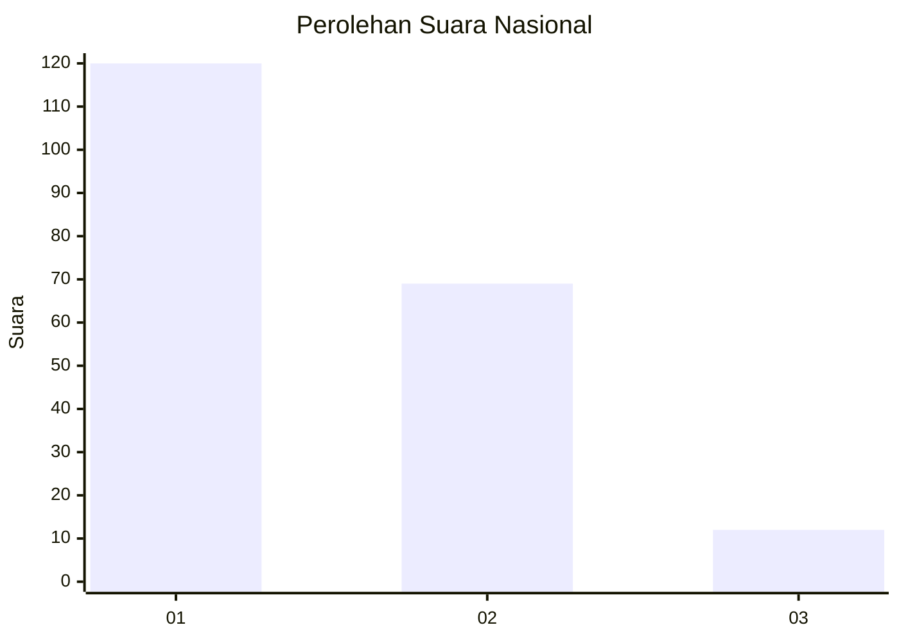
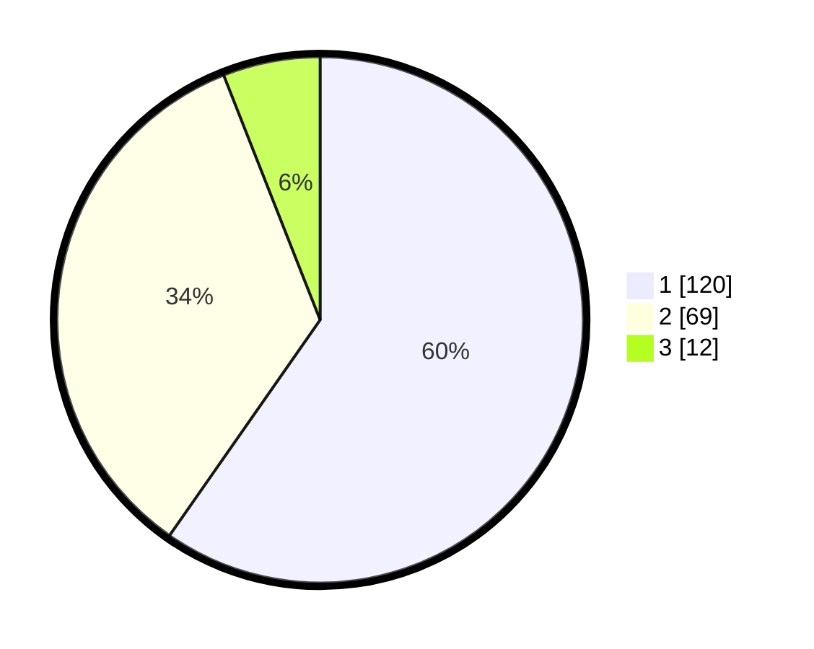

# Hasil

## Grafik

## Tabel

| No.    | Nama Paslon    | Suara | Suara (raw) | Persentase |
|:------ |:-------------- | -----:| -----------:| ----------:|
| 100025 | ANIES MUHAIMIN | 120   | [120][p-1]  | 59,70      |
| 100026 | PRABOWO GIBRAN | 69    | [69][p-2]   | 34,33      |
| 100027 | GANJAR MAHFUD  | 12    | [12][p-3]   | 5,97       |

[p-1]: https://github.com/gigit-pemilu/pemilu-2024/blob/main/pilpres/hitung-suara/sub/31-dki-jakarta/sub/75-jakarta-timur/sub/04-kramatjati/sub/1006-cililitan/sub/064-tps/sub/paslon-1.txt
[p-2]: https://github.com/gigit-pemilu/pemilu-2024/blob/main/pilpres/hitung-suara/sub/31-dki-jakarta/sub/75-jakarta-timur/sub/04-kramatjati/sub/1006-cililitan/sub/064-tps/sub/paslon-2.txt
[p-3]: https://github.com/gigit-pemilu/pemilu-2024/blob/main/pilpres/hitung-suara/sub/31-dki-jakarta/sub/75-jakarta-timur/sub/04-kramatjati/sub/1006-cililitan/sub/064-tps/sub/paslon-3.txt

## Foto C Plano

https://sirekap-obj-formc.kpu.go.id/dcc1/pemilu/ppwp/31/75/04/10/06/3175041006064-20240215-190649--7782892b-3a8a-4898-a2ca-cc363608feba.jpg

https://sirekap-obj-formc.kpu.go.id/dcc1/pemilu/ppwp/31/75/04/10/06/3175041006064-20240215-132306--43f7ce6b-341f-406a-be46-92bbe2392362.jpg

https://sirekap-obj-formc.kpu.go.id/dcc1/pemilu/ppwp/31/75/04/10/06/3175041006064-20240215-132114--aa22e0be-eb96-4e96-8a02-805545b0e940.jpg

## Metadata

| Key        | Value               |
| ---------- | ------------------- |
| Time Stamp | 2024-02-15 19:30:26 |

