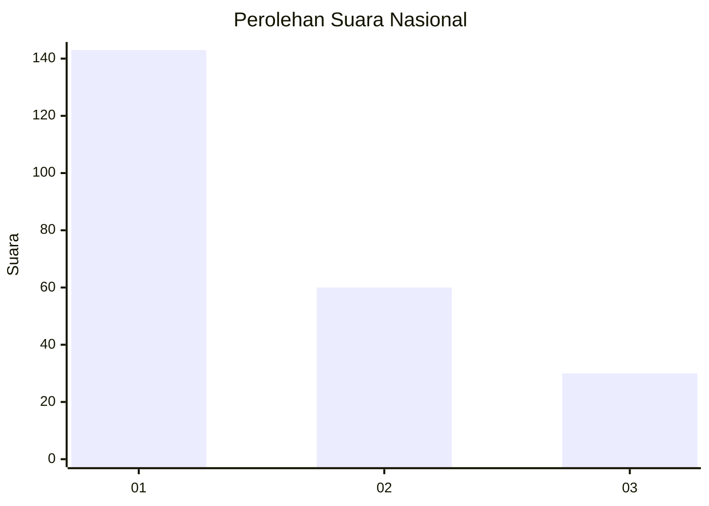
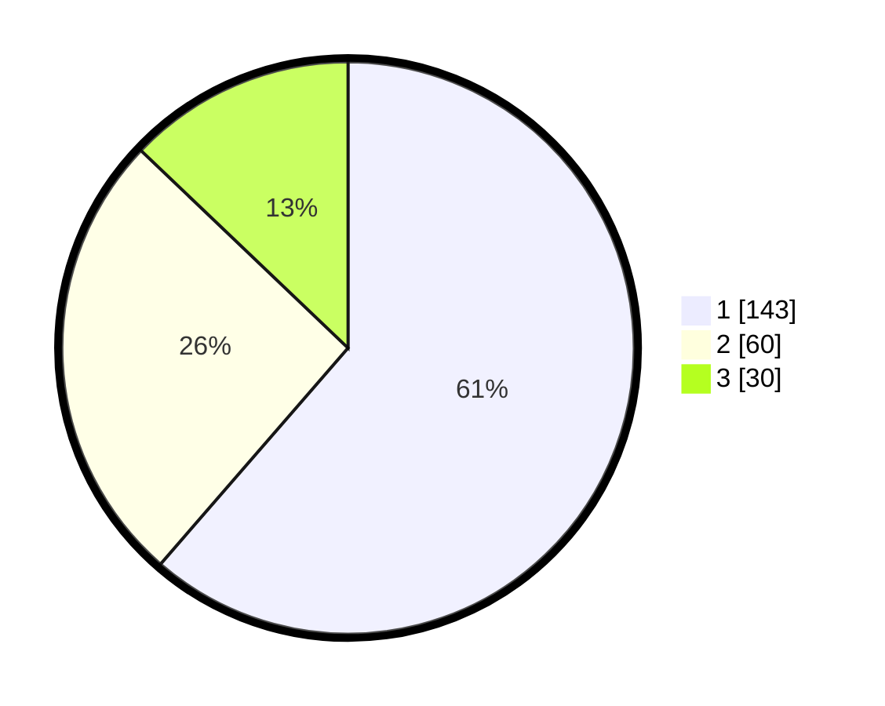

# Hasil

## Grafik

## Tabel

| No. | Nama Paslon    | Suara | Suara (raw) | Persentase |
|:--- |:-------------- | -----:| -----------:| ----------:|
| 1   | ANIES MUHAIMIN | 143   | [143][p-1]  | 61,37      |
| 2   | PRABOWO GIBRAN | 60    | [60][p-2]   | 25,75      |
| 3   | GANJAR MAHFUD  | 30    | [30][p-3]   | 12,88      |

[p-1]: https://github.com/gigit-pemilu/pemilu-2024/blob/main/pilpres/hitung-suara/sub/31-dki-jakarta/sub/75-jakarta-timur/sub/04-kramatjati/sub/1006-cililitan/sub/072-tps/sub/paslon-1.txt
[p-2]: https://github.com/gigit-pemilu/pemilu-2024/blob/main/pilpres/hitung-suara/sub/31-dki-jakarta/sub/75-jakarta-timur/sub/04-kramatjati/sub/1006-cililitan/sub/072-tps/sub/paslon-2.txt
[p-3]: https://github.com/gigit-pemilu/pemilu-2024/blob/main/pilpres/hitung-suara/sub/31-dki-jakarta/sub/75-jakarta-timur/sub/04-kramatjati/sub/1006-cililitan/sub/072-tps/sub/paslon-3.txt

## Foto C Plano

https://sirekap-obj-formc.kpu.go.id/55e8/pemilu/ppwp/31/75/04/10/06/3175041006072-20240214-231421--224cc6e1-65f1-4a63-ac0b-373b8815e912.jpg

https://sirekap-obj-formc.kpu.go.id/55e8/pemilu/ppwp/31/75/04/10/06/3175041006072-20240214-231441--7d5dedec-8805-48a2-b55a-969b846a078c.jpg

https://sirekap-obj-formc.kpu.go.id/55e8/pemilu/ppwp/31/75/04/10/06/3175041006072-20240214-231528--9054f86a-45d5-4626-ba60-27e283dfb886.jpg

## Metadata

| Key        | Value               |
| ---------- | ------------------- |
| Time Stamp | 2024-02-15 15:00:29 |

