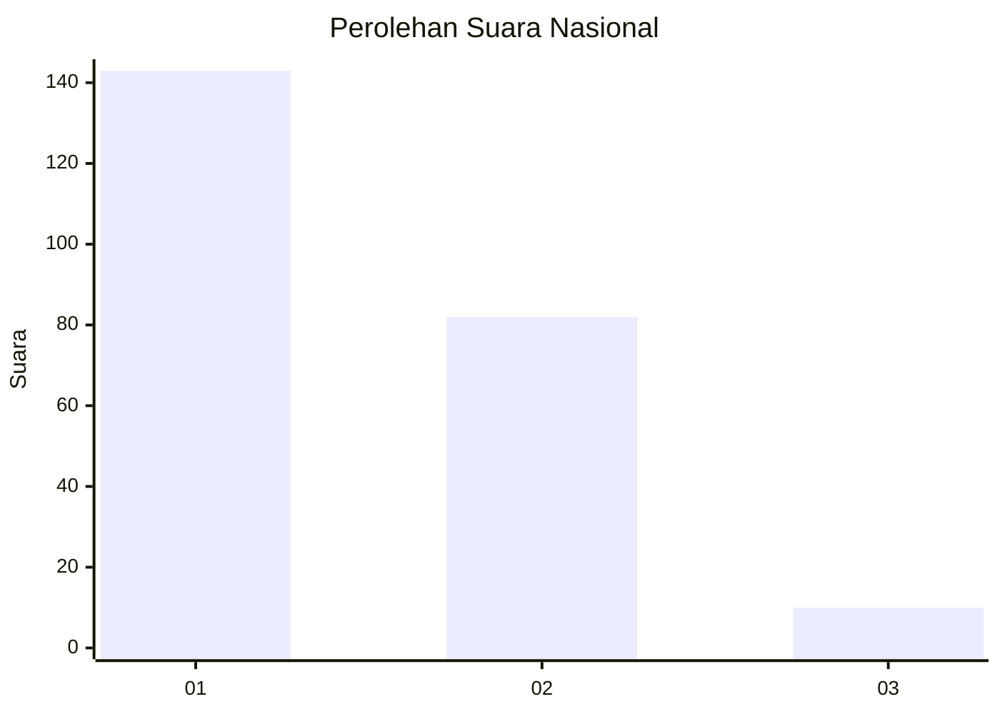
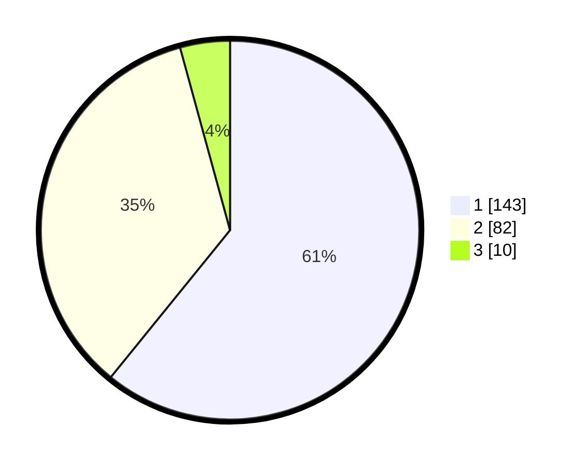

# Hasil

## Grafik

## Tabel

| No.    | Nama Paslon    | Suara | Suara (raw) | Persentase |
|:------ |:-------------- | -----:| -----------:| ----------:|
| 100025 | ANIES MUHAIMIN | 143   | [143][p-1]  | 60,85      |
| 100026 | PRABOWO GIBRAN | 82    | [82][p-2]   | 34,89      |
| 100027 | GANJAR MAHFUD  | 10    | [10][p-3]   | 4,26       |

[p-1]: https://github.com/gigit-pemilu/pemilu-2024/blob/main/pilpres/hitung-suara/sub/31-dki-jakarta/sub/75-jakarta-timur/sub/04-kramatjati/sub/1006-cililitan/sub/115-tps/sub/paslon-1.txt
[p-2]: https://github.com/gigit-pemilu/pemilu-2024/blob/main/pilpres/hitung-suara/sub/31-dki-jakarta/sub/75-jakarta-timur/sub/04-kramatjati/sub/1006-cililitan/sub/115-tps/sub/paslon-2.txt
[p-3]: https://github.com/gigit-pemilu/pemilu-2024/blob/main/pilpres/hitung-suara/sub/31-dki-jakarta/sub/75-jakarta-timur/sub/04-kramatjati/sub/1006-cililitan/sub/115-tps/sub/paslon-3.txt

## Foto C Plano

https://sirekap-obj-formc.kpu.go.id/22c9/pemilu/ppwp/31/75/04/10/06/3175041006115-20240214-193628--5446e547-4933-4cdb-9a84-99f401458e64.jpg

https://sirekap-obj-formc.kpu.go.id/22c9/pemilu/ppwp/31/75/04/10/06/3175041006115-20240214-191223--f8831a89-9aab-4cdb-85f0-9a57bc4fdb09.jpg

https://sirekap-obj-formc.kpu.go.id/22c9/pemilu/ppwp/31/75/04/10/06/3175041006115-20240214-193517--629c9d2a-7ced-4049-846f-ebafa2441199.jpg

## Metadata

| Key        | Value               |
| ---------- | ------------------- |
| Time Stamp | 2024-02-15 12:00:28 |

