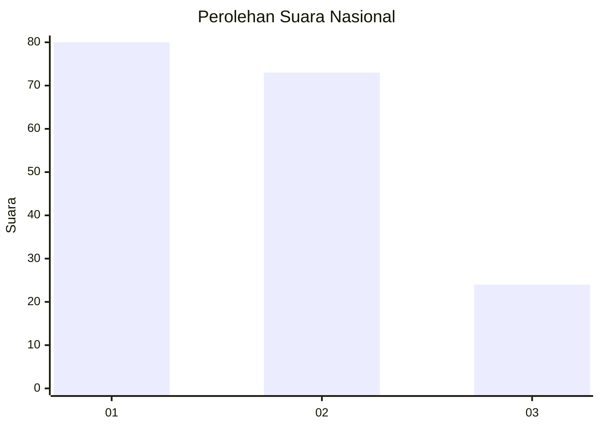
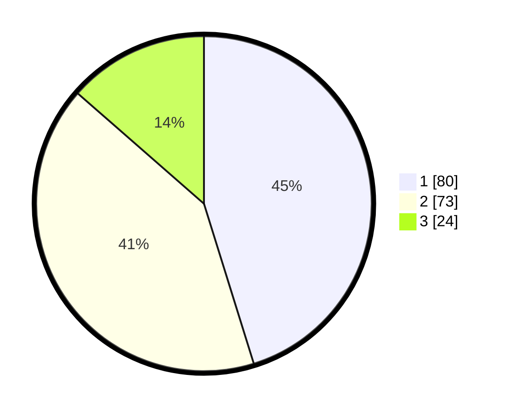

# Hasil

## Grafik

## Tabel

| No.    | Nama Paslon    | Suara | Suara (raw) | Persentase |
|:------ |:-------------- | -----:| -----------:| ----------:|
| 100025 | ANIES MUHAIMIN | 80    | [80][p-1]   | 45,20      |
| 100026 | PRABOWO GIBRAN | 73    | [73][p-2]   | 41,24      |
| 100027 | GANJAR MAHFUD  | 24    | [24][p-3]   | 13,56      |

[p-1]: https://github.com/gigit-pemilu/pemilu-2024/blob/main/pilpres/hitung-suara/sub/31-dki-jakarta/sub/75-jakarta-timur/sub/04-kramatjati/sub/1007-cawang/sub/005-tps/sub/paslon-1.txt
[p-2]: https://github.com/gigit-pemilu/pemilu-2024/blob/main/pilpres/hitung-suara/sub/31-dki-jakarta/sub/75-jakarta-timur/sub/04-kramatjati/sub/1007-cawang/sub/005-tps/sub/paslon-2.txt
[p-3]: https://github.com/gigit-pemilu/pemilu-2024/blob/main/pilpres/hitung-suara/sub/31-dki-jakarta/sub/75-jakarta-timur/sub/04-kramatjati/sub/1007-cawang/sub/005-tps/sub/paslon-3.txt

## Foto C Plano

https://sirekap-obj-formc.kpu.go.id/b9dc/pemilu/ppwp/31/75/04/10/07/3175041007005-20240219-121550--a049bda5-4ec3-458c-b396-35227d167a0c.jpg

https://sirekap-obj-formc.kpu.go.id/b9dc/pemilu/ppwp/31/75/04/10/07/3175041007005-20240219-121701--ed8e913e-bd3a-48dd-b3ff-d281a728739b.jpg

https://sirekap-obj-formc.kpu.go.id/b9dc/pemilu/ppwp/31/75/04/10/07/3175041007005-20240219-122003--aba23c5f-52c7-4bd4-9d54-d77b9ce57d75.jpg

## Metadata

| Key        | Value               |
| ---------- | ------------------- |
| Time Stamp | 2024-02-24 22:31:28 |

