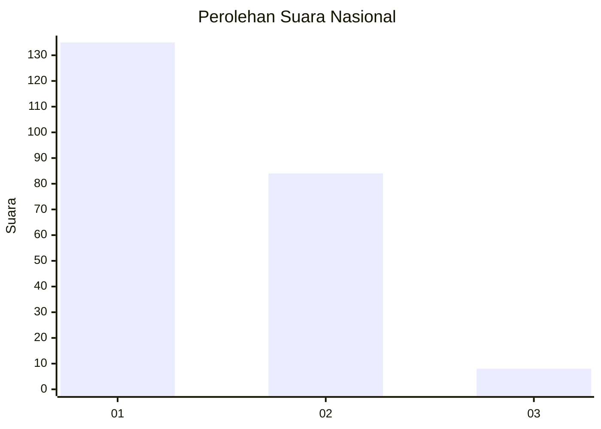
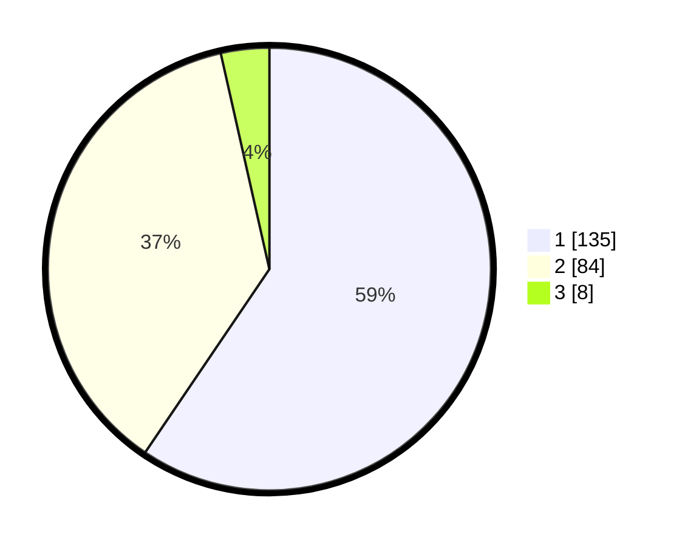

# Hasil

## Grafik

## Tabel

| No.    | Nama Paslon    | Suara | Suara (raw) | Persentase |
|:------ |:-------------- | -----:| -----------:| ----------:|
| 100025 | ANIES MUHAIMIN | 135   | [135][p-1]  | 59,47      |
| 100026 | PRABOWO GIBRAN | 84    | [84][p-2]   | 37,00      |
| 100027 | GANJAR MAHFUD  | 8     | [8][p-3]    | 3,52       |

[p-1]: https://github.com/gigit-pemilu/pemilu-2024/blob/main/pilpres/hitung-suara/sub/31-dki-jakarta/sub/75-jakarta-timur/sub/04-kramatjati/sub/1007-cawang/sub/006-tps/sub/paslon-1.txt
[p-2]: https://github.com/gigit-pemilu/pemilu-2024/blob/main/pilpres/hitung-suara/sub/31-dki-jakarta/sub/75-jakarta-timur/sub/04-kramatjati/sub/1007-cawang/sub/006-tps/sub/paslon-2.txt
[p-3]: https://github.com/gigit-pemilu/pemilu-2024/blob/main/pilpres/hitung-suara/sub/31-dki-jakarta/sub/75-jakarta-timur/sub/04-kramatjati/sub/1007-cawang/sub/006-tps/sub/paslon-3.txt

## Foto C Plano

https://sirekap-obj-formc.kpu.go.id/8470/pemilu/ppwp/31/75/04/10/07/3175041007006-20240215-171518--c76b8f03-b3e1-40e0-a18c-1c08585912fe.jpg

https://sirekap-obj-formc.kpu.go.id/8470/pemilu/ppwp/31/75/04/10/07/3175041007006-20240219-201424--2c54e29b-61d5-463a-99a9-e781b24dfcfd.jpg

https://sirekap-obj-formc.kpu.go.id/8470/pemilu/ppwp/31/75/04/10/07/3175041007006-20240219-133951--68f8c84a-b308-4bba-8027-e90fa3b1c9a8.jpg

## Metadata

| Key        | Value               |
| ---------- | ------------------- |
| Time Stamp | 2024-02-25 15:00:00 |

