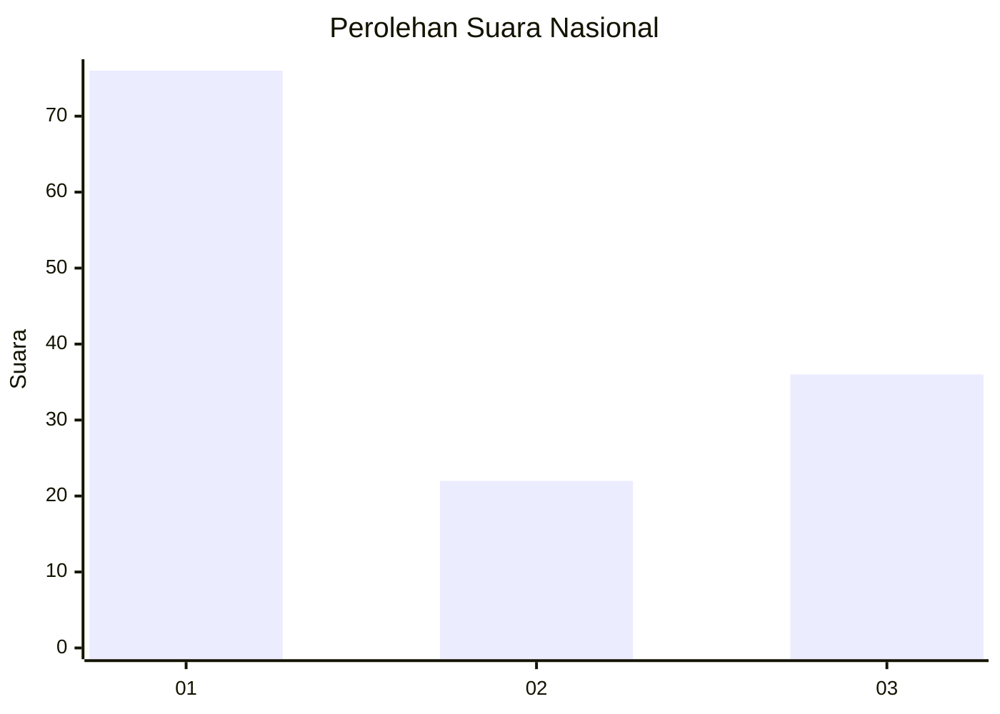
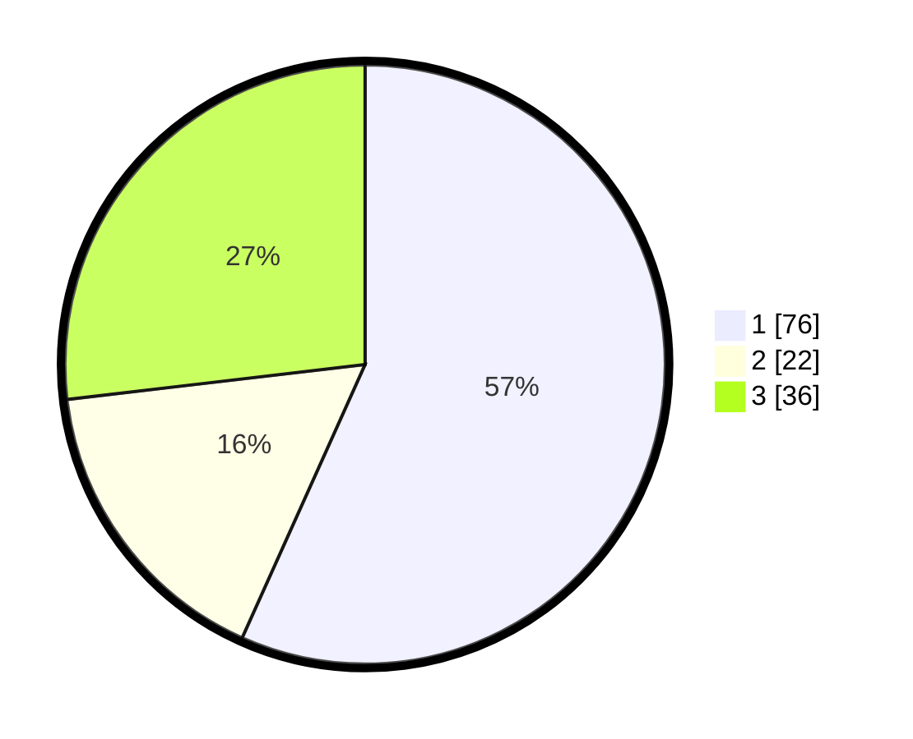

# Hasil

## Grafik

## Tabel

| No. | Nama Paslon    | Suara | Suara (raw) | Persentase |
|:--- |:-------------- | -----:| -----------:| ----------:|
| 1   | ANIES MUHAIMIN | 76    | [76][p-1]   | 56,72      |
| 2   | PRABOWO GIBRAN | 22    | [22][p-2]   | 16,42      |
| 3   | GANJAR MAHFUD  | 36    | [36][p-3]   | 26,87      |

[p-1]: https://github.com/gigit-pemilu/pemilu-2024/blob/main/pilpres/hitung-suara/sub/31-dki-jakarta/sub/75-jakarta-timur/sub/04-kramatjati/sub/1007-cawang/sub/029-tps/sub/paslon-1.txt
[p-2]: https://github.com/gigit-pemilu/pemilu-2024/blob/main/pilpres/hitung-suara/sub/31-dki-jakarta/sub/75-jakarta-timur/sub/04-kramatjati/sub/1007-cawang/sub/029-tps/sub/paslon-2.txt
[p-3]: https://github.com/gigit-pemilu/pemilu-2024/blob/main/pilpres/hitung-suara/sub/31-dki-jakarta/sub/75-jakarta-timur/sub/04-kramatjati/sub/1007-cawang/sub/029-tps/sub/paslon-3.txt

## Foto C Plano

https://sirekap-obj-formc.kpu.go.id/b9dc/pemilu/ppwp/31/75/04/10/07/3175041007029-20240218-222113--6db2f28b-5dad-4291-a28a-e5f3b6e8aa7e.jpg

https://sirekap-obj-formc.kpu.go.id/b9dc/pemilu/ppwp/31/75/04/10/07/3175041007029-20240219-142638--32df3b25-1a3c-45b9-9541-40f938154a41.jpg

https://sirekap-obj-formc.kpu.go.id/b9dc/pemilu/ppwp/31/75/04/10/07/3175041007029-20240219-143416--4d1baf44-9f60-4587-9780-a73e8edf5be3.jpg

## Metadata

| Key        | Value               |
| ---------- | ------------------- |
| Time Stamp | 2024-02-24 22:31:28 |

