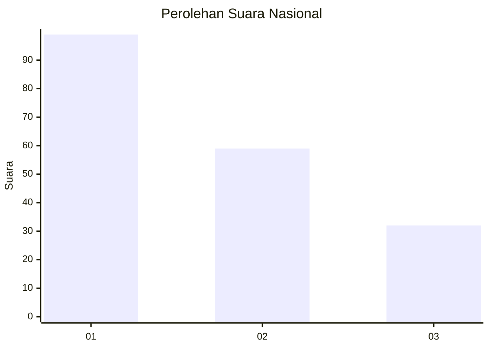
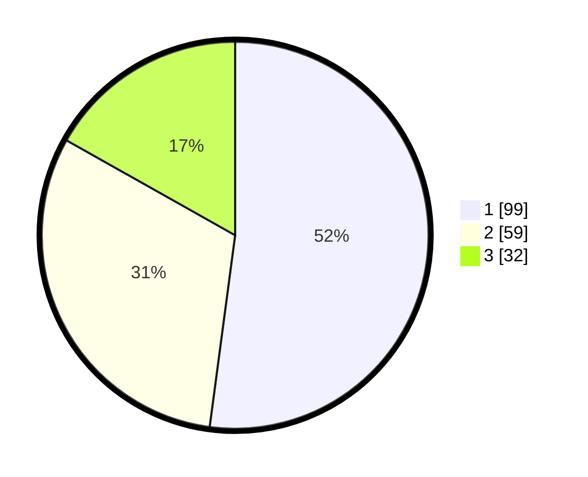

# Hasil

## Grafik

## Tabel

| No.    | Nama Paslon    | Suara | Suara (raw) | Persentase |
|:------ |:-------------- | -----:| -----------:| ----------:|
| 100025 | ANIES MUHAIMIN | 99    | [99][p-1]   | 52,11      |
| 100026 | PRABOWO GIBRAN | 59    | [59][p-2]   | 31,05      |
| 100027 | GANJAR MAHFUD  | 32    | [32][p-3]   | 16,84      |

[p-1]: https://github.com/gigit-pemilu/pemilu-2024/blob/main/pilpres/hitung-suara/sub/31-dki-jakarta/sub/75-jakarta-timur/sub/04-kramatjati/sub/1007-cawang/sub/033-tps/sub/paslon-1.txt
[p-2]: https://github.com/gigit-pemilu/pemilu-2024/blob/main/pilpres/hitung-suara/sub/31-dki-jakarta/sub/75-jakarta-timur/sub/04-kramatjati/sub/1007-cawang/sub/033-tps/sub/paslon-2.txt
[p-3]: https://github.com/gigit-pemilu/pemilu-2024/blob/main/pilpres/hitung-suara/sub/31-dki-jakarta/sub/75-jakarta-timur/sub/04-kramatjati/sub/1007-cawang/sub/033-tps/sub/paslon-3.txt

## Foto C Plano

https://sirekap-obj-formc.kpu.go.id/4016/pemilu/ppwp/31/75/04/10/07/3175041007033-20240214-224653--b1f7302e-20ed-41ae-81a4-82a854b7d0a4.jpg

https://sirekap-obj-formc.kpu.go.id/4016/pemilu/ppwp/31/75/04/10/07/3175041007033-20240214-224759--4bdd3aa0-35b3-446f-8fd7-8b0cb109b893.jpg

https://sirekap-obj-formc.kpu.go.id/4016/pemilu/ppwp/31/75/04/10/07/3175041007033-20240214-224845--1ef57507-5886-48c1-afc3-bbb879c5f110.jpg

## Metadata

| Key        | Value               |
| ---------- | ------------------- |
| Time Stamp | 2024-02-15 18:30:25 |

