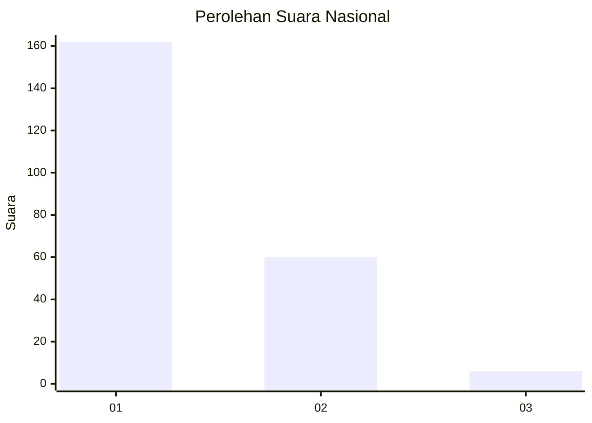
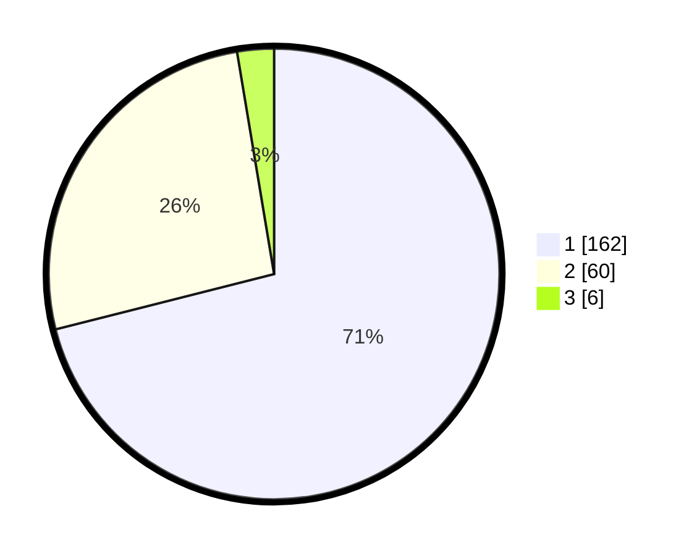

# Hasil

## Grafik

## Tabel

| No.    | Nama Paslon    | Suara | Suara (raw) | Persentase |
|:------ |:-------------- | -----:| -----------:| ----------:|
| 100025 | ANIES MUHAIMIN | 162   | [162][p-1]  | 71,05      |
| 100026 | PRABOWO GIBRAN | 60    | [60][p-2]   | 26,32      |
| 100027 | GANJAR MAHFUD  | 6     | [6][p-3]    | 2,63       |

[p-1]: https://github.com/gigit-pemilu/pemilu-2024/blob/main/pilpres/hitung-suara/sub/31-dki-jakarta/sub/75-jakarta-timur/sub/04-kramatjati/sub/1007-cawang/sub/038-tps/sub/paslon-1.txt
[p-2]: https://github.com/gigit-pemilu/pemilu-2024/blob/main/pilpres/hitung-suara/sub/31-dki-jakarta/sub/75-jakarta-timur/sub/04-kramatjati/sub/1007-cawang/sub/038-tps/sub/paslon-2.txt
[p-3]: https://github.com/gigit-pemilu/pemilu-2024/blob/main/pilpres/hitung-suara/sub/31-dki-jakarta/sub/75-jakarta-timur/sub/04-kramatjati/sub/1007-cawang/sub/038-tps/sub/paslon-3.txt

## Foto C Plano

https://sirekap-obj-formc.kpu.go.id/8c9d/pemilu/ppwp/31/75/04/10/07/3175041007038-20240215-000221--780020ea-6398-4da8-8034-1798060b656f.jpg

https://sirekap-obj-formc.kpu.go.id/8c9d/pemilu/ppwp/31/75/04/10/07/3175041007038-20240215-000206--66c28b24-3e3a-4db4-ab53-d90457069e00.jpg

https://sirekap-obj-formc.kpu.go.id/8c9d/pemilu/ppwp/31/75/04/10/07/3175041007038-20240215-000352--109e07f4-d54d-4f6c-b106-6393f3bfaa43.jpg

## Metadata

| Key        | Value               |
| ---------- | ------------------- |
| Time Stamp | 2024-02-15 18:30:25 |

