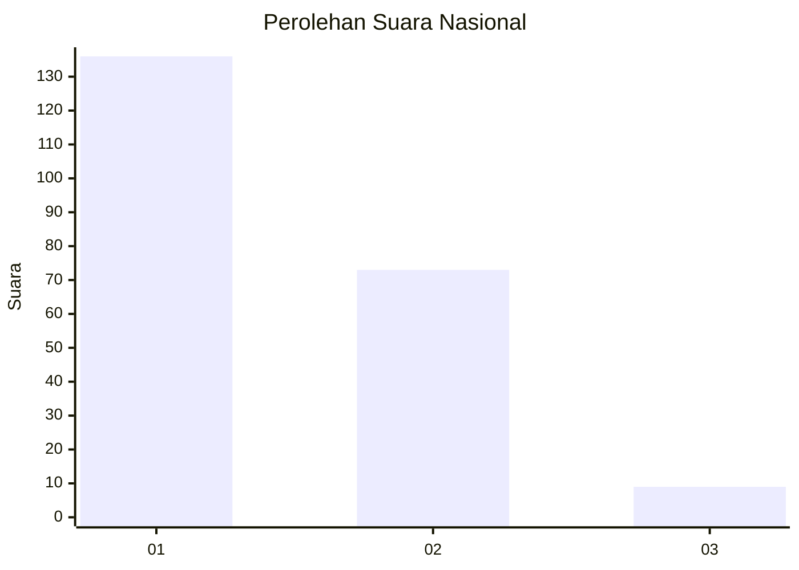
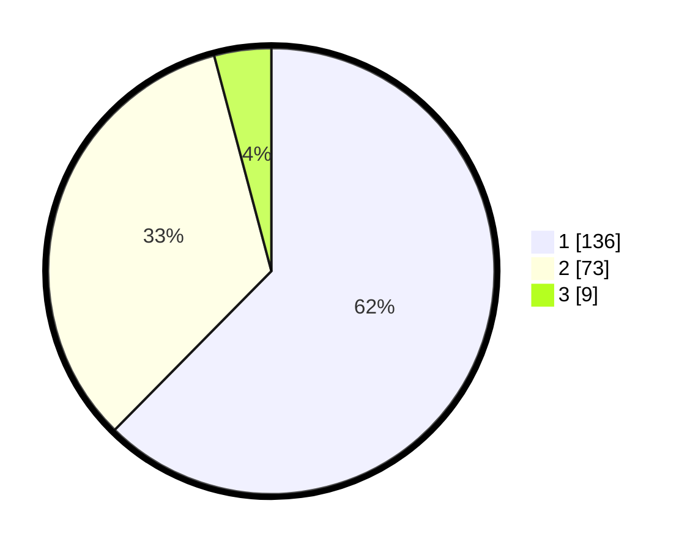

# Hasil

## Grafik

## Tabel

| No.    | Nama Paslon    | Suara | Suara (raw) | Persentase |
|:------ |:-------------- | -----:| -----------:| ----------:|
| 100025 | ANIES MUHAIMIN | 136   | [136][p-1]  | 62,39      |
| 100026 | PRABOWO GIBRAN | 73    | [73][p-2]   | 33,49      |
| 100027 | GANJAR MAHFUD  | 9     | [9][p-3]    | 4,13       |

[p-1]: https://github.com/gigit-pemilu/pemilu-2024/blob/main/pilpres/hitung-suara/sub/31-dki-jakarta/sub/75-jakarta-timur/sub/04-kramatjati/sub/1007-cawang/sub/040-tps/sub/paslon-1.txt
[p-2]: https://github.com/gigit-pemilu/pemilu-2024/blob/main/pilpres/hitung-suara/sub/31-dki-jakarta/sub/75-jakarta-timur/sub/04-kramatjati/sub/1007-cawang/sub/040-tps/sub/paslon-2.txt
[p-3]: https://github.com/gigit-pemilu/pemilu-2024/blob/main/pilpres/hitung-suara/sub/31-dki-jakarta/sub/75-jakarta-timur/sub/04-kramatjati/sub/1007-cawang/sub/040-tps/sub/paslon-3.txt

## Foto C Plano

https://sirekap-obj-formc.kpu.go.id/eadb/pemilu/ppwp/31/75/04/10/07/3175041007040-20240214-235621--c34614e1-a46b-4ee4-ae59-6516a4d51969.jpg

https://sirekap-obj-formc.kpu.go.id/eadb/pemilu/ppwp/31/75/04/10/07/3175041007040-20240214-235754--2ddbb656-1e2f-47f0-8174-f3deaf8642db.jpg

https://sirekap-obj-formc.kpu.go.id/eadb/pemilu/ppwp/31/75/04/10/07/3175041007040-20240214-235857--7a87b687-a95a-4ff4-aed6-eb74fbf07a19.jpg

## Metadata

| Key        | Value               |
| ---------- | ------------------- |
| Time Stamp | 2024-02-25 14:00:00 |

