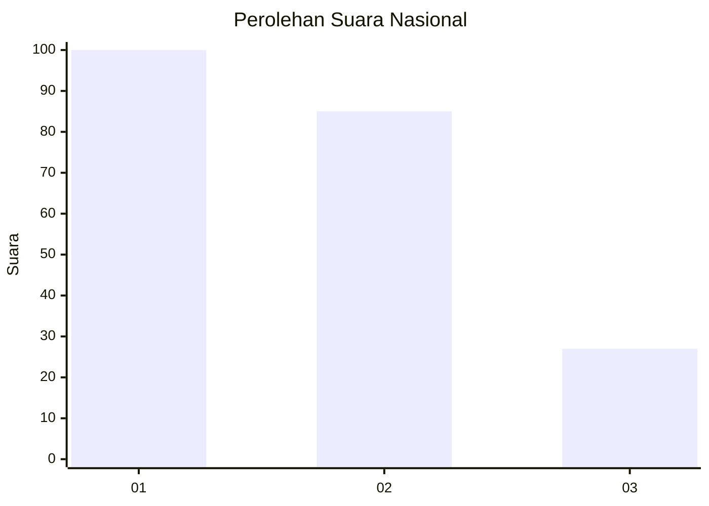
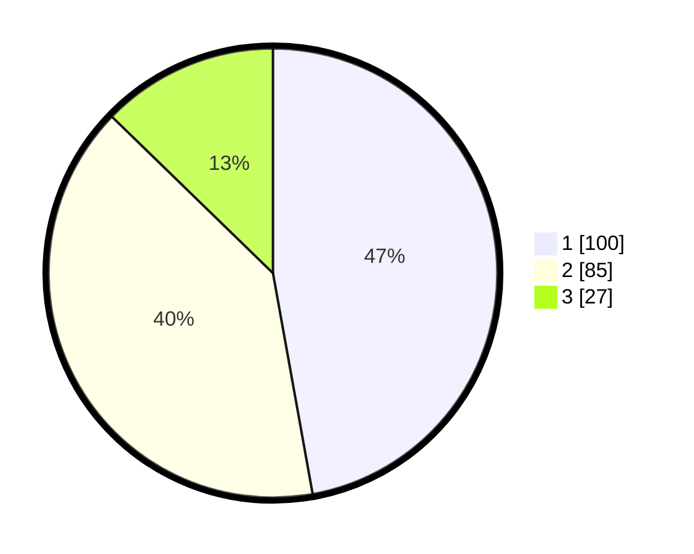

# Hasil

## Grafik

## Tabel

| No.    | Nama Paslon    | Suara | Suara (raw) | Persentase |
|:------ |:-------------- | -----:| -----------:| ----------:|
| 100025 | ANIES MUHAIMIN | 100   | [100][p-1]  | 47,17      |
| 100026 | PRABOWO GIBRAN | 85    | [85][p-2]   | 40,09      |
| 100027 | GANJAR MAHFUD  | 27    | [27][p-3]   | 12,74      |

[p-1]: https://github.com/gigit-pemilu/pemilu-2024/blob/main/pilpres/hitung-suara/sub/31-dki-jakarta/sub/75-jakarta-timur/sub/04-kramatjati/sub/1007-cawang/sub/046-tps/sub/paslon-1.txt
[p-2]: https://github.com/gigit-pemilu/pemilu-2024/blob/main/pilpres/hitung-suara/sub/31-dki-jakarta/sub/75-jakarta-timur/sub/04-kramatjati/sub/1007-cawang/sub/046-tps/sub/paslon-2.txt
[p-3]: https://github.com/gigit-pemilu/pemilu-2024/blob/main/pilpres/hitung-suara/sub/31-dki-jakarta/sub/75-jakarta-timur/sub/04-kramatjati/sub/1007-cawang/sub/046-tps/sub/paslon-3.txt

## Foto C Plano

https://sirekap-obj-formc.kpu.go.id/d594/pemilu/ppwp/31/75/04/10/07/3175041007046-20240215-012220--e81b2520-9edc-499a-9597-c0dca7643765.jpg

https://sirekap-obj-formc.kpu.go.id/d594/pemilu/ppwp/31/75/04/10/07/3175041007046-20240215-011527--02c47ab9-1997-4c3a-b123-bdc0b9a10295.jpg

https://sirekap-obj-formc.kpu.go.id/d594/pemilu/ppwp/31/75/04/10/07/3175041007046-20240215-011702--5085ffca-411e-4cc0-bff9-0abfb02abd46.jpg

## Metadata

| Key        | Value               |
| ---------- | ------------------- |
| Time Stamp | 2024-02-24 22:31:28 |

