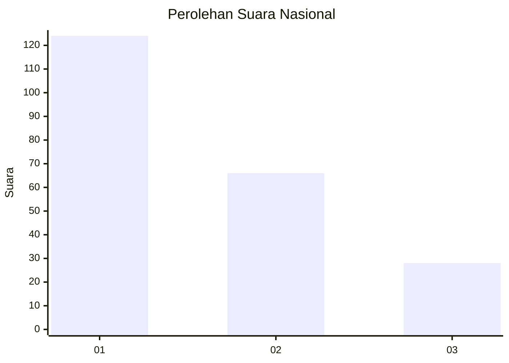
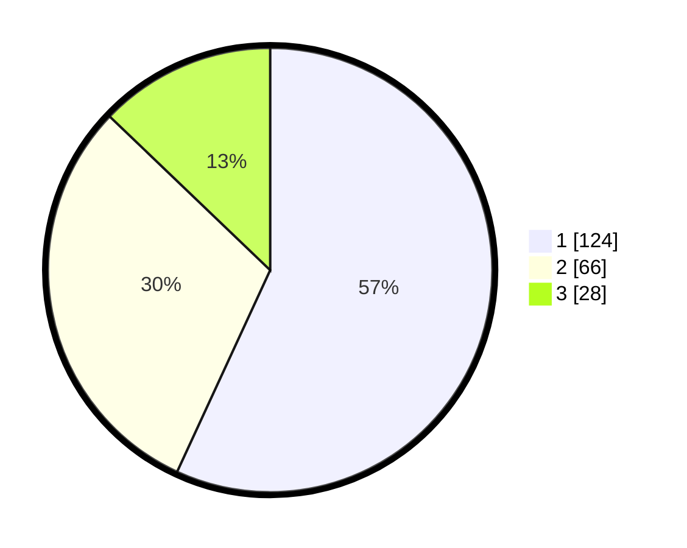

# Hasil

## Grafik

## Tabel

| No.    | Nama Paslon    | Suara | Suara (raw) | Persentase |
|:------ |:-------------- | -----:| -----------:| ----------:|
| 100025 | ANIES MUHAIMIN | 124   | [124][p-1]  | 56,88      |
| 100026 | PRABOWO GIBRAN | 66    | [66][p-2]   | 30,28      |
| 100027 | GANJAR MAHFUD  | 28    | [28][p-3]   | 12,84      |

[p-1]: https://github.com/gigit-pemilu/pemilu-2024/blob/main/pilpres/hitung-suara/sub/31-dki-jakarta/sub/75-jakarta-timur/sub/04-kramatjati/sub/1007-cawang/sub/053-tps/sub/paslon-1.txt
[p-2]: https://github.com/gigit-pemilu/pemilu-2024/blob/main/pilpres/hitung-suara/sub/31-dki-jakarta/sub/75-jakarta-timur/sub/04-kramatjati/sub/1007-cawang/sub/053-tps/sub/paslon-2.txt
[p-3]: https://github.com/gigit-pemilu/pemilu-2024/blob/main/pilpres/hitung-suara/sub/31-dki-jakarta/sub/75-jakarta-timur/sub/04-kramatjati/sub/1007-cawang/sub/053-tps/sub/paslon-3.txt

## Foto C Plano

https://sirekap-obj-formc.kpu.go.id/336d/pemilu/ppwp/31/75/04/10/07/3175041007053-20240221-201002--def2d279-5bb4-4fe8-a378-c480b113735f.jpg

https://sirekap-obj-formc.kpu.go.id/336d/pemilu/ppwp/31/75/04/10/07/3175041007053-20240221-201249--9e070bd9-8731-4061-900f-4e28ff7a5962.jpg

https://sirekap-obj-formc.kpu.go.id/336d/pemilu/ppwp/31/75/04/10/07/3175041007053-20240221-201543--5a1cead1-9881-45dc-9b12-7f519c975df9.jpg

## Metadata

| Key        | Value               |
| ---------- | ------------------- |
| Time Stamp | 2024-02-25 15:00:00 |

