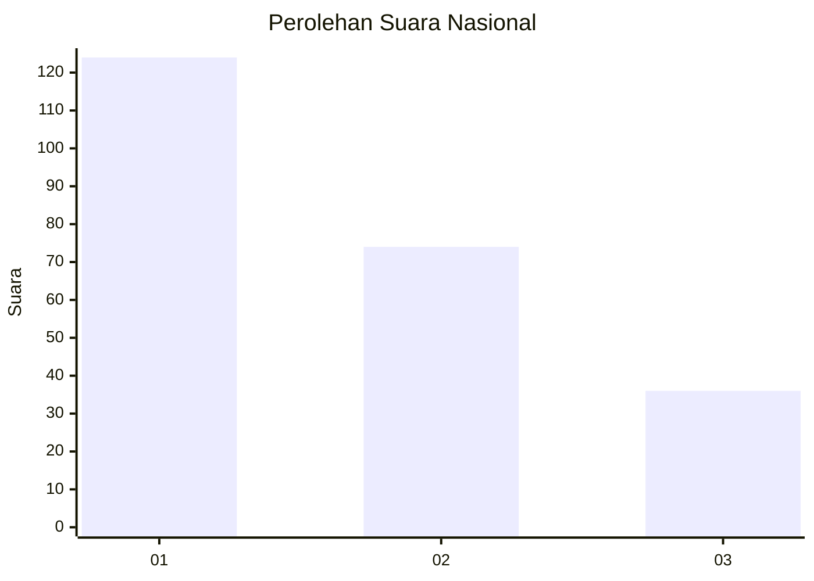
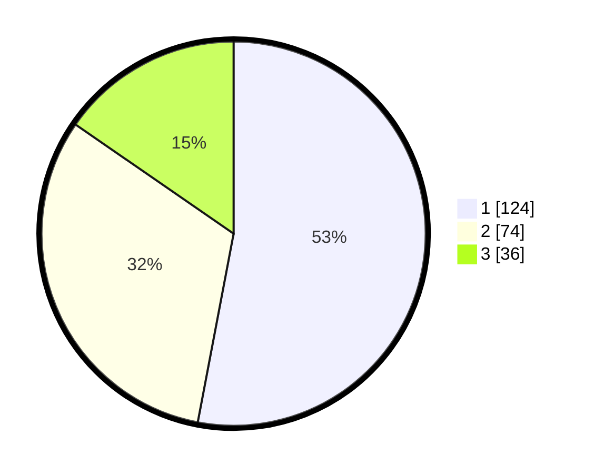

# Hasil

## Grafik

## Tabel

| No.    | Nama Paslon    | Suara | Suara (raw) | Persentase |
|:------ |:-------------- | -----:| -----------:| ----------:|
| 100025 | ANIES MUHAIMIN | 124   | [124][p-1]  | 52,99      |
| 100026 | PRABOWO GIBRAN | 74    | [74][p-2]   | 31,62      |
| 100027 | GANJAR MAHFUD  | 36    | [36][p-3]   | 15,38      |

[p-1]: https://github.com/gigit-pemilu/pemilu-2024/blob/main/pilpres/hitung-suara/sub/31-dki-jakarta/sub/75-jakarta-timur/sub/04-kramatjati/sub/1007-cawang/sub/059-tps/sub/paslon-1.txt
[p-2]: https://github.com/gigit-pemilu/pemilu-2024/blob/main/pilpres/hitung-suara/sub/31-dki-jakarta/sub/75-jakarta-timur/sub/04-kramatjati/sub/1007-cawang/sub/059-tps/sub/paslon-2.txt
[p-3]: https://github.com/gigit-pemilu/pemilu-2024/blob/main/pilpres/hitung-suara/sub/31-dki-jakarta/sub/75-jakarta-timur/sub/04-kramatjati/sub/1007-cawang/sub/059-tps/sub/paslon-3.txt

## Foto C Plano

https://sirekap-obj-formc.kpu.go.id/7e6a/pemilu/ppwp/31/75/04/10/07/3175041007059-20240214-214938--7d8f559b-1d47-43c9-b3b1-eae6bb1bcf31.jpg

https://sirekap-obj-formc.kpu.go.id/7e6a/pemilu/ppwp/31/75/04/10/07/3175041007059-20240214-215003--e6a7fb70-f854-4899-b3d5-8692e104266b.jpg

https://sirekap-obj-formc.kpu.go.id/7e6a/pemilu/ppwp/31/75/04/10/07/3175041007059-20240214-215053--0f567639-2369-4369-87a5-9ca35fd19d99.jpg

## Metadata

| Key        | Value               |
| ---------- | ------------------- |
| Time Stamp | 2024-02-24 22:31:28 |

