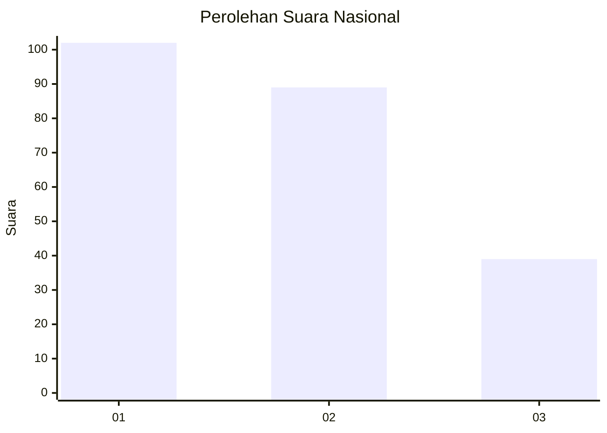
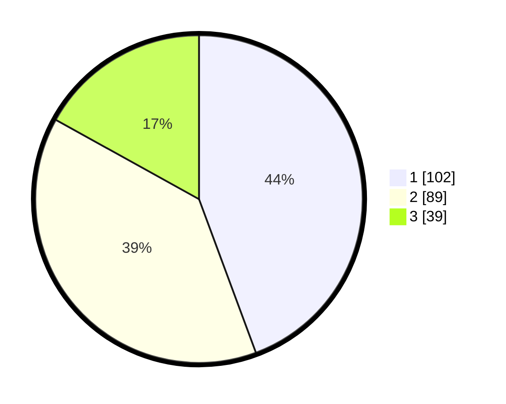

# Hasil

## Grafik

## Tabel

| No.    | Nama Paslon    | Suara | Suara (raw) | Persentase |
|:------ |:-------------- | -----:| -----------:| ----------:|
| 100025 | ANIES MUHAIMIN | 102   | [102][p-1]  | 44,35      |
| 100026 | PRABOWO GIBRAN | 89    | [89][p-2]   | 38,70      |
| 100027 | GANJAR MAHFUD  | 39    | [39][p-3]   | 16,96      |

[p-1]: https://github.com/gigit-pemilu/pemilu-2024/blob/main/pilpres/hitung-suara/sub/31-dki-jakarta/sub/75-jakarta-timur/sub/04-kramatjati/sub/1007-cawang/sub/079-tps/sub/paslon-1.txt
[p-2]: https://github.com/gigit-pemilu/pemilu-2024/blob/main/pilpres/hitung-suara/sub/31-dki-jakarta/sub/75-jakarta-timur/sub/04-kramatjati/sub/1007-cawang/sub/079-tps/sub/paslon-2.txt
[p-3]: https://github.com/gigit-pemilu/pemilu-2024/blob/main/pilpres/hitung-suara/sub/31-dki-jakarta/sub/75-jakarta-timur/sub/04-kramatjati/sub/1007-cawang/sub/079-tps/sub/paslon-3.txt

## Foto C Plano

https://sirekap-obj-formc.kpu.go.id/e044/pemilu/ppwp/31/75/04/10/07/3175041007079-20240215-000421--eaec9072-907c-4e27-b0a2-cce16e3a8995.jpg

https://sirekap-obj-formc.kpu.go.id/e044/pemilu/ppwp/31/75/04/10/07/3175041007079-20240215-000301--8f414c51-9969-4f43-a750-ccb48392687b.jpg

https://sirekap-obj-formc.kpu.go.id/e044/pemilu/ppwp/31/75/04/10/07/3175041007079-20240214-223223--9f424266-5eb5-4a6c-a82f-12e38ca4549a.jpg

## Metadata

| Key        | Value               |
| ---------- | ------------------- |
| Time Stamp | 2024-02-15 21:01:18 |

