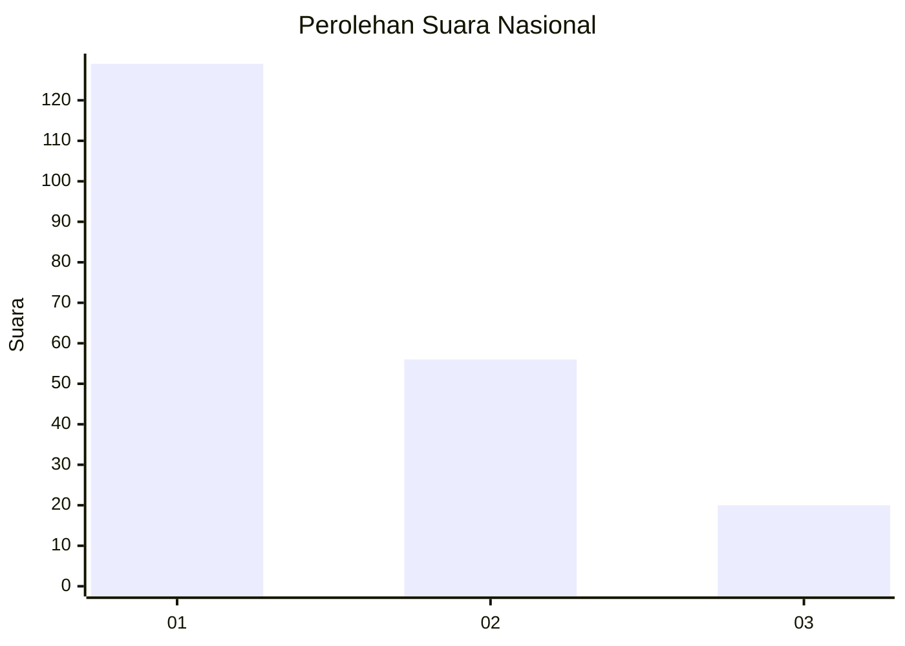
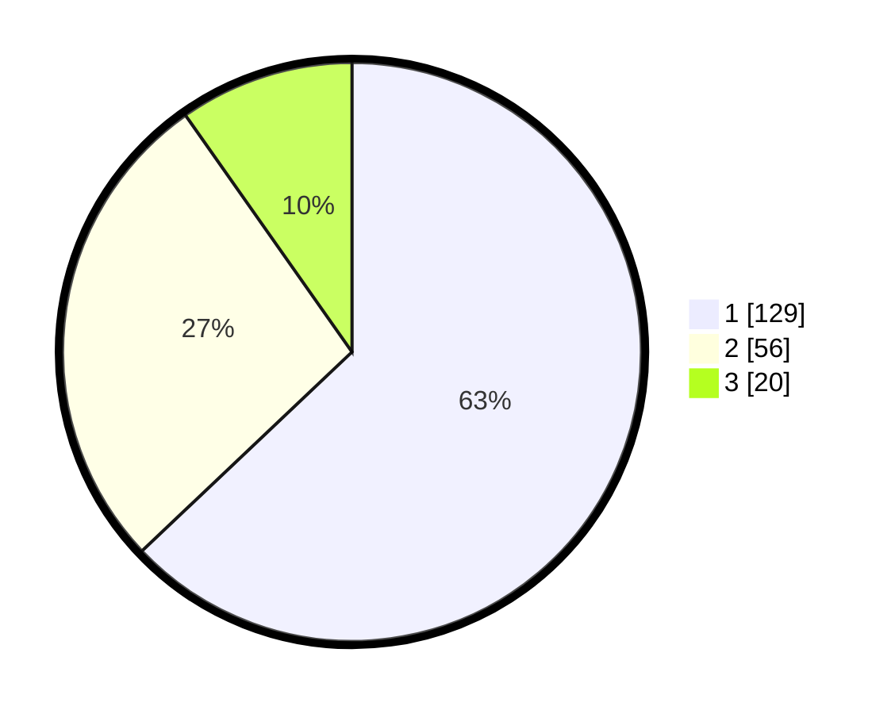

# Hasil

## Grafik

## Tabel

| No.    | Nama Paslon    | Suara | Suara (raw) | Persentase |
|:------ |:-------------- | -----:| -----------:| ----------:|
| 100025 | ANIES MUHAIMIN | 129   | [129][p-1]  | 62,93      |
| 100026 | PRABOWO GIBRAN | 56    | [56][p-2]   | 27,32      |
| 100027 | GANJAR MAHFUD  | 20    | [20][p-3]   | 9,76       |

[p-1]: https://github.com/gigit-pemilu/pemilu-2024/blob/main/pilpres/hitung-suara/sub/31-dki-jakarta/sub/75-jakarta-timur/sub/04-kramatjati/sub/1007-cawang/sub/090-tps/sub/paslon-1.txt
[p-2]: https://github.com/gigit-pemilu/pemilu-2024/blob/main/pilpres/hitung-suara/sub/31-dki-jakarta/sub/75-jakarta-timur/sub/04-kramatjati/sub/1007-cawang/sub/090-tps/sub/paslon-2.txt
[p-3]: https://github.com/gigit-pemilu/pemilu-2024/blob/main/pilpres/hitung-suara/sub/31-dki-jakarta/sub/75-jakarta-timur/sub/04-kramatjati/sub/1007-cawang/sub/090-tps/sub/paslon-3.txt

## Foto C Plano

https://sirekap-obj-formc.kpu.go.id/fe6a/pemilu/ppwp/31/75/04/10/07/3175041007090-20240214-213737--c7c18848-ce81-44e2-a4c2-9397fa2d448a.jpg

https://sirekap-obj-formc.kpu.go.id/fe6a/pemilu/ppwp/31/75/04/10/07/3175041007090-20240214-195616--d4d5d7a3-af25-4e22-a5e4-4421b446f89a.jpg

https://sirekap-obj-formc.kpu.go.id/fe6a/pemilu/ppwp/31/75/04/10/07/3175041007090-20240214-195744--19b02dde-f512-4e6c-8b7f-16542801ece7.jpg

## Metadata

| Key        | Value               |
| ---------- | ------------------- |
| Time Stamp | 2024-02-15 12:00:28 |

