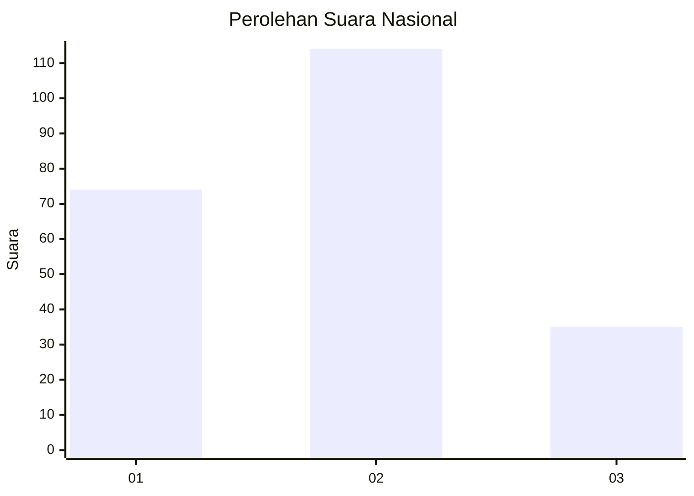
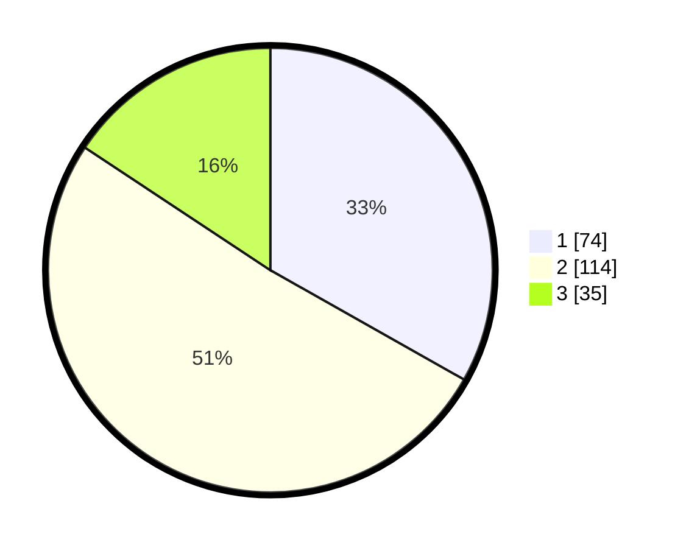

# Hasil

## Grafik

## Tabel

| No.    | Nama Paslon    | Suara | Suara (raw) | Persentase |
|:------ |:-------------- | -----:| -----------:| ----------:|
| 100025 | ANIES MUHAIMIN | 74    | [74][p-1]   | 33,18      |
| 100026 | PRABOWO GIBRAN | 114   | [114][p-2]  | 51,12      |
| 100027 | GANJAR MAHFUD  | 35    | [35][p-3]   | 15,70      |

[p-1]: https://github.com/gigit-pemilu/pemilu-2024/blob/main/pilpres/hitung-suara/sub/31-dki-jakarta/sub/75-jakarta-timur/sub/04-kramatjati/sub/1007-cawang/sub/091-tps/sub/paslon-1.txt
[p-2]: https://github.com/gigit-pemilu/pemilu-2024/blob/main/pilpres/hitung-suara/sub/31-dki-jakarta/sub/75-jakarta-timur/sub/04-kramatjati/sub/1007-cawang/sub/091-tps/sub/paslon-2.txt
[p-3]: https://github.com/gigit-pemilu/pemilu-2024/blob/main/pilpres/hitung-suara/sub/31-dki-jakarta/sub/75-jakarta-timur/sub/04-kramatjati/sub/1007-cawang/sub/091-tps/sub/paslon-3.txt

## Foto C Plano

https://sirekap-obj-formc.kpu.go.id/92ee/pemilu/ppwp/31/75/04/10/07/3175041007091-20240214-210214--2a7b2eb6-7b12-44c7-bf3a-2db463ed40cc.jpg

https://sirekap-obj-formc.kpu.go.id/92ee/pemilu/ppwp/31/75/04/10/07/3175041007091-20240214-210344--e57c003c-992c-473e-885d-5828c9479604.jpg

https://sirekap-obj-formc.kpu.go.id/92ee/pemilu/ppwp/31/75/04/10/07/3175041007091-20240214-210444--ac2d0cff-7477-409a-8bf1-d33ddb90141b.jpg

## Metadata

| Key        | Value               |
| ---------- | ------------------- |
| Time Stamp | 2024-02-15 16:00:26 |

