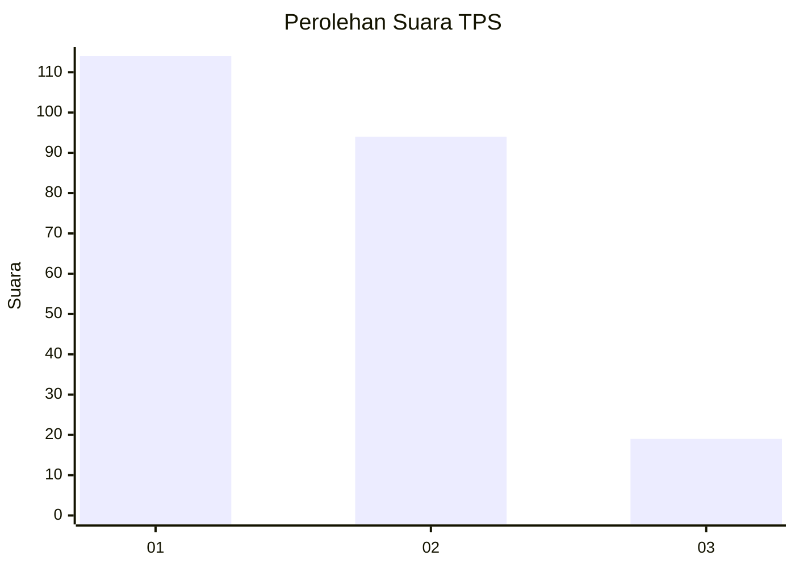
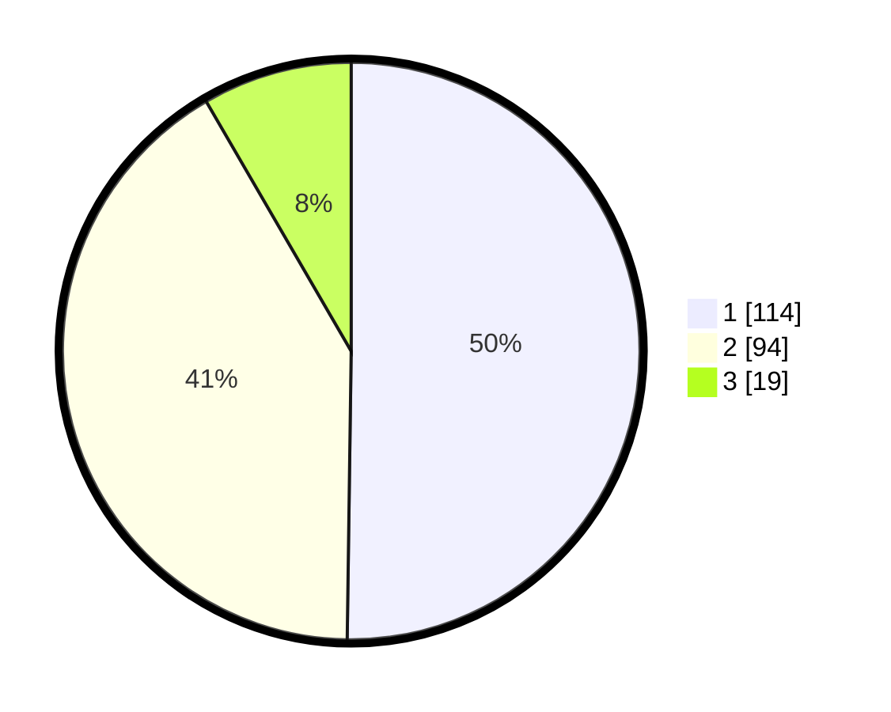

# Hasil

## Grafik

## Tabel

| No. | Nama Paslon    | Suara | Suara (raw) | Persentase |
|:--- |:-------------- | -----:| -----------:| ----------:|
| 1   | ANIES MUHAIMIN | 114   | [114][p-1]  | 50,22      |
| 2   | PRABOWO GIBRAN | 94    | [94][p-2]   | 41,41      |
| 3   | GANJAR MAHFUD  | 19    | [19][p-3]   | 8,37       |

[p-1]: https://github.com/gigit-pemilu/pemilu-2024-31-dki-jakarta/blob/main/pilpres/hitung-suara/sub/31-dki-jakarta/sub/75-jakarta-timur/sub/05-pasar-rebo/sub/1001-gedong/sub/002-tps/sub/paslon-1.txt
[p-2]: https://github.com/gigit-pemilu/pemilu-2024-31-dki-jakarta/blob/main/pilpres/hitung-suara/sub/31-dki-jakarta/sub/75-jakarta-timur/sub/05-pasar-rebo/sub/1001-gedong/sub/002-tps/sub/paslon-2.txt
[p-3]: https://github.com/gigit-pemilu/pemilu-2024-31-dki-jakarta/blob/main/pilpres/hitung-suara/sub/31-dki-jakarta/sub/75-jakarta-timur/sub/05-pasar-rebo/sub/1001-gedong/sub/002-tps/sub/paslon-3.txt

## Foto C Plano

https://sirekap-obj-formc.kpu.go.id/eadd/pemilu/ppwp/31/75/05/10/01/3175051001002-20240215-014209--da3750a2-bad0-4d62-bb92-e4f388c92dfb.jpg

https://sirekap-obj-formc.kpu.go.id/eadd/pemilu/ppwp/31/75/05/10/01/3175051001002-20240215-014228--68ffe2e1-db5b-4b4b-a3b9-df9f0ced25fc.jpg

https://sirekap-obj-formc.kpu.go.id/eadd/pemilu/ppwp/31/75/05/10/01/3175051001002-20240215-014246--b1994f74-adbe-4aa6-9786-526e48e63f7b.jpg

## Metadata

| Key        | Value               |
| ---------- | ------------------- |
| Time Stamp | 2024-02-24 22:31:28 |

