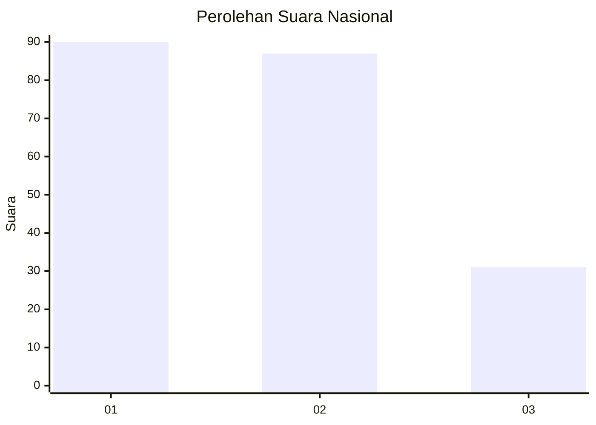
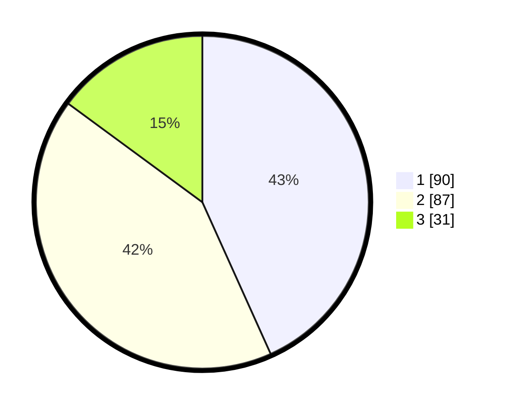

# Hasil

## Grafik

## Tabel

| No.    | Nama Paslon    | Suara | Suara (raw) | Persentase |
|:------ |:-------------- | -----:| -----------:| ----------:|
| 100025 | ANIES MUHAIMIN | 90    | [90][p-1]   | 43,27      |
| 100026 | PRABOWO GIBRAN | 87    | [87][p-2]   | 41,83      |
| 100027 | GANJAR MAHFUD  | 31    | [31][p-3]   | 14,90      |

[p-1]: https://github.com/gigit-pemilu/pemilu-2024/blob/main/pilpres/hitung-suara/sub/31-dki-jakarta/sub/75-jakarta-timur/sub/05-pasar-rebo/sub/1001-gedong/sub/014-tps/sub/paslon-1.txt
[p-2]: https://github.com/gigit-pemilu/pemilu-2024/blob/main/pilpres/hitung-suara/sub/31-dki-jakarta/sub/75-jakarta-timur/sub/05-pasar-rebo/sub/1001-gedong/sub/014-tps/sub/paslon-2.txt
[p-3]: https://github.com/gigit-pemilu/pemilu-2024/blob/main/pilpres/hitung-suara/sub/31-dki-jakarta/sub/75-jakarta-timur/sub/05-pasar-rebo/sub/1001-gedong/sub/014-tps/sub/paslon-3.txt

## Foto C Plano

https://sirekap-obj-formc.kpu.go.id/904e/pemilu/ppwp/31/75/05/10/01/3175051001014-20240215-010701--eaf0446e-8421-4034-87ae-66b178b87be3.jpg

https://sirekap-obj-formc.kpu.go.id/904e/pemilu/ppwp/31/75/05/10/01/3175051001014-20240215-011009--b6662a76-bc1b-4f7f-8e30-87b6da29398c.jpg

https://sirekap-obj-formc.kpu.go.id/904e/pemilu/ppwp/31/75/05/10/01/3175051001014-20240215-011228--af76016f-ea52-4ae5-a579-b9d734acea3d.jpg

## Metadata

| Key        | Value               |
| ---------- | ------------------- |
| Time Stamp | 2024-02-15 17:00:25 |

