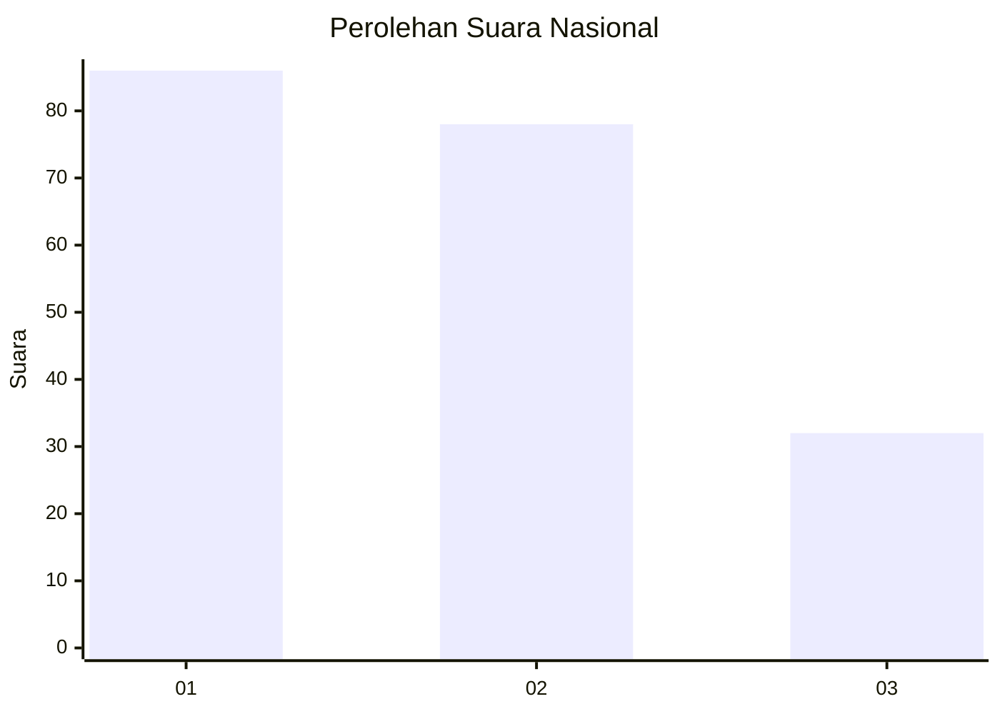
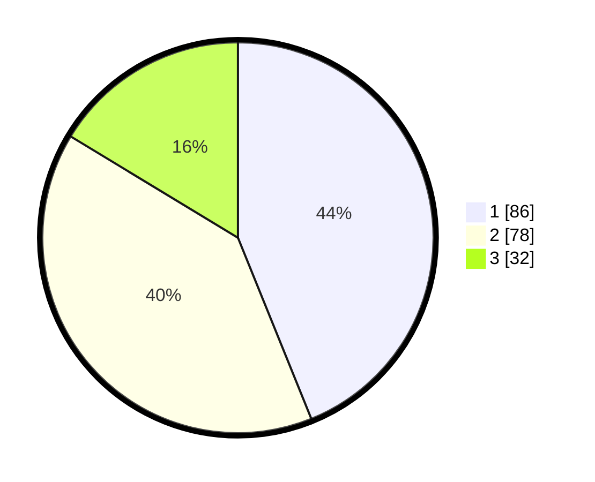

# Hasil

## Grafik

## Tabel

| No.    | Nama Paslon    | Suara | Suara (raw) | Persentase |
|:------ |:-------------- | -----:| -----------:| ----------:|
| 100025 | ANIES MUHAIMIN | 86    | [86][p-1]   | 43,88      |
| 100026 | PRABOWO GIBRAN | 78    | [78][p-2]   | 39,80      |
| 100027 | GANJAR MAHFUD  | 32    | [32][p-3]   | 16,33      |

[p-1]: https://github.com/gigit-pemilu/pemilu-2024/blob/main/pilpres/hitung-suara/sub/31-dki-jakarta/sub/75-jakarta-timur/sub/05-pasar-rebo/sub/1001-gedong/sub/016-tps/sub/paslon-1.txt
[p-2]: https://github.com/gigit-pemilu/pemilu-2024/blob/main/pilpres/hitung-suara/sub/31-dki-jakarta/sub/75-jakarta-timur/sub/05-pasar-rebo/sub/1001-gedong/sub/016-tps/sub/paslon-2.txt
[p-3]: https://github.com/gigit-pemilu/pemilu-2024/blob/main/pilpres/hitung-suara/sub/31-dki-jakarta/sub/75-jakarta-timur/sub/05-pasar-rebo/sub/1001-gedong/sub/016-tps/sub/paslon-3.txt

## Foto C Plano

https://sirekap-obj-formc.kpu.go.id/31f4/pemilu/ppwp/31/75/05/10/01/3175051001016-20240214-211817--87de5047-3a90-451f-8820-9b102872b011.jpg

https://sirekap-obj-formc.kpu.go.id/31f4/pemilu/ppwp/31/75/05/10/01/3175051001016-20240214-211942--6407955f-1dc6-4236-b2bb-5b0733d4d2ef.jpg

https://sirekap-obj-formc.kpu.go.id/31f4/pemilu/ppwp/31/75/05/10/01/3175051001016-20240214-212112--2e2753cb-2c89-4263-80a7-b6e33102bd5c.jpg

## Metadata

| Key        | Value               |
| ---------- | ------------------- |
| Time Stamp | 2024-02-15 00:41:44 |

