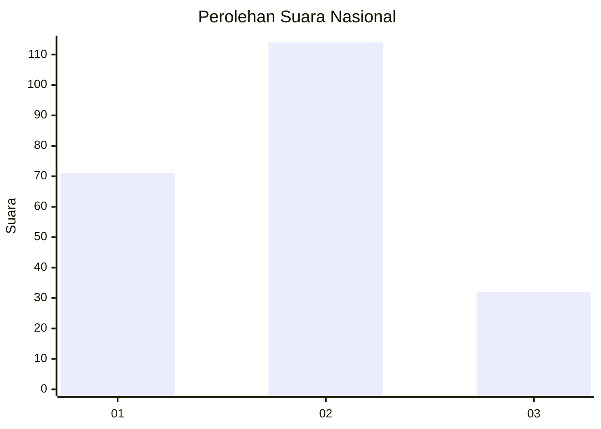
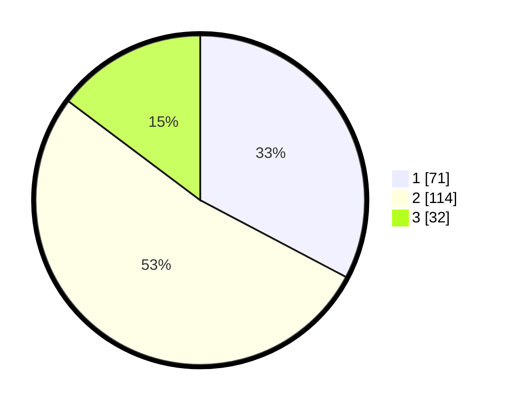

# Hasil

## Grafik

## Tabel

| No.    | Nama Paslon    | Suara | Suara (raw) | Persentase |
|:------ |:-------------- | -----:| -----------:| ----------:|
| 100025 | ANIES MUHAIMIN | 71    | [71][p-1]   | 32,72      |
| 100026 | PRABOWO GIBRAN | 114   | [114][p-2]  | 52,53      |
| 100027 | GANJAR MAHFUD  | 32    | [32][p-3]   | 14,75      |

[p-1]: https://github.com/gigit-pemilu/pemilu-2024/blob/main/pilpres/hitung-suara/sub/31-dki-jakarta/sub/75-jakarta-timur/sub/05-pasar-rebo/sub/1001-gedong/sub/025-tps/sub/paslon-1.txt
[p-2]: https://github.com/gigit-pemilu/pemilu-2024/blob/main/pilpres/hitung-suara/sub/31-dki-jakarta/sub/75-jakarta-timur/sub/05-pasar-rebo/sub/1001-gedong/sub/025-tps/sub/paslon-2.txt
[p-3]: https://github.com/gigit-pemilu/pemilu-2024/blob/main/pilpres/hitung-suara/sub/31-dki-jakarta/sub/75-jakarta-timur/sub/05-pasar-rebo/sub/1001-gedong/sub/025-tps/sub/paslon-3.txt

## Foto C Plano

https://sirekap-obj-formc.kpu.go.id/45f0/pemilu/ppwp/31/75/05/10/01/3175051001025-20240214-222310--88bf0209-f2f3-4405-b387-87638b9da18d.jpg

https://sirekap-obj-formc.kpu.go.id/45f0/pemilu/ppwp/31/75/05/10/01/3175051001025-20240214-214420--687fe199-5880-4bfb-9718-e0f78d4a7641.jpg

https://sirekap-obj-formc.kpu.go.id/45f0/pemilu/ppwp/31/75/05/10/01/3175051001025-20240214-222705--9b4b3057-06de-4d74-acc5-70448b249c53.jpg

## Metadata

| Key        | Value               |
| ---------- | ------------------- |
| Time Stamp | 2024-02-15 17:30:25 |

