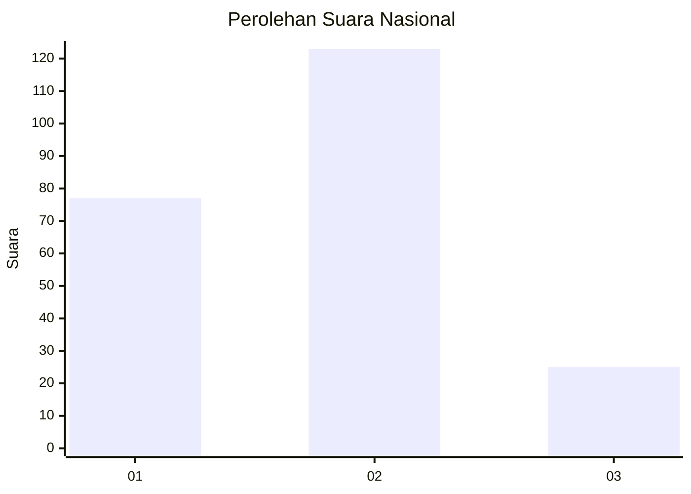
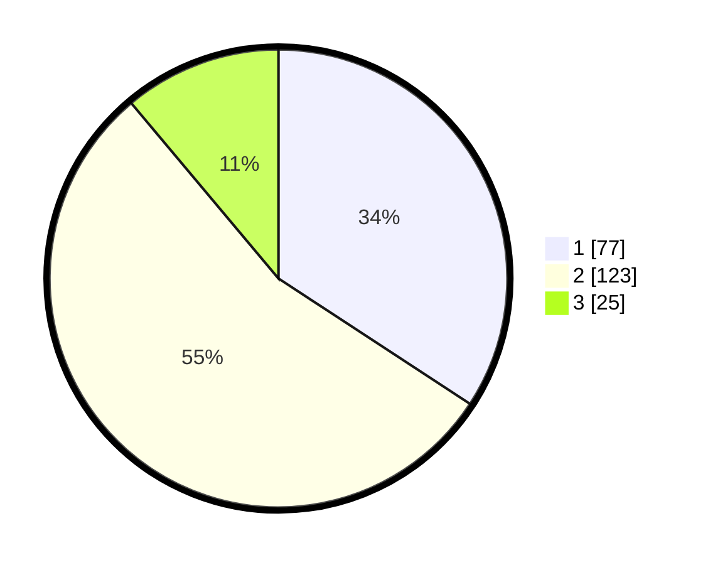

# Hasil

## Grafik

## Tabel

| No.    | Nama Paslon    | Suara | Suara (raw) | Persentase |
|:------ |:-------------- | -----:| -----------:| ----------:|
| 100025 | ANIES MUHAIMIN | 77    | [77][p-1]   | 34,22      |
| 100026 | PRABOWO GIBRAN | 123   | [123][p-2]  | 54,67      |
| 100027 | GANJAR MAHFUD  | 25    | [25][p-3]   | 11,11      |

[p-1]: https://github.com/gigit-pemilu/pemilu-2024/blob/main/pilpres/hitung-suara/sub/31-dki-jakarta/sub/75-jakarta-timur/sub/05-pasar-rebo/sub/1001-gedong/sub/047-tps/sub/paslon-1.txt
[p-2]: https://github.com/gigit-pemilu/pemilu-2024/blob/main/pilpres/hitung-suara/sub/31-dki-jakarta/sub/75-jakarta-timur/sub/05-pasar-rebo/sub/1001-gedong/sub/047-tps/sub/paslon-2.txt
[p-3]: https://github.com/gigit-pemilu/pemilu-2024/blob/main/pilpres/hitung-suara/sub/31-dki-jakarta/sub/75-jakarta-timur/sub/05-pasar-rebo/sub/1001-gedong/sub/047-tps/sub/paslon-3.txt

## Foto C Plano

https://sirekap-obj-formc.kpu.go.id/45cb/pemilu/ppwp/31/75/05/10/01/3175051001047-20240214-214513--bfce296b-2704-4684-9337-f75d8b5d4cd2.jpg

https://sirekap-obj-formc.kpu.go.id/45cb/pemilu/ppwp/31/75/05/10/01/3175051001047-20240214-214837--2d8118a8-2796-4e63-920e-ded16d364afb.jpg

https://sirekap-obj-formc.kpu.go.id/45cb/pemilu/ppwp/31/75/05/10/01/3175051001047-20240214-215113--c120e442-42aa-46d0-8ef3-4351a23c7a77.jpg

## Metadata

| Key        | Value               |
| ---------- | ------------------- |
| Time Stamp | 2024-02-15 17:30:25 |

