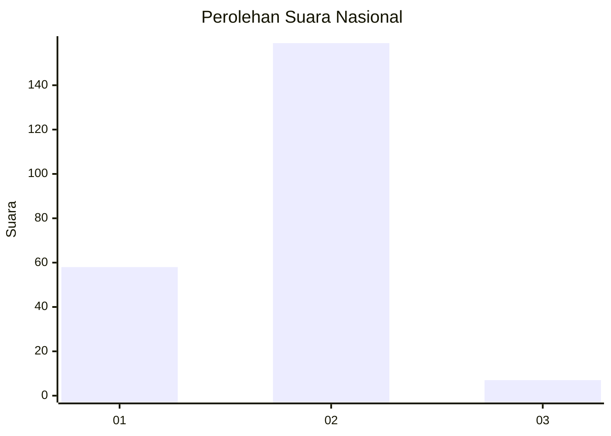
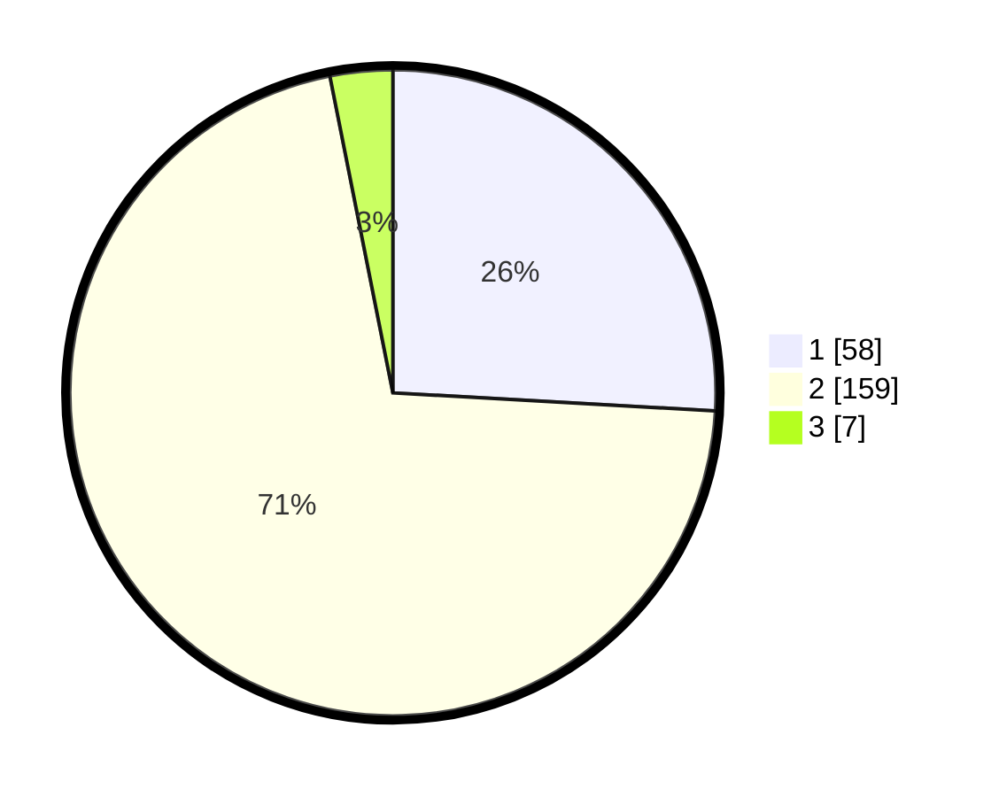

# Hasil

## Grafik

## Tabel

| No.    | Nama Paslon    | Suara | Suara (raw) | Persentase |
|:------ |:-------------- | -----:| -----------:| ----------:|
| 100025 | ANIES MUHAIMIN | 58    | [58][p-1]   | 25,89      |
| 100026 | PRABOWO GIBRAN | 159   | [159][p-2]  | 70,98      |
| 100027 | GANJAR MAHFUD  | 7     | [7][p-3]    | 3,13       |

[p-1]: https://github.com/gigit-pemilu/pemilu-2024/blob/main/pilpres/hitung-suara/sub/31-dki-jakarta/sub/75-jakarta-timur/sub/05-pasar-rebo/sub/1001-gedong/sub/049-tps/sub/paslon-1.txt
[p-2]: https://github.com/gigit-pemilu/pemilu-2024/blob/main/pilpres/hitung-suara/sub/31-dki-jakarta/sub/75-jakarta-timur/sub/05-pasar-rebo/sub/1001-gedong/sub/049-tps/sub/paslon-2.txt
[p-3]: https://github.com/gigit-pemilu/pemilu-2024/blob/main/pilpres/hitung-suara/sub/31-dki-jakarta/sub/75-jakarta-timur/sub/05-pasar-rebo/sub/1001-gedong/sub/049-tps/sub/paslon-3.txt

## Foto C Plano

https://sirekap-obj-formc.kpu.go.id/a039/pemilu/ppwp/31/75/05/10/01/3175051001049-20240214-201417--d69908a7-98fc-4ec8-b248-1fc2b3c39fb8.jpg

https://sirekap-obj-formc.kpu.go.id/a039/pemilu/ppwp/31/75/05/10/01/3175051001049-20240214-201456--6884ca9b-b75b-40ae-b850-e2d7e185997d.jpg

https://sirekap-obj-formc.kpu.go.id/a039/pemilu/ppwp/31/75/05/10/01/3175051001049-20240214-201520--e60da811-397c-438d-a07a-2ab210022b34.jpg

## Metadata

| Key        | Value               |
| ---------- | ------------------- |
| Time Stamp | 2024-02-15 20:30:46 |

