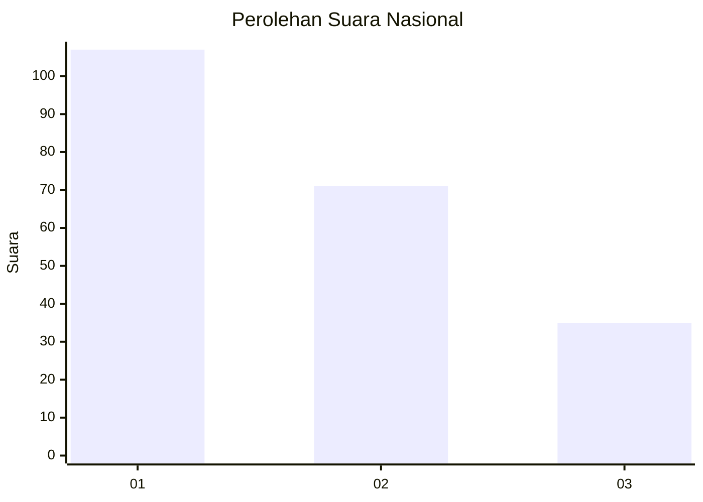
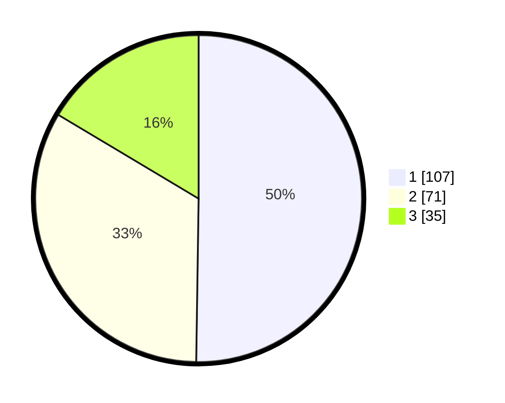

# Hasil

## Grafik

## Tabel

| No.    | Nama Paslon    | Suara | Suara (raw) | Persentase |
|:------ |:-------------- | -----:| -----------:| ----------:|
| 100025 | ANIES MUHAIMIN | 107   | [107][p-1]  | 50,23      |
| 100026 | PRABOWO GIBRAN | 71    | [71][p-2]   | 33,33      |
| 100027 | GANJAR MAHFUD  | 35    | [35][p-3]   | 16,43      |

[p-1]: https://github.com/gigit-pemilu/pemilu-2024/blob/main/pilpres/hitung-suara/sub/31-dki-jakarta/sub/75-jakarta-timur/sub/05-pasar-rebo/sub/1001-gedong/sub/067-tps/sub/paslon-1.txt
[p-2]: https://github.com/gigit-pemilu/pemilu-2024/blob/main/pilpres/hitung-suara/sub/31-dki-jakarta/sub/75-jakarta-timur/sub/05-pasar-rebo/sub/1001-gedong/sub/067-tps/sub/paslon-2.txt
[p-3]: https://github.com/gigit-pemilu/pemilu-2024/blob/main/pilpres/hitung-suara/sub/31-dki-jakarta/sub/75-jakarta-timur/sub/05-pasar-rebo/sub/1001-gedong/sub/067-tps/sub/paslon-3.txt

## Foto C Plano

https://sirekap-obj-formc.kpu.go.id/902f/pemilu/ppwp/31/75/05/10/01/3175051001067-20240214-210630--5d744a80-5d8e-4250-9c8d-c88fb17571c2.jpg

https://sirekap-obj-formc.kpu.go.id/902f/pemilu/ppwp/31/75/05/10/01/3175051001067-20240214-210728--cd76dc70-0c52-4f2b-8b46-21ad4617d760.jpg

https://sirekap-obj-formc.kpu.go.id/902f/pemilu/ppwp/31/75/05/10/01/3175051001067-20240214-205946--2040cf75-72d5-4ab6-a58c-199bae885395.jpg

## Metadata

| Key        | Value               |
| ---------- | ------------------- |
| Time Stamp | 2024-02-15 02:10:27 |

