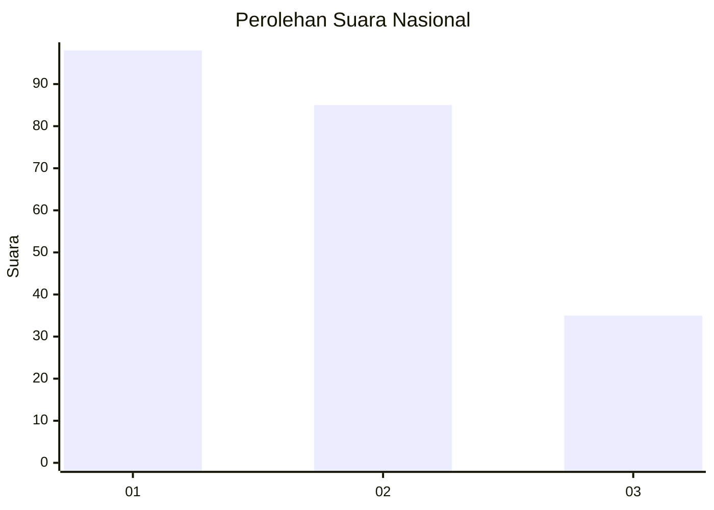
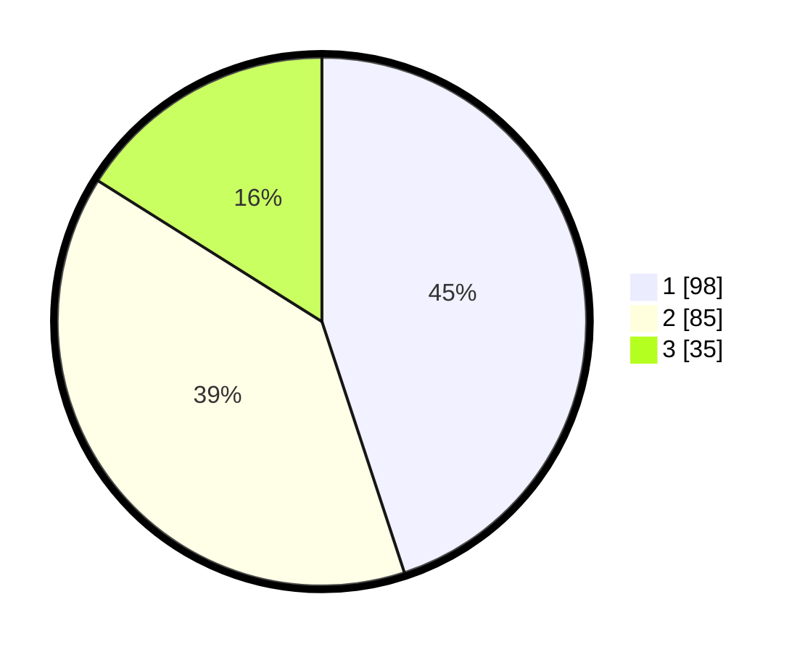

# Hasil

## Grafik

## Tabel

| No.    | Nama Paslon    | Suara | Suara (raw) | Persentase |
|:------ |:-------------- | -----:| -----------:| ----------:|
| 100025 | ANIES MUHAIMIN | 98    | [98][p-1]   | 44,95      |
| 100026 | PRABOWO GIBRAN | 85    | [85][p-2]   | 38,99      |
| 100027 | GANJAR MAHFUD  | 35    | [35][p-3]   | 16,06      |

[p-1]: https://github.com/gigit-pemilu/pemilu-2024/blob/main/pilpres/hitung-suara/sub/31-dki-jakarta/sub/75-jakarta-timur/sub/05-pasar-rebo/sub/1001-gedong/sub/077-tps/sub/paslon-1.txt
[p-2]: https://github.com/gigit-pemilu/pemilu-2024/blob/main/pilpres/hitung-suara/sub/31-dki-jakarta/sub/75-jakarta-timur/sub/05-pasar-rebo/sub/1001-gedong/sub/077-tps/sub/paslon-2.txt
[p-3]: https://github.com/gigit-pemilu/pemilu-2024/blob/main/pilpres/hitung-suara/sub/31-dki-jakarta/sub/75-jakarta-timur/sub/05-pasar-rebo/sub/1001-gedong/sub/077-tps/sub/paslon-3.txt

## Foto C Plano

https://sirekap-obj-formc.kpu.go.id/8540/pemilu/ppwp/31/75/05/10/01/3175051001077-20240214-224956--736fee8a-2a92-4c4b-99b2-49472b0957de.jpg

https://sirekap-obj-formc.kpu.go.id/8540/pemilu/ppwp/31/75/05/10/01/3175051001077-20240214-224959--055cf206-ee1f-4f96-a27b-93d40b56d83f.jpg

https://sirekap-obj-formc.kpu.go.id/8540/pemilu/ppwp/31/75/05/10/01/3175051001077-20240214-225004--79c296c8-6bb8-4e02-b621-89ce2c153518.jpg

## Metadata

| Key        | Value               |
| ---------- | ------------------- |
| Time Stamp | 2024-02-15 09:00:24 |

