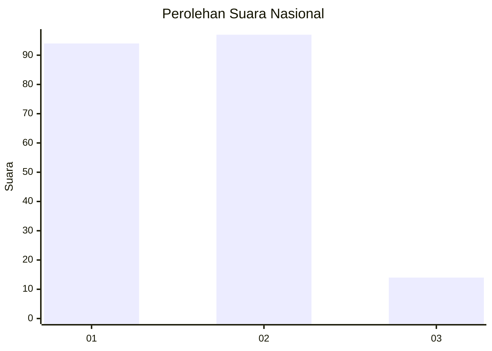
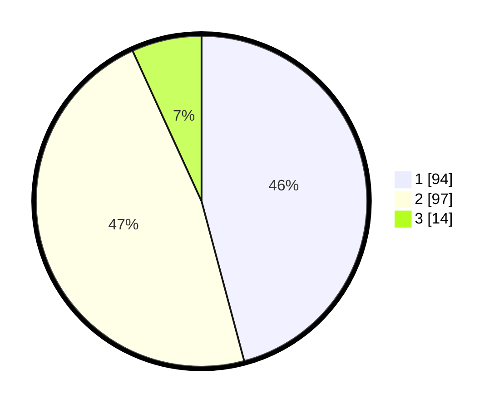

# Hasil

## Grafik

## Tabel

| No.    | Nama Paslon    | Suara | Suara (raw) | Persentase |
|:------ |:-------------- | -----:| -----------:| ----------:|
| 100025 | ANIES MUHAIMIN | 94    | [94][p-1]   | 45,85      |
| 100026 | PRABOWO GIBRAN | 97    | [97][p-2]   | 47,32      |
| 100027 | GANJAR MAHFUD  | 14    | [14][p-3]   | 6,83       |

[p-1]: https://github.com/gigit-pemilu/pemilu-2024/blob/main/pilpres/hitung-suara/sub/31-dki-jakarta/sub/75-jakarta-timur/sub/05-pasar-rebo/sub/1001-gedong/sub/096-tps/sub/paslon-1.txt
[p-2]: https://github.com/gigit-pemilu/pemilu-2024/blob/main/pilpres/hitung-suara/sub/31-dki-jakarta/sub/75-jakarta-timur/sub/05-pasar-rebo/sub/1001-gedong/sub/096-tps/sub/paslon-2.txt
[p-3]: https://github.com/gigit-pemilu/pemilu-2024/blob/main/pilpres/hitung-suara/sub/31-dki-jakarta/sub/75-jakarta-timur/sub/05-pasar-rebo/sub/1001-gedong/sub/096-tps/sub/paslon-3.txt

## Foto C Plano

https://sirekap-obj-formc.kpu.go.id/709e/pemilu/ppwp/31/75/05/10/01/3175051001096-20240214-192858--ce18b2a5-745e-4ef7-9ea8-a7aec00c19b2.jpg

https://sirekap-obj-formc.kpu.go.id/709e/pemilu/ppwp/31/75/05/10/01/3175051001096-20240214-193333--82b1f7e4-a59b-4fae-ba55-fd7c0dbf2903.jpg

https://sirekap-obj-formc.kpu.go.id/709e/pemilu/ppwp/31/75/05/10/01/3175051001096-20240214-193437--6221b26d-4104-4074-a9e0-c67bed3d1de0.jpg

## Metadata

| Key        | Value               |
| ---------- | ------------------- |
| Time Stamp | 2024-02-16 01:00:27 |

