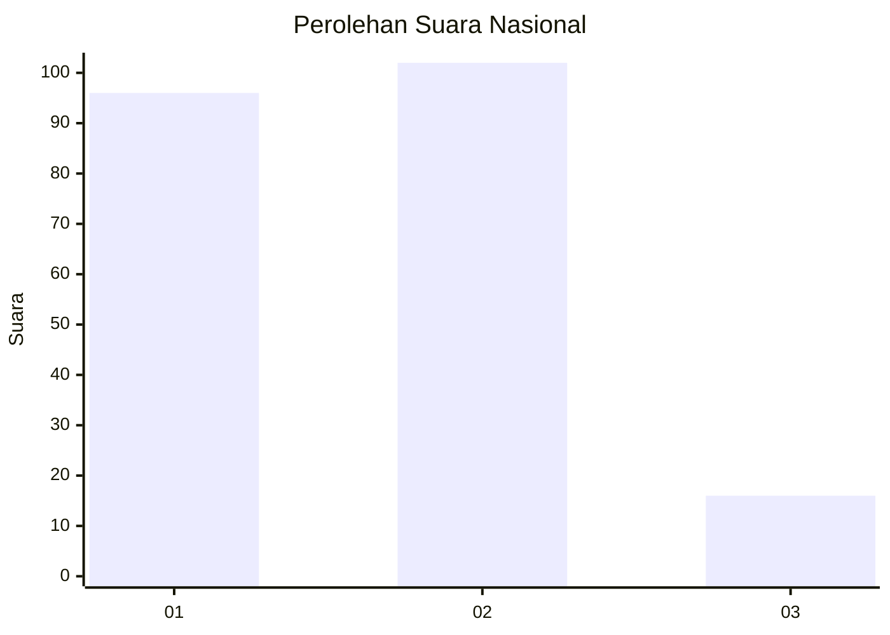
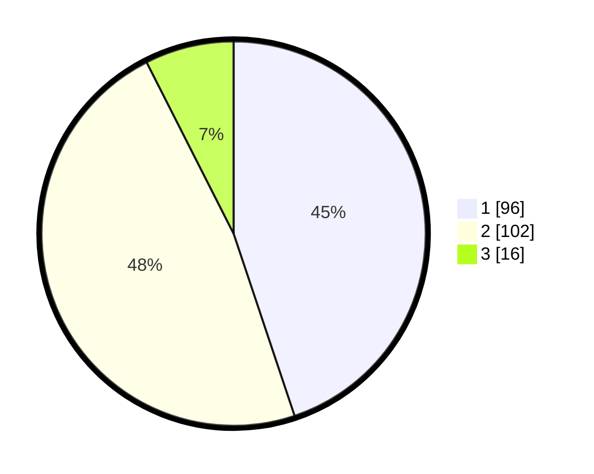

# Hasil

## Grafik

## Tabel

| No.    | Nama Paslon    | Suara | Suara (raw) | Persentase |
|:------ |:-------------- | -----:| -----------:| ----------:|
| 100025 | ANIES MUHAIMIN | 96    | [96][p-1]   | 44,86      |
| 100026 | PRABOWO GIBRAN | 102   | [102][p-2]  | 47,66      |
| 100027 | GANJAR MAHFUD  | 16    | [16][p-3]   | 7,48       |

[p-1]: https://github.com/gigit-pemilu/pemilu-2024/blob/main/pilpres/hitung-suara/sub/31-dki-jakarta/sub/75-jakarta-timur/sub/05-pasar-rebo/sub/1002-baru/sub/015-tps/sub/paslon-1.txt
[p-2]: https://github.com/gigit-pemilu/pemilu-2024/blob/main/pilpres/hitung-suara/sub/31-dki-jakarta/sub/75-jakarta-timur/sub/05-pasar-rebo/sub/1002-baru/sub/015-tps/sub/paslon-2.txt
[p-3]: https://github.com/gigit-pemilu/pemilu-2024/blob/main/pilpres/hitung-suara/sub/31-dki-jakarta/sub/75-jakarta-timur/sub/05-pasar-rebo/sub/1002-baru/sub/015-tps/sub/paslon-3.txt

## Foto C Plano

https://sirekap-obj-formc.kpu.go.id/89fe/pemilu/ppwp/31/75/05/10/02/3175051002015-20240214-234007--901189f6-0cb0-4ae0-a297-dbfc1f0bab45.jpg

https://sirekap-obj-formc.kpu.go.id/89fe/pemilu/ppwp/31/75/05/10/02/3175051002015-20240214-234442--1fce46cf-bc98-4053-b02e-2600f21f03d1.jpg

https://sirekap-obj-formc.kpu.go.id/89fe/pemilu/ppwp/31/75/05/10/02/3175051002015-20240214-234333--32e58b17-e83c-4269-a502-42d81960f3aa.jpg

## Metadata

| Key        | Value               |
| ---------- | ------------------- |
| Time Stamp | 2024-02-15 15:00:29 |

