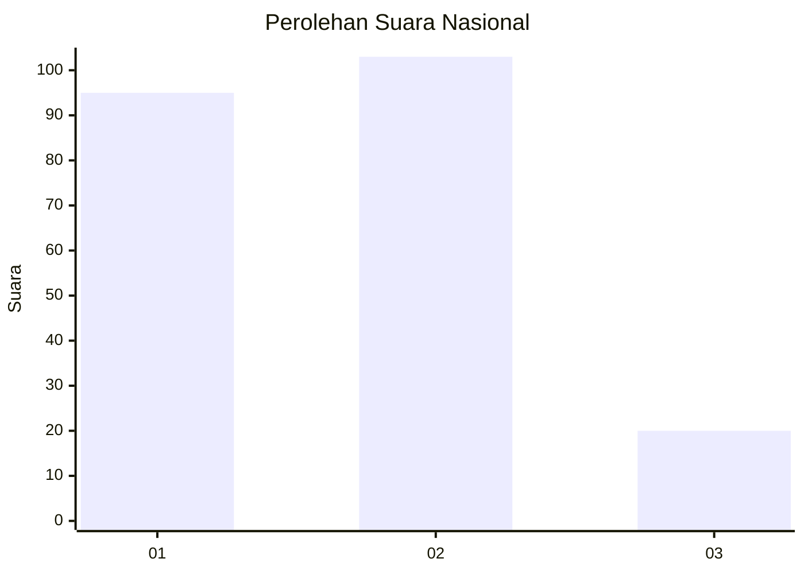
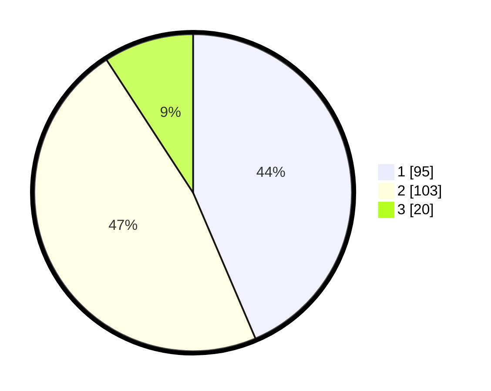

# Hasil

## Grafik

## Tabel

| No.    | Nama Paslon    | Suara | Suara (raw) | Persentase |
|:------ |:-------------- | -----:| -----------:| ----------:|
| 100025 | ANIES MUHAIMIN | 95    | [95][p-1]   | 43,58      |
| 100026 | PRABOWO GIBRAN | 103   | [103][p-2]  | 47,25      |
| 100027 | GANJAR MAHFUD  | 20    | [20][p-3]   | 9,17       |

[p-1]: https://github.com/gigit-pemilu/pemilu-2024/blob/main/pilpres/hitung-suara/sub/31-dki-jakarta/sub/75-jakarta-timur/sub/05-pasar-rebo/sub/1002-baru/sub/052-tps/sub/paslon-1.txt
[p-2]: https://github.com/gigit-pemilu/pemilu-2024/blob/main/pilpres/hitung-suara/sub/31-dki-jakarta/sub/75-jakarta-timur/sub/05-pasar-rebo/sub/1002-baru/sub/052-tps/sub/paslon-2.txt
[p-3]: https://github.com/gigit-pemilu/pemilu-2024/blob/main/pilpres/hitung-suara/sub/31-dki-jakarta/sub/75-jakarta-timur/sub/05-pasar-rebo/sub/1002-baru/sub/052-tps/sub/paslon-3.txt

## Foto C Plano

https://sirekap-obj-formc.kpu.go.id/623b/pemilu/ppwp/31/75/05/10/02/3175051002052-20240215-053406--bfc90137-12ae-4efd-a325-001ad66592ba.jpg

https://sirekap-obj-formc.kpu.go.id/623b/pemilu/ppwp/31/75/05/10/02/3175051002052-20240215-033114--9a635e5c-712d-49c2-8bef-c980c916e30b.jpg

https://sirekap-obj-formc.kpu.go.id/623b/pemilu/ppwp/31/75/05/10/02/3175051002052-20240215-033637--c51b66e8-99cc-40f1-9e7b-223f3b95ca5b.jpg

## Metadata

| Key        | Value               |
| ---------- | ------------------- |
| Time Stamp | 2024-02-16 01:00:27 |

