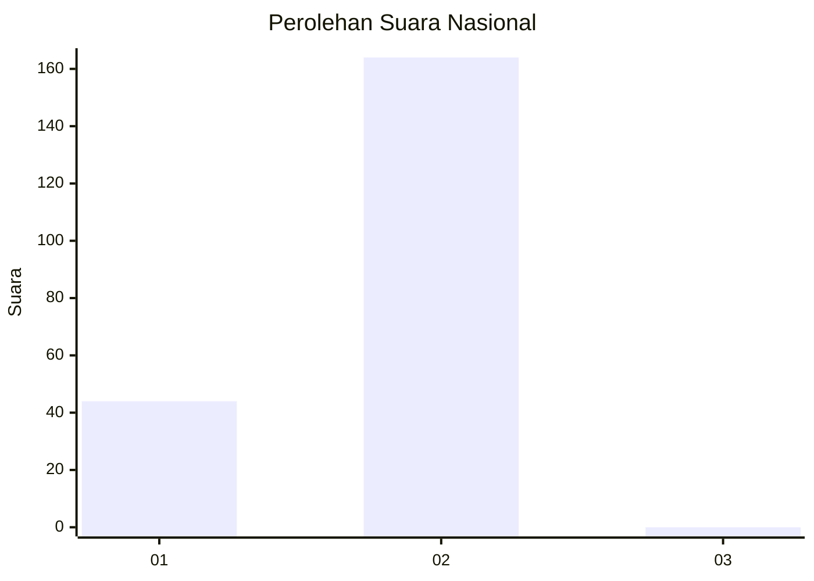
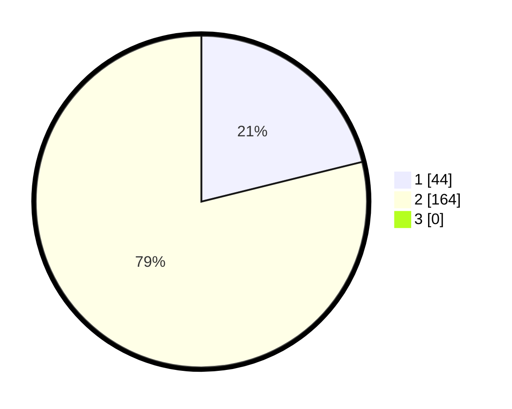

# Hasil

## Grafik

## Tabel

| No.    | Nama Paslon    | Suara | Suara (raw) | Persentase |
|:------ |:-------------- | -----:| -----------:| ----------:|
| 100025 | ANIES MUHAIMIN | 44    | [44][p-1]   | 21,15      |
| 100026 | PRABOWO GIBRAN | 164   | [164][p-2]  | 78,85      |
| 100027 | GANJAR MAHFUD  | 0     | [0][p-3]    | 0,00       |

[p-1]: https://github.com/gigit-pemilu/pemilu-2024/blob/main/pilpres/hitung-suara/sub/31-dki-jakarta/sub/75-jakarta-timur/sub/05-pasar-rebo/sub/1002-baru/sub/072-tps/sub/paslon-1.txt
[p-2]: https://github.com/gigit-pemilu/pemilu-2024/blob/main/pilpres/hitung-suara/sub/31-dki-jakarta/sub/75-jakarta-timur/sub/05-pasar-rebo/sub/1002-baru/sub/072-tps/sub/paslon-2.txt
[p-3]: https://github.com/gigit-pemilu/pemilu-2024/blob/main/pilpres/hitung-suara/sub/31-dki-jakarta/sub/75-jakarta-timur/sub/05-pasar-rebo/sub/1002-baru/sub/072-tps/sub/paslon-3.txt

## Foto C Plano

https://sirekap-obj-formc.kpu.go.id/d48a/pemilu/ppwp/31/75/05/10/02/3175051002072-20240214-204650--f40f77e1-9ef1-4c40-bb92-aba5d1072b4d.jpg

https://sirekap-obj-formc.kpu.go.id/d48a/pemilu/ppwp/31/75/05/10/02/3175051002072-20240214-214209--227241b4-c0f0-4b53-8aec-ac6eecd5cbb2.jpg

https://sirekap-obj-formc.kpu.go.id/d48a/pemilu/ppwp/31/75/05/10/02/3175051002072-20240214-214106--8a04f2b5-fc8b-4296-9bad-1ec694b11592.jpg

## Metadata

| Key        | Value               |
| ---------- | ------------------- |
| Time Stamp | 2024-02-16 01:00:27 |

