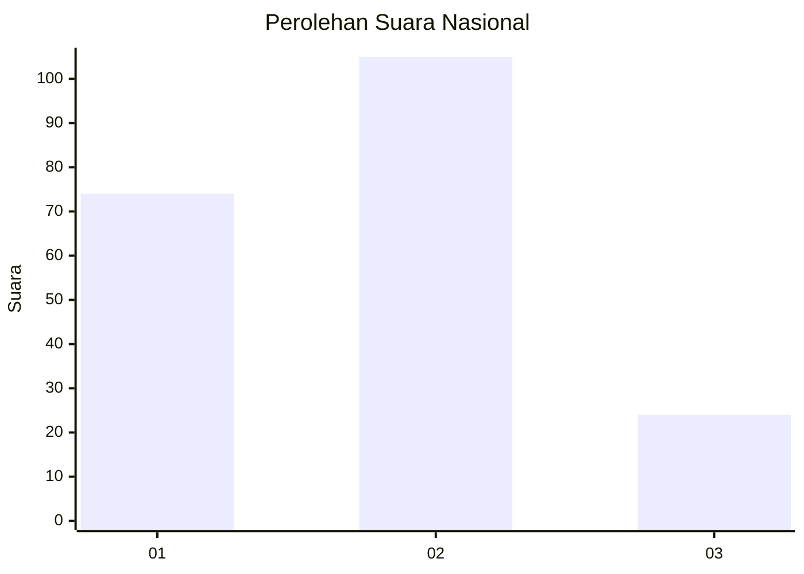
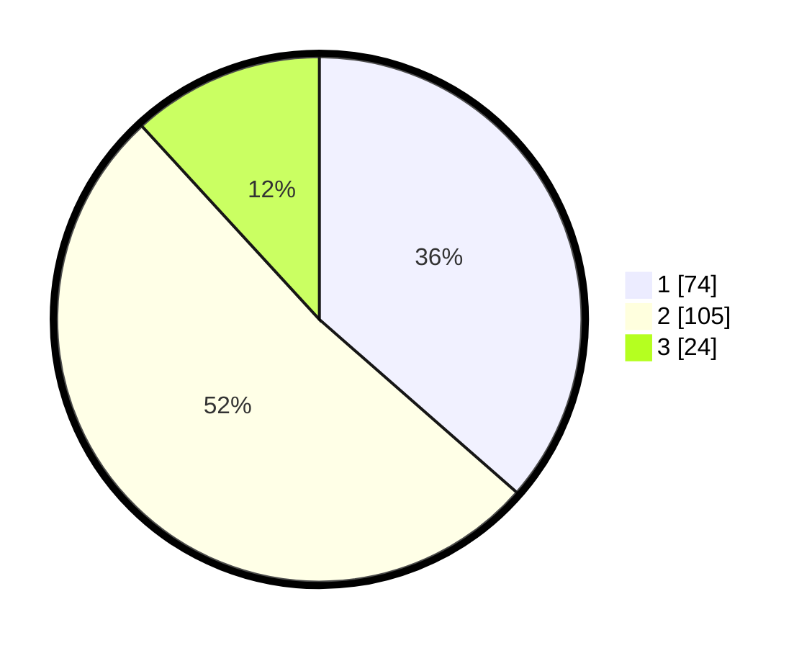

# Hasil

## Grafik

## Tabel

| No.    | Nama Paslon    | Suara | Suara (raw) | Persentase |
|:------ |:-------------- | -----:| -----------:| ----------:|
| 100025 | ANIES MUHAIMIN | 74    | [74][p-1]   | 36,45      |
| 100026 | PRABOWO GIBRAN | 105   | [105][p-2]  | 51,72      |
| 100027 | GANJAR MAHFUD  | 24    | [24][p-3]   | 11,82      |

[p-1]: https://github.com/gigit-pemilu/pemilu-2024/blob/main/pilpres/hitung-suara/sub/31-dki-jakarta/sub/75-jakarta-timur/sub/05-pasar-rebo/sub/1003-cijantung/sub/003-tps/sub/paslon-1.txt
[p-2]: https://github.com/gigit-pemilu/pemilu-2024/blob/main/pilpres/hitung-suara/sub/31-dki-jakarta/sub/75-jakarta-timur/sub/05-pasar-rebo/sub/1003-cijantung/sub/003-tps/sub/paslon-2.txt
[p-3]: https://github.com/gigit-pemilu/pemilu-2024/blob/main/pilpres/hitung-suara/sub/31-dki-jakarta/sub/75-jakarta-timur/sub/05-pasar-rebo/sub/1003-cijantung/sub/003-tps/sub/paslon-3.txt

## Foto C Plano

https://sirekap-obj-formc.kpu.go.id/059e/pemilu/ppwp/31/75/05/10/03/3175051003003-20240214-202044--33684065-e2ab-4991-be16-7777d0b7825c.jpg

https://sirekap-obj-formc.kpu.go.id/059e/pemilu/ppwp/31/75/05/10/03/3175051003003-20240214-202109--e9539875-8f87-4766-aaee-536abadf6bd5.jpg

https://sirekap-obj-formc.kpu.go.id/059e/pemilu/ppwp/31/75/05/10/03/3175051003003-20240214-202116--b06b4ba2-ba1f-4d44-91e0-016505a3c4f2.jpg

## Metadata

| Key        | Value               |
| ---------- | ------------------- |
| Time Stamp | 2024-02-25 12:00:00 |

