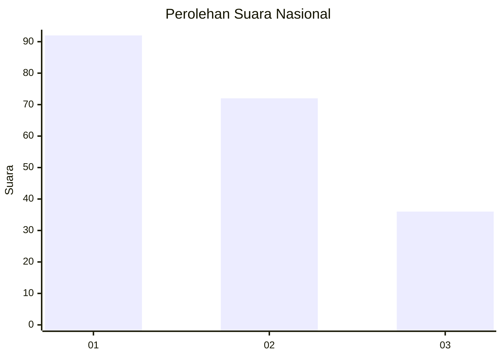
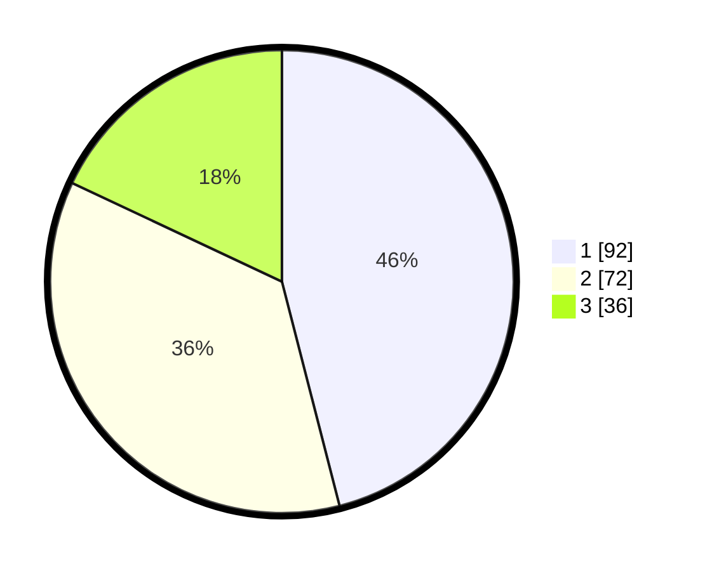

# Hasil

## Grafik

## Tabel

| No.    | Nama Paslon    | Suara | Suara (raw) | Persentase |
|:------ |:-------------- | -----:| -----------:| ----------:|
| 100025 | ANIES MUHAIMIN | 92    | [92][p-1]   | 46,00      |
| 100026 | PRABOWO GIBRAN | 72    | [72][p-2]   | 36,00      |
| 100027 | GANJAR MAHFUD  | 36    | [36][p-3]   | 18,00      |

[p-1]: https://github.com/gigit-pemilu/pemilu-2024/blob/main/pilpres/hitung-suara/sub/31-dki-jakarta/sub/75-jakarta-timur/sub/05-pasar-rebo/sub/1003-cijantung/sub/010-tps/sub/paslon-1.txt
[p-2]: https://github.com/gigit-pemilu/pemilu-2024/blob/main/pilpres/hitung-suara/sub/31-dki-jakarta/sub/75-jakarta-timur/sub/05-pasar-rebo/sub/1003-cijantung/sub/010-tps/sub/paslon-2.txt
[p-3]: https://github.com/gigit-pemilu/pemilu-2024/blob/main/pilpres/hitung-suara/sub/31-dki-jakarta/sub/75-jakarta-timur/sub/05-pasar-rebo/sub/1003-cijantung/sub/010-tps/sub/paslon-3.txt

## Foto C Plano

https://sirekap-obj-formc.kpu.go.id/9642/pemilu/ppwp/31/75/05/10/03/3175051003010-20240214-230202--aec160b1-845c-465e-ba35-18119c07b150.jpg

https://sirekap-obj-formc.kpu.go.id/9642/pemilu/ppwp/31/75/05/10/03/3175051003010-20240214-155639--84fcb5da-b979-4420-a4c9-d00e0ef9a0f5.jpg

https://sirekap-obj-formc.kpu.go.id/9642/pemilu/ppwp/31/75/05/10/03/3175051003010-20240214-160059--671448ec-d463-4d09-96ce-f913cfe37a56.jpg

## Metadata

| Key        | Value               |
| ---------- | ------------------- |
| Time Stamp | 2024-02-15 00:41:44 |

