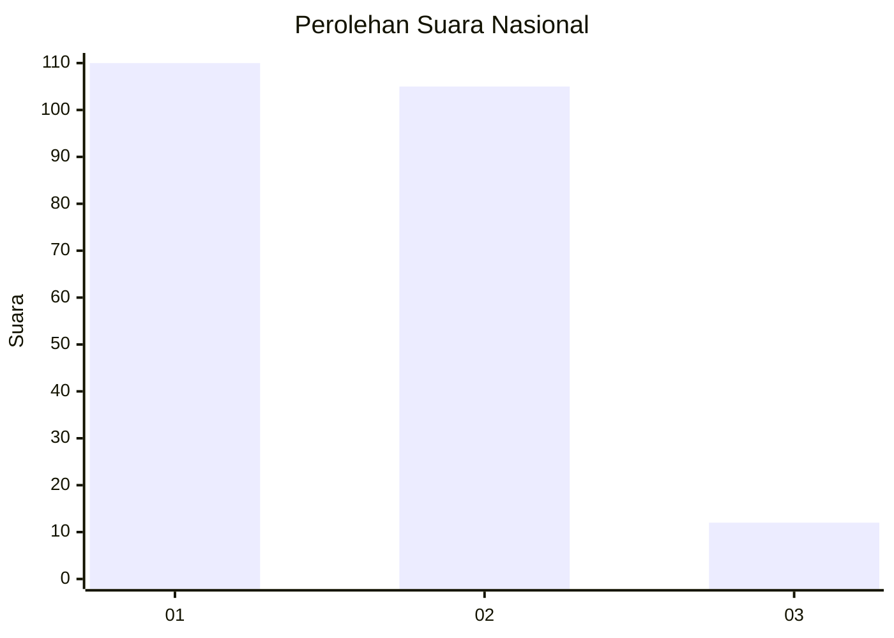
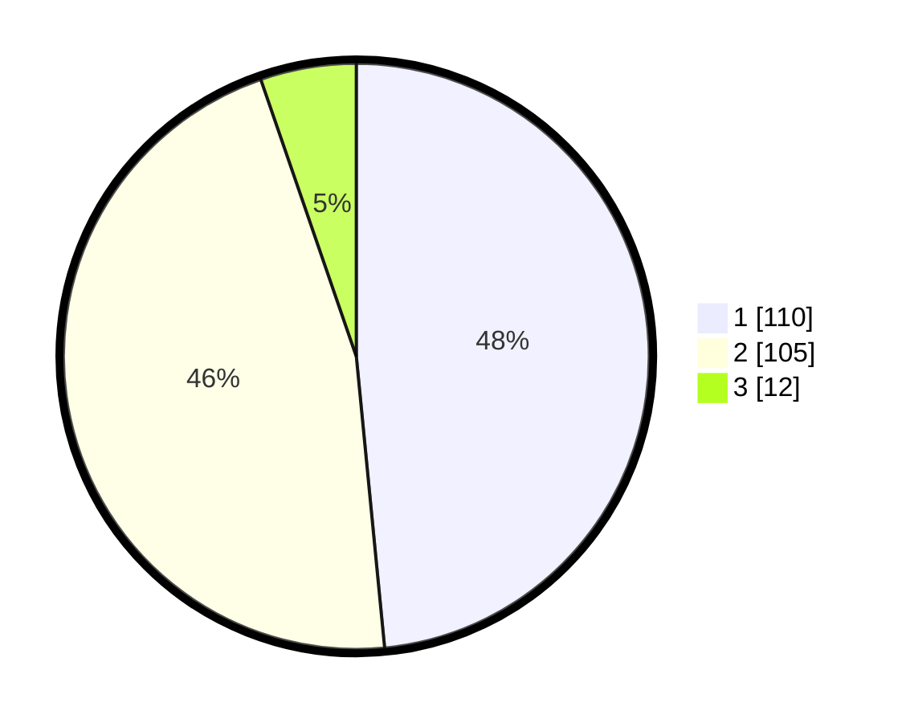

# Hasil

## Grafik

## Tabel

| No.    | Nama Paslon    | Suara | Suara (raw) | Persentase |
|:------ |:-------------- | -----:| -----------:| ----------:|
| 100025 | ANIES MUHAIMIN | 110   | [110][p-1]  | 48,46      |
| 100026 | PRABOWO GIBRAN | 105   | [105][p-2]  | 46,26      |
| 100027 | GANJAR MAHFUD  | 12    | [12][p-3]   | 5,29       |

[p-1]: https://github.com/gigit-pemilu/pemilu-2024/blob/main/pilpres/hitung-suara/sub/31-dki-jakarta/sub/75-jakarta-timur/sub/05-pasar-rebo/sub/1003-cijantung/sub/021-tps/sub/paslon-1.txt
[p-2]: https://github.com/gigit-pemilu/pemilu-2024/blob/main/pilpres/hitung-suara/sub/31-dki-jakarta/sub/75-jakarta-timur/sub/05-pasar-rebo/sub/1003-cijantung/sub/021-tps/sub/paslon-2.txt
[p-3]: https://github.com/gigit-pemilu/pemilu-2024/blob/main/pilpres/hitung-suara/sub/31-dki-jakarta/sub/75-jakarta-timur/sub/05-pasar-rebo/sub/1003-cijantung/sub/021-tps/sub/paslon-3.txt

## Foto C Plano

https://sirekap-obj-formc.kpu.go.id/443f/pemilu/ppwp/31/75/05/10/03/3175051003021-20240214-225503--6815be0c-b838-458d-b376-404df702c95c.jpg

https://sirekap-obj-formc.kpu.go.id/443f/pemilu/ppwp/31/75/05/10/03/3175051003021-20240214-225618--dc53500d-396b-4134-9a92-c108be83ecda.jpg

https://sirekap-obj-formc.kpu.go.id/443f/pemilu/ppwp/31/75/05/10/03/3175051003021-20240214-225654--a94f44f6-ab0e-4b8e-b5c3-9939565b6698.jpg

## Metadata

| Key        | Value               |
| ---------- | ------------------- |
| Time Stamp | 2024-02-15 15:30:25 |

