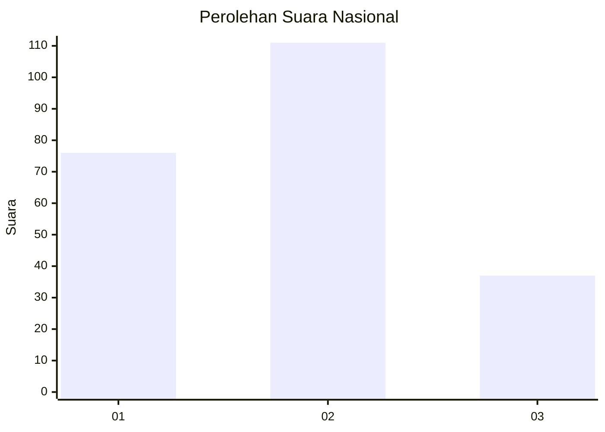
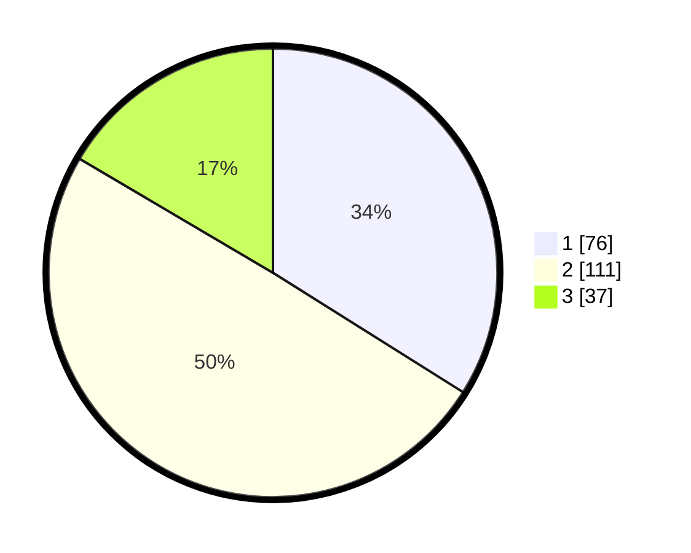

# Hasil

## Grafik

## Tabel

| No.    | Nama Paslon    | Suara | Suara (raw) | Persentase |
|:------ |:-------------- | -----:| -----------:| ----------:|
| 100025 | ANIES MUHAIMIN | 76    | [76][p-1]   | 33,93      |
| 100026 | PRABOWO GIBRAN | 111   | [111][p-2]  | 49,55      |
| 100027 | GANJAR MAHFUD  | 37    | [37][p-3]   | 16,52      |

[p-1]: https://github.com/gigit-pemilu/pemilu-2024/blob/main/pilpres/hitung-suara/sub/31-dki-jakarta/sub/75-jakarta-timur/sub/05-pasar-rebo/sub/1003-cijantung/sub/033-tps/sub/paslon-1.txt
[p-2]: https://github.com/gigit-pemilu/pemilu-2024/blob/main/pilpres/hitung-suara/sub/31-dki-jakarta/sub/75-jakarta-timur/sub/05-pasar-rebo/sub/1003-cijantung/sub/033-tps/sub/paslon-2.txt
[p-3]: https://github.com/gigit-pemilu/pemilu-2024/blob/main/pilpres/hitung-suara/sub/31-dki-jakarta/sub/75-jakarta-timur/sub/05-pasar-rebo/sub/1003-cijantung/sub/033-tps/sub/paslon-3.txt

## Foto C Plano

https://sirekap-obj-formc.kpu.go.id/5534/pemilu/ppwp/31/75/05/10/03/3175051003033-20240214-224832--3eb6130d-879a-40e5-aed1-543bc6b69872.jpg

https://sirekap-obj-formc.kpu.go.id/5534/pemilu/ppwp/31/75/05/10/03/3175051003033-20240214-233427--04de92e5-18e7-413d-94ef-7bcf0dbff043.jpg

https://sirekap-obj-formc.kpu.go.id/5534/pemilu/ppwp/31/75/05/10/03/3175051003033-20240214-224352--3ea56184-9fe9-4785-af74-f71dd5a7ffa4.jpg

## Metadata

| Key        | Value               |
| ---------- | ------------------- |
| Time Stamp | 2024-02-24 22:31:28 |

