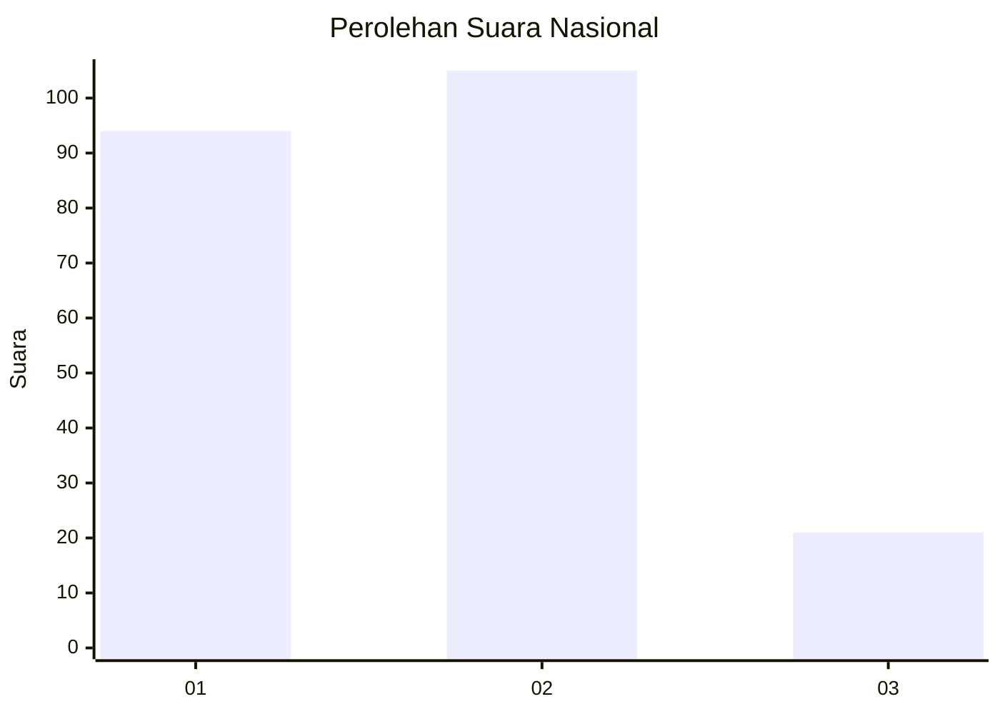
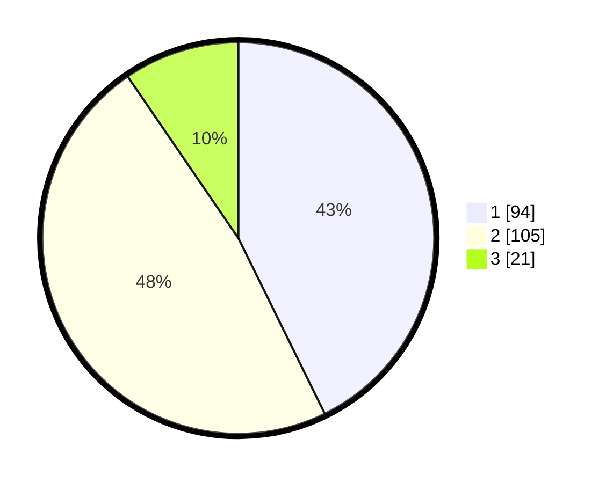

# Hasil

## Grafik

## Tabel

| No.    | Nama Paslon    | Suara | Suara (raw) | Persentase |
|:------ |:-------------- | -----:| -----------:| ----------:|
| 100025 | ANIES MUHAIMIN | 94    | [94][p-1]   | 42,73      |
| 100026 | PRABOWO GIBRAN | 105   | [105][p-2]  | 47,73      |
| 100027 | GANJAR MAHFUD  | 21    | [21][p-3]   | 9,55       |

[p-1]: https://github.com/gigit-pemilu/pemilu-2024/blob/main/pilpres/hitung-suara/sub/31-dki-jakarta/sub/75-jakarta-timur/sub/05-pasar-rebo/sub/1003-cijantung/sub/036-tps/sub/paslon-1.txt
[p-2]: https://github.com/gigit-pemilu/pemilu-2024/blob/main/pilpres/hitung-suara/sub/31-dki-jakarta/sub/75-jakarta-timur/sub/05-pasar-rebo/sub/1003-cijantung/sub/036-tps/sub/paslon-2.txt
[p-3]: https://github.com/gigit-pemilu/pemilu-2024/blob/main/pilpres/hitung-suara/sub/31-dki-jakarta/sub/75-jakarta-timur/sub/05-pasar-rebo/sub/1003-cijantung/sub/036-tps/sub/paslon-3.txt

## Foto C Plano

https://sirekap-obj-formc.kpu.go.id/9c88/pemilu/ppwp/31/75/05/10/03/3175051003036-20240214-200347--a3834b78-4613-4f32-a63d-8b7734de281a.jpg

https://sirekap-obj-formc.kpu.go.id/9c88/pemilu/ppwp/31/75/05/10/03/3175051003036-20240214-221333--76f69b0f-45eb-4d33-b7f5-b7098ca67ee0.jpg

https://sirekap-obj-formc.kpu.go.id/9c88/pemilu/ppwp/31/75/05/10/03/3175051003036-20240214-220842--277613a9-70d7-434a-8ffe-49add17692b0.jpg

## Metadata

| Key        | Value               |
| ---------- | ------------------- |
| Time Stamp | 2024-02-24 22:31:28 |

